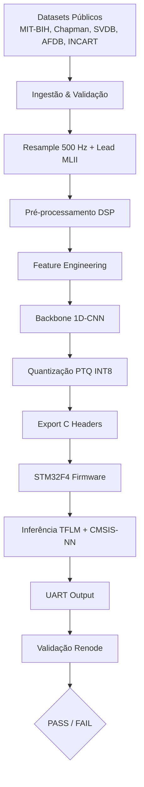

<p align="center">
  <h1 align="center">🫀 Project-Lewis</h1>
  <p align="center">
    <strong>Pipeline completo de ECG → modelo quantizado INT8 → firmware embarcado STM32F4</strong><br>
    validado sem hardware físico via simulação Renode.
  </p>
  <p align="center">
    
    
    
    
    
  </p>
</p>

---

## 📑 Índice

1. [Visão Geral](#-visão-geral)
2. [Arquitetura](#-arquitetura)
3. [Pipeline de Dados](#-pipeline-de-dados)
4. [ML Pipeline](#-ml-pipeline)
5. [Firmware, Simulação & DevOps](#-firmware-simulação--devops)
6. [Estrutura do Repositório](#-estrutura-do-repositório)
7. [Como Executar](#-como-executar)
8. [Quality Gates](#-quality-gates)
9. [Limites da Simulação](#-limites-da-simulação)
10. [Versão Atual](#-versão-atual)
11. [Autor & Licença](#-autor--licença)

---

## 🎯 Visão Geral

O **Project-Lewis** demonstra uma arquitetura end-to-end para classificação de arritmias cardíacas a partir de sinais de ECG, indo da ingestão de dados públicos até a inferência embarcada em um microcontrolador **STM32F4** usando **TensorFlow Lite Micro**.

O projeto é dividido em camadas bem definidas, cada uma com contratos de interface, quality gates e documentação própria:

| Camada | Responsabilidade | Tecnologias |
| :--- | :--- | :--- |
| **01 — Ingestão** | Download, validação e governança de datasets | `wfdb`, `wget`, DVC, DLQ |
| **02 — Pré-processamento** | Resample 500 Hz, lead única, filtro, Z-score | `scipy`, YAML versionado |
| **03 — Features** | Detecção AMPT, features morfológicas/temporais | Python puro |
| **04 — Modelagem** | Backbone 1D-CNN, pré-treino e fine-tuning | TensorFlow/Keras |
| **05 — Quantização** | PTQ INT8 per-channel, exportação para C | TFLite |
| **06 — Validação** | Quality gates e relatórios de qualidade | `pytest`, CI/CD |
| **07 — DevOps** | Ambiente reprodutível, CI, Docker | `uv`, GitHub Actions |
| **08 — Firmware** | Firmware C/C++17 bare-metal para STM32F4 | ARM GCC, TFLM, CMSIS-NN |
| **09 — Simulação** | Validação sem hardware via Renode | Renode 1.15.3 |

> 🇧🇷 Projeto de arquitetura de firmware, CI/CD e quality gates para sistemas embarcados médicos.
> 🇺🇸 Demonstration of embedded firmware architecture, CI/CD and quality gates for medical edge devices.

---

## 🏗️ Arquitetura



**Fluxo de dados no firmware:**

```text
ADC stub / UART raw int8
    → dequantização float32
    → filtro passa-banda 0.5–40 Hz
    → filtro notch 60 Hz
    → normalização Z-score
    → quantização int8
    → inferência TFLM (CMSIS-NN)
    → argmax → saída UART
```

---

## 🫀 Pipeline de Dados

A camada de dados unifica sinais de ECG de múltiplas fontes públicas em um formato único de **500 Hz**, lead **MLII-equivalente** e janelas de **1000 ms** — tudo rastreável e reprodutível.

### 📊 Datasets de Entrada

| Dataset | Registros | Fs original | Tamanho (raw) | Papel |
| :--- | :--- | :--- | :--- | :--- |
| **Chapman-Shaoxing** | 45.152 | 500 Hz | ~5.1 GB | Pré-treino do backbone |
| **MIT-BIH Arrhythmia** | 48 | 360 Hz | ~104 MB | Fine-tuning + teste |
| **MIT-BIH SVDB** | 78 | 250 Hz | ~75 MB | Fine-tuning (supraventricular) |
| **MIT-BIH AFDB** | 25 (23 c/ sinal) | 250 Hz | ~606 MB | Fine-tuning (fibrilação atrial) |
| **INCART** | 75 | 257 Hz | ~795 MB | Fine-tuning (diversidade russa) |

> **Total MIT-BIH+:** 226 registros • ~1.1 GB

### ⚙️ Fluxo de Pré-processamento

```bash
make env          # uv + dependências
make download-all # PhysioNet / ZIP / mirror
make process      # resample → lead → filter → detrend → normalize
make test         # QG0 → QG1
```

1. **Ingestão:** `wfdb.io.dl_database` com retry exponencial + DLQ (`data/.dlq/`) para falhas.
2. **Resample:** `scipy.signal.resample_poly` para **500 Hz**.
3. **Lead única:** MLII/ECG1 para MIT-BIH/SVDB/AFDB; lead **II** para Chapman/INCART.
4. **Filtro:** Butterworth 4ª ordem, bandpass **0.5–40 Hz** (`filtfilt` zero-phase).
5. **Detrend linear** + **Z-score global** (fit no treino, transform no teste).
6. **Segmentação:** janela de **1000 ms** centrada no R-peak; fallback para **600 ms** quando RR < 600 ms. Sem padding zero.

### 🎯 Seleção de Lead MLII-equivalente

| Dataset | Lead | Índice | Nota |
| :--- | :--- | :--- | :--- |
| Chapman | `II` | `lead_names.index("II")` | Nativamente 500 Hz |
| MIT-BIH | `MLII` | `0` | Lead padrão |
| SVDB | `ECG1` | `0` | Equivalência não documentada oficialmente |
| AFDB | `ECG1` | `0` | Equivalência não documentada oficialmente |
| INCART | `II` | `lead_names.index("II")` | Anatomicamente próximo de MLII |

### 📜 Linhagem e Governança

Cada registro processado gera um JSON em `data/lineage/{dataset}/{record_id}.json` com checksum, parâmetros, pipeline e metadados. A DLQ (`data/.dlq/`) captura falhas de download e processamento para reprocessamento seletivo.

```yaml
# config/preprocess_v1.0.yaml
filter:
  type: butterworth
  order: 4
  lowcut: 0.5
  highcut: 40.0
normalization:
  type: zscore_global
```

---

## 🧠 ML Pipeline

### 🏗️ Arquitetura Backbone 1D-CNN

Classificador enxuto para borda, inspirado em literatura TinyML para ECG:

```text
Input(500, 1)                    # 1000 ms @ 500 Hz, lead MLII-equivalente
 → Conv1D(16, k7) → MaxPool1D(2)   # 250 amostras
 → Conv1D(32, k5) → MaxPool1D(2)   # 125 amostras
 → Conv1D(64, k3) → MaxPool1D(2)   # 62 amostras
 → GlobalAveragePooling1D()
 → Dense(64, relu) → Dropout(0.3)
 → Dense(5, softmax)              # AAMI: N, S, V, F, Q
```

- **~13K parâmetros** | **FlatBuffer < 64 KB** | **Arena TFLM ~40–50 KB**

### 🔬 Feature Engineering

| Módulo | Descrição |
| :--- | :--- |
| `src/features/ampt_500hz.py` | Detector AMPT (banda 5–15 Hz, MWI 150 ms, refratariedade 360 ms) |
| `src/features/time_domain.py` | RR, HRV, RMSSD, heart rate |
| `src/features/morphological.py` | R-amp, Q-depth, T-amp, QRS-width (envelope method), ST-slope J+60ms→J+80ms |
| `src/features/augmentation.py` | Jitter, baseline wander, powerline, time warp *(apenas treino)* |
| `src/features/balancer.py` | SMOTE/ADASYN no espaço de features |

### 🎯 Treinamento em Dois Estágios

1. **Pré-treino em Chapman-Shaoxing** (~5 GB, 12 leads, 500 Hz) com 5 superclasses SCP-ECG.
2. **Fine-tuning em MIT-BIH+** (226 registros, 1 lead, AAMI) com backbone congelado.

```bash
make pretrain   # models/backbone_pretrained_v1.0.keras
make finetune   # models/finetuned_float32_v1.0.keras
```

### 👤 Validação Inter-Patient

Nunca misturamos batimentos do mesmo paciente entre treino e teste. Usamos **GroupKFold por paciente** (`n_splits=5`) para evitar *data leakage*.

### 📊 Métricas AAMI EC57

| Métrica | Threshold mínimo |
| :--- | :--- |
| Acc global | > 93% |
| F1-macro | > 85% |
| MCC | > 0.80 |
| Sens N / V / S / F / Q | > 96% / 90% / 75% / 60% / 70% |
| FPR global | < 5% |

> F1-macro e MCC são as métricas primárias; acurácia global pode ser enganosa em classes desbalanceadas.

### ⚡ Quantização PTQ INT8

Quantização pós-treino **per-channel INT8** com 512 amostras estratificadas AAMI:

```bash
make quantize   # gera models/model_int8_v1.0.tflite
```

| Critério | Limite |
| :--- | :--- |
| ΔAcc global | < 1% |
| ΔF1-macro | < 2% |
| ΔSens N | < 0.5% |
| ΔSens V/S/F/Q | < 3% |
| FlatBuffer | < 64 KB |

### 📤 Exportação para Firmware

Conversão para headers C puros, sem dependências externas:

```bash
make export
# entregáveis:
#   firmware/src/ml/model_data.h
#   firmware/src/ml/quantization_params.h
```

---

## ⚙️ Firmware, Simulação & DevOps

O Project-Lewis entrega um firmware C/C++17 para **STM32F407VG** rodando **TensorFlow Lite Micro** com kernels **CMSIS-NN**. Toda a validação de hardware é feita sem silicone real, via emulação fiel no **Renode 1.15.3**.

### 🖥️ Firmware & Pipeline DSP

| Recurso | Especificação |
| :--- | :--- |
| **MCU** | STM32F407VG (Cortex-M4F, 168 MHz, 192 KB SRAM, 1 MB Flash) |
| **DSP** | Filtro passa-banda 0.5–40 Hz + notch 60 Hz + Z-score |
| **ML** | TFLM INT8, arena estática 64 KB, modelo < 64 KB |
| **Debug** | UART4 sem `printf`/semihosting |

### 🧪 Simulação Renode

```bash
make firmware-deps     # ARM GCC 13.3 + Renode 1.15.3
make firmware-build    # ELF para STM32F4
make firmware-test     # 5 s de simulação headless
make hard-gates        # Hard Gates HG-01..HG-06
```

> ⚠️ **Limites:** timings são representativos, energia não é estimada e há tolerância de 1 LSB entre CMSIS-NN e kernels de referência. Veja [`docs/SIMULATION_LIMITS.md`](docs/SIMULATION_LIMITS.md).

### 🔄 CI/CD & Reprodutibilidade

- **`uv` + `pyproject.toml`**: lockfile determinístico e ambientes isolados.
- **Makefile**: targets por camada com paralelismo (`make -j4 all`).
- **Docker + Docker Compose**: reprodutibilidade total entre máquinas.
- **GitHub Actions**: lint → unit tests → integration tests → quality gates.
- **Pre-commit**: Black, isort, flake8, mypy, bandit.

```bash
make env              # cria ambiente
make all              # pipeline completo
make docker-build     # imagem reprodutível
make quality-report   # relatório QG0–QG6
```

---

## 📁 Estrutura do Repositório

```
project-lewis/
├── config/                # Parâmetros versionados (pré-processamento, energia)
├── data/                  # Datasets brutos/processados (DVC, gitignored)
│   ├── raw_chapman/
│   ├── raw_mitbih/
│   ├── processed/
│   ├── lineage/
│   └── .dlq/
├── docs/                  # Especificações por camada
│   ├── ESPECIFICACAO_Fase1_Agentes-v1.1.md
│   ├── Camada-01-Ingestao-v1.1.md
│   ├── Camada-02-Resample-Preprocessamento-v1.1.md
│   ├── Camada-03-Feature-Engineering-v1.1.md
│   ├── Camada-04-Modelagem-v1.1.md
│   ├── Camada-05-Quantizacao-Exportacao-v1.1.md
│   ├── Camada-06-Validacao-Quality-Gates-v1.1.md
│   ├── Camada-07-Integracao-DevOps-v1.1.md
│   ├── Camada-08-Firmware-v1.1.md
│   ├── Camada-09-Simulacao-v1.1.md
│   ├── Camada-09-Energia-v1.4.md
│   ├── DEBITO_TECNICO_Energia_Renode-v1.4.md
│   └── SIMULATION_LIMITS.md
├── firmware/              # Firmware embarcado
│   ├── src/               # app, dsp, hal, ml, platform, utils
│   ├── renode/            # scripts .resc, .robot
│   ├── scripts/           # runners Renode
│   ├── tests/             # testes HIL
│   ├── Makefile
│   └── third_party/       # tflite-micro
├── models/                # Modelos treinados e quantizados
├── notebooks/             # EDA e validação visual
├── reports/               # Relatórios de qualidade e simulação
├── scripts/               # Automação de quality gates e relatórios
├── src/                   # Código Python do pipeline
│   ├── data/
│   ├── features/
│   ├── models/
│   └── quantization/
├── tests/                 # Testes pytest (QG0–QG18)
├── .github/workflows/     # CI/CD
├── docker-compose.yml
├── Dockerfile
├── Makefile
├── LICENSE
└── README.md
```

---

## 🚀 Como Executar

### 1. Ambiente

```bash
# Usando uv (recomendado)
make env
source .venv/bin/activate

# Ou Docker
make docker-build
make docker-run
```

### 2. Pipeline de Dados

```bash
make download-all   # QG0
make process        # QG1
```

### 3. Features e Modelagem

```bash
make features       # QG2/QG3
make pretrain       # QG4
make finetune       # QG5
```

### 4. Quantização e Exportação

```bash
make quantize       # QG6
make export         # headers C
```

### 5. Firmware e Simulação

```bash
cd firmware
make firmware-deps
make firmware-build
make firmware-test
```

### 6. Testes Completos

```bash
make test           # pytest completo
make hard-gates     # Hard Gates HG-01..HG-06
make quality-report # relatório consolidado
```

---

## 🛡️ Quality Gates

Nenhum artefato avança para a próxima camada sem passar no gate correspondente.

### Fase 1 — Dados & ML

| Gate | Foco | Threshold | Comando |
| :--- | :--- | :--- | :--- |
| **QG0** | Download | Chapman ≥ 45k; MIT-BIH 48; SVDB 78; AFDB 25; INCART 75; DLQ vazia | `pytest tests/test_download.py` |
| **QG1** | Pré-processamento | Fs = 500 Hz; range ±5 mV; Z-score global; linhagem 100% | `pytest tests/test_preprocessing.py` |
| **QG2** | AMPT @ 500 Hz | Sens > 96,5%; PPV > 99,0%; tol = 150 ms | `pytest tests/test_ampt.py` |
| **QG3** | Features | Janela 1000 ms; ≥ 10 dimensões; sem NaN/Inf | `pytest tests/test_features.py` |
| **QG4** | Pré-treino | AUC-ROC macro > 0,85 | `pytest tests/test_pretrain.py` |
| **QG5** | Fine-tuning | F1-macro > 85%; MCC > 0,80; inter-patient | `pytest tests/test_finetune.py` |
| **QG6** | Quantização | ΔF1-macro < 2%; FlatBuffer < 64 KB; header compilável | `pytest tests/test_quantization.py` |

### Firmware & Simulação

| Gate | Foco | Threshold | Comando |
| :--- | :--- | :--- | :--- |
| **QG7** | Build firmware | `-Werror`; FlatBuffer < 64 KB | `make firmware-build` |
| **QG8** | Bit-exatidão C vs Python | `atol = 1` LSB | `pytest -m qg8` |
| **QG9** | Latência TFLM | < 200 ms/batimento | Relatório Renode |
| **QG10** | Fidelidade DSP | cosine > 0,99 | `pytest -m qg10` |
| **QG11** | Fault injection | Graceful degradation | `pytest -m qg11` |
| **QG12** | Arena limit (48 KB RAM) | `INIT FAIL` sem HardFault | `pytest -m qg12` |
| **QG13** | Watchdog de inferência | Reset após timeout | `pytest -m qg13` |
| **QG16** | Filtros DSP vs Python | correlação > 0,99 | `pytest -m qg16` |
| **QG17** | Pipeline filtrado C vs Python | MAE < 0,01 / cosine > 0,99 | `pytest -m qg17` |
| **QG18** | Detector R-peak C vs AMPT | Sens ≥ 90%; PPV ≥ 90% | `pytest -m qg18` |
| **QG19** | Consumo energético | < 50 mA e < 165 mJ/batimento @ 3,3 V | `reports/firmware_simulation_report.json` |

> QG19 é um débito técnico documentado para a v1.4. Veja [`docs/DEBITO_TECNICO_Energia_Renode-v1.4.md`](docs/DEBITO_TECNICO_Energia_Renode-v1.4.md).

---

## ⚠️ Limites da Simulação

Consulte [`docs/SIMULATION_LIMITS.md`](docs/SIMULATION_LIMITS.md) para detalhes sobre:

- Validação sem hardware físico (Renode 1.15.3).
- Latências determinísticas (sem modelagem de cache/jitter/temperatura).
- Divergência de até 1 LSB entre CMSIS-NN e kernels de referência.
- Modelagem de energia ainda não implementada (débito técnico v1.4).

---

## 📌 Versão Atual

`v1.3-sim-deep` — pipeline DSP completo no firmware (filtros + Z-score), detector leve de R-peak, watchdog software, todos os gates de firmware/DSP passando via simulação Renode, e débito técnico de modelagem de energia documentado para v1.4.

---

## 👤 Autor

**Douglas Souza** — Engenheiro de Software & Arquiteto de Sistemas

Arquitetura de firmware embarcado, CI/CD, compliance e integração ML embarcado.

---

## 📜 Licença

MIT License — veja [`LICENSE`](LICENSE) para detalhes.
