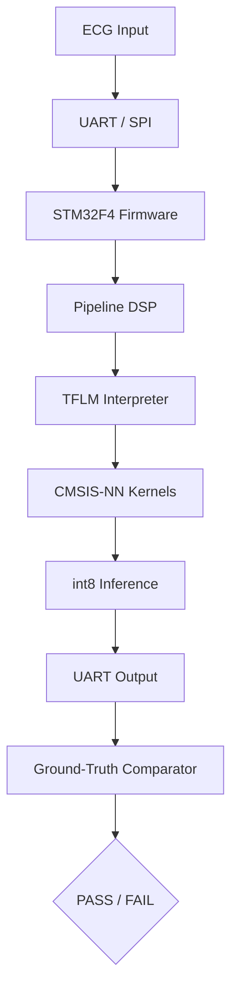

# Project-Lewis v1.3-sim-deep

**Firmware embarcado para inferência de ECG com TensorFlow Lite Micro em STM32F4, validado exclusivamente via simulação Renode.**

> 🇧🇷 Projeto de demonstração de arquitetura de firmware, CI/CD e quality gates para sistemas embarcados sem hardware físico.
>
> 🇺🇸 Demonstration of embedded firmware architecture, CI/CD and quality gates for hardware-less validation using Renode simulation.

---

## 🎯 Escopo do Projeto

| Camada | Tecnologia | Validação |
|--------|-----------|-----------|
| **Firmware** | C/C++17, ARM GCC 13.3, STM32F4 (Cortex-M4) | Renode 1.15.3 |
| **ML Embarcado** | TensorFlow Lite Micro (CMSIS-NN) | Bit-exatidão int8 vs. Python |
| **Pipeline DSP** | Filtros bandpass/notch + Z-score em ponto flutuante | Fidelidade C vs Python (QG16/QG17) |
| **Simulação** | Renode (periféricos UART, SPI, GPIO) | Graceful shutdown, fault injection |
| **CI/CD** | GitHub Actions, pytest, Makefile | Hard Gates HG-01..HG-06 |
| **Qualidade** | QG0–QG18 (latência, memória, acurácia, resiliência, DSP, R-peak) | 220+ testes |

---

## 🏗️ Arquitetura



**Pipeline DSP embarcado:**

```text
ADC stub / UART raw int8
    → dequantização float32
    → filtro passa-banda 0.5–40 Hz
    → filtro notch 60 Hz
    → normalização Z-score
    → quantização int8
    → inferência TFLM
```

---

## 📁 Estrutura

```
project-lewis/
├── firmware/
│   ├── src/              # Código fonte C/C++
│   │   ├── dsp/          # adc_stub, filtros, normalizer, r_peak_detector
│   │   ├── app/          # main.c, command_loop.c
│   │   ├── hal/          # abstração de hardware (target/simulator/native)
│   │   ├── ml/           # wrapper TFLM
│   │   └── utils/        # debug sem printf
│   ├── renode/           # Scripts .resc, .repl, .robot
│   ├── scripts/          # Instalação e execução Renode
│   ├── build/            # Artefatos de build (gitignored)
│   └── Makefile          # Build nativo, ARM e testes
├── tests/
│   ├── test_*.py         # Quality Gates QG7–QG18
│   ├── fixtures/         # Referências Python bit-exatas
│   └── ground_truth/     # Datasets de referência versionados
├── scripts/
│   ├── generate_quality_report.py
│   └── run_hard_gates.py
├── docs/
│   ├── Camada-*.md       # Especificações por camada
│   └── SIMULATION_LIMITS.md
├── .github/
│   └── workflows/
│       └── ci.yml
├── README.md
├── LICENSE
└── Makefile
```

---

## 🚀 Como Executar

### Dependências
```bash
make firmware-deps    # Toolchain ARM GCC 13.3 + Renode 1.15.3
```

### Build e Testes
```bash
make firmware-native  # Build host com TFLM real
make firmware-build   # Build ARM (STM32F4)
make firmware-test    # Simulação Renode (5 s)
make test             # Suite completa
make hard-gates       # Hard Gates HG-01..HG-06
```

### Gates de firmware/DSP específicos
```bash
pytest -m "qg7 or qg8 or qg9 or qg10 or qg13 or qg16 or qg17 or qg18"
```

---

## 🛡️ Quality Gates

| Gate | Descrição | Threshold |
|------|-----------|-----------|
| QG7  | Build sem warnings (`-Werror`); FlatBuffer < 64 KB | `make firmware-build` |
| QG8  | Bit-exatidão ARM vs Python | `atol=1` (CMSIS-NN) |
| QG9  | Latência inference | `< 200 ms` |
| QG10 | Fidelity vs. ground-truth | `cosine similarity > 0.99` |
| QG11 | Fault injection (SPI/UART) | Graceful degradation |
| QG12 | Arena limit (48 KB RAM) | `INIT FAIL` sem HardFault |
| QG13 | Watchdog software de inferência | Reset após timeout |
| QG16 | Filtros DSP bandpass/notch vs Python | correlação > 0.99 |
| QG17 | Fidelidade do pipeline filtrado C vs Python | MAE < 0.01 / cosine > 0.99 |
| QG18 | Detector leve de R-peak em C vs AMPT | Sens ≥ 90 %, PPV ≥ 90 % |

---

## ⚠️ Limites da Simulação

Consulte [`docs/SIMULATION_LIMITS.md`](docs/SIMULATION_LIMITS.md) para detalhes sobre:
- Validação sem hardware físico (Renode 1.15.3).
- Latências determinísticas (sem modelagem de cache/jitter).
- Divergência de até 1 LSB entre CMSIS-NN e kernels de referência.
- Estimativa de energia não implementada (débito técnico documentado).

---

## 📌 Versão Atual

`v1.3-sim-deep` — pipeline DSP completo no firmware (filtros + Z-score), detector leve de R-peak, watchdog software e todos os gates de firmware/DSP passando via simulação Renode.

---

## 👤 Autor

**Douglas Souza** — Engenheiro de Software & Arquiteto de Sistemas

Arquitetura de firmware embarcado, CI/CD, compliance e integração ML embarcado.

---

## 📜 Licença

MIT License — veja [`LICENSE`](LICENSE) para detalhes.
