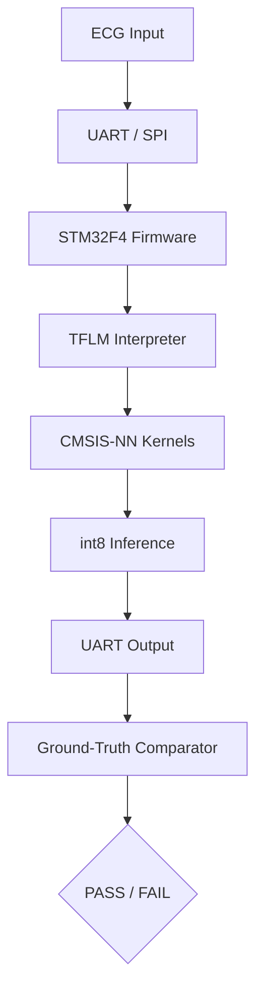

# Project-Lewis v1.2

**Firmware embarcado para inferência de ECG com TensorFlow Lite Micro em STM32F4, validado exclusivamente via simulação Renode.**

> 🇧🇷 Projeto de demonstração de arquitetura de firmware, CI/CD e quality gates para sistemas embarcados sem hardware físico.
>
> 🇺🇸 Demonstration of embedded firmware architecture, CI/CD and quality gates for hardware-less validation using Renode simulation.

---

## 🎯 Escopo do Projeto

| Camada | Tecnologia | Validação |
|--------|-----------|-----------|
| **Firmware** | C/C++17, ARM GCC 13.3, STM32F4 (Cortex-M4) | Renode 1.15.3 |
| **ML Embarcado** | TensorFlow Lite Micro (CMSIS-NN) | Bit-exatidão int8 vs. Python |
| **Simulação** | Renode (periféricos UART, SPI, GPIO) | Graceful shutdown, fault injection |
| **CI/CD** | GitHub Actions, pytest, Makefile | Hard Gates HG-01..HG-06 |
| **Qualidade** | QG0–QG12 (latência, memória, acurácia, resiliência) | 206 testes em ~7m20s |

---

## 🏗️ Arquitetura



---

## 📁 Estrutura

```
project-lewis/
├── firmware/
│   ├── src/              # Código fonte C/C++
│   ├── renode/           # Scripts .resc, .repl, .robot
│   ├── scripts/          # Instalação e execução Renode
│   ├── build/            # Artefatos de build (gitignored)
│   └── Makefile          # Build nativo, ARM e testes
├── tests/
│   ├── test_*.py         # Quality Gates QG7-QG12
│   └── ground_truth/     # Datasets de referência versionados
├── scripts/
│   ├── generate_quality_report.py
│   └── run_hard_gates.py
├── docs/
│   └── SIMULATION_LIMITS.md
├── .github/
│   └── workflows/
│       └── ci.yml
├── README.md
├── LICENSE
└── Makefile
```

---

## 🚀 Como Executar

### Dependências
```bash
make firmware-deps    # Toolchain ARM GCC 13.3 + Renode 1.15.3
```

### Build e Testes
```bash
make firmware-native  # Build host com TFLM real
make firmware-build   # Build ARM (STM32F4)
make firmware-test    # Simulação Renode
make test             # Suite completa (206 testes)
make hard-gates       # Hard Gates HG-01..HG-06
```

---

## 🛡️ Quality Gates

| Gate | Descrição | Threshold |
|------|-----------|-----------|
| QG7 | Bit-exatidão native vs. Python | `atol=1e-5` |
| QG8 | Bit-exatidão ARM vs. Python | `atol=1` (CMSIS-NN) |
| QG9 | Latência inference | `< 20 ms` |
| QG10 | Fidelity vs. ground-truth | `cosine similarity > 0.99` |
| QG11 | Fault injection (SPI/UART) | Graceful degradation |
| QG12 | Arena limit (48 KB RAM) | `INIT FAIL` sem HardFault |

---

## ⚠️ Limites da Simulação

Consulte [`docs/SIMULATION_LIMITS.md`](docs/SIMULATION_LIMITS.md) para detalhes sobre:
- Semihosting implícito no Renode 1.15.3
- Latências determinísticas (sem modelagem de cache/jitter)
- Divergência de 1 LSB entre CMSIS-NN e kernels de referência

---

## 👤 Autor

**Douglas Souza** — Engenheiro de Software & Arquiteto de Sistemas

Arquitetura de firmware embarcado, CI/CD, compliance e integração ML embarcado.

---

## 📜 Licença

MIT License — veja [`LICENSE`](LICENSE) para detalhes.
