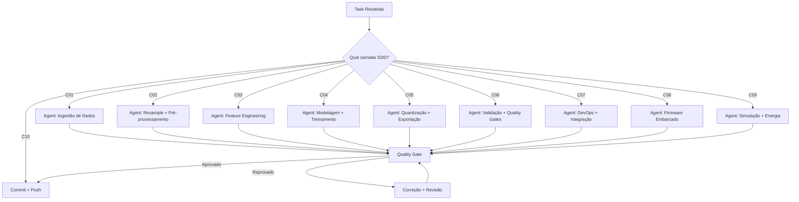

# SDD — Project-Lewis: Classificação de Arritmias ECG em Edge
## Arquitetura de Instrução para Agentes de Coding AI (Kimi Code / OpenCode)

**Versão:** 3.0 | **Data:** 2026-06-19 | **Arquiteto:** Douglas Souza  
**Projeto:** Project-Lewis — Pipeline de Dados + Ciência de Dados + Firmware Embarcado  
**Hardware Dev:** Lenovo IdeaPad 3 15ITL6 | Zorin OS 18.1 (Ubuntu 24.04.3 LTS)  
**Python:** 3.12.x (system Python — não usar 3.13+)  
**Ferramentas Alvo:** Kimi Code (Moonshot AI) | OpenCode (Open Source)

---

## 1. Visão Geral do Projeto

O Project-Lewis é um sistema de classificação de arritmias cardíacas via ECG, operando em edge (STM32F4 Cortex-M4F, 168 MHz, 192 KB SRAM, 1 MB Flash). O pipeline abrange desde a ingestão de datasets biomédicos públicos (MIT-BIH, Chapman-Shaoxing, SVDB, AFDB, INCART) até a inferência embarcada com TensorFlow Lite Micro (TFLM), passando por pré-treino de backbone 1D-CNN, fine-tuning inter-patient, quantização PTQ INT8 per-channel e simulação fiel no Renode.

### 1.1 Escopo do Sistema

| Fase | Camada | Descrição | Entregável |
|------|--------|-----------|------------|
| Fase 1 | C01 — Ingestão | Download e validação de 5 datasets públicos | Datasets brutos versionados (DVC) |
| Fase 1 | C02 — Resample/Pré-processamento | Unificação 500 Hz, filtro bandpass 0.5–40 Hz, Z-score global | Sinais processados + linhagem |
| Fase 1 | C03 — Feature Engineering | Segmentação 1000ms, AMPT @ 500Hz, features temporais/morfológicas | Features + augmentation |
| Fase 1 | C04 — Modelagem | Pré-treino Chapman (SCP-ECG 5 classes) + Fine-tuning MIT-BIH+ (AAMI 5 classes) | Modelo float32 treinado |
| Fase 1 | C05 — Quantização/Exportação | PTQ INT8 per-channel, exportação para header C (`model_data.h`) | FlatBuffer < 64KB + headers C |
| Fase 1 | C06 — Validação/QG | Quality gates QG0–QG6 com métricas AAMI EC57 | Relatório de qualidade consolidado |
| Fase 1 | C07 — Integração/DevOps | Makefile, uv, Docker, DVC, CI/CD GitHub Actions, pre-commit | Pipeline reprodutível end-to-end |
| Fase 2 | C08 — Firmware | C bare-metal STM32F4: DSP + TFLM + pipeline de inferência | `lewis.bin` compilável |
| Fase 2 | C09 — Simulação/Energia | Renode STM32F4Discovery, modelagem de consumo energético | Relatório de simulação + métricas |

### 1.2 Stack Técnica Válida

| Camada | Tecnologia | Versão | Observação |
|--------|-----------|--------|------------|
| Linguagem | Python | 3.12.x | System Python do SO; veto 3.13+ |
| Gerenciador | uv (Astral) | latest | Lockfile nativo `uv.lock`; nunca `requirements.txt` cru |
| Dados | numpy, scipy, pandas | >=1.26,<2.0 | Base numérica |
| Sinais | wfdb | >=4.1,<5.0 | Leitura PhysioNet nativa |
| ML | TensorFlow / Keras | >=2.21.0,<2.22 | Treinamento e conversão TFLite |
| ML Utils | scikit-learn, imbalanced-learn | >=1.4 | GroupKFold, SMOTE, StandardScaler |
| Testes | pytest (>=8.0), pytest-cov, pytest-xdist | latest | Pirâmide 70/20/10 |
| Qualidade | black, isort, flake8, mypy, bandit, pre-commit | latest | Hooks obrigatórios |
| Container | Docker, docker-compose | latest | Reprodutibilidade total |
| Versionamento Dados | DVC | latest | `.dvc` no Git; binários em S3/GCS |
| Firmware | C (C99/C11), arm-none-eabi-gcc | 13.3.rel1 | Bare-metal, sem newlib printf |
| ML Embarcado | TensorFlow Lite Micro (TFLM) | latest | Source em `firmware/third_party/tflite-micro/`, pinado por `firmware/third_party/tflite-micro.commit` |
| DSP Embarcado | CMSIS-DSP, CMSIS-NN | latest | Aceleração Cortex-M4F |
| Simulação | Renode | 1.15.3 | Emulação fiel STM32F4Discovery |
| AFE | ADS1292R | — | 1 canal, 500 SPS, referência real |
| MCU Alvo | STM32F407VG | — | Cortex-M4F, 168 MHz, 192KB SRAM, 1MB Flash |
| Compliance | LGPD (Lei 13.709/18) | — | Por design em todas as camadas de dados |

### 1.3 Regras de Ouro do Project-Lewis

1. **Nunca usar Radix UI** — shadcn/ui + Base UI exclusivamente (se houver frontend futuro)
2. **Sempre validar com Zod** — contratos de dados frontend + backend
3. **Sempre testar antes de commitar** — TDD: vermelho → verde → refatorar
4. **GroupKFold por paciente é obrigatório** — nunca shuffle aleatório em sinais fisiológicos
5. **Padding com zeros é proibido** — descarta bordas, nunca preenche
6. **SMOTE apenas no espaço de features** — nunca no sinal bruto
7. **Augmentation apenas no treino de fine-tuning** — nunca no pré-treino ou teste
8. **Normalização Z-score global** — fit no treino, transform em val/teste; nunca por segmento
9. **AMPT usa banda 5–15 Hz** — não 5–25 Hz (esse é o Pan-Tompkins++)
10. **Tolerância AMPT: 150 ms** — padrão AAMI/PhysioNet para detecção de batimento
11. **Input shape: (500, 1)** — 1000 ms @ 500 Hz; fallback 600 ms para RR < 600 ms
12. **FlatBuffer TFLM < 64KB** — arena TFLM < 64KB; CMSIS-NN ativado
13. **Senhas hasheadas com Argon2id/bcrypt** — se houver camada de auth
14. **LGPD: nenhum PII em logs** — anonimização de dados pessoais
15. **Revisão humana obrigatória** — para código crítico (security, firmware, LGPD)

> **Nota de segurança:** O Project-Lewis não possui camada de autenticação na arquitetura atual (pipeline edge de ML embarcado). A Regra 13 é uma regra condicional: se uma camada de auth for introduzida futuramente, ela deve usar Argon2id ou bcrypt com salt aleatório por senha.

---

## 2. Estrutura de Diretórios (Contrato Inviolável)

```
Project-Lewis/
├── AGENTS.md                    # Contexto geral + stack + regras de ouro
├── PLAN.md                      # Plano de execução de tasks (SDD workflow)
├── pyproject.toml               # Dependências (uv / PEP 621)
├── uv.lock                      # Lockfile determinístico
├── Makefile                     # Orquestração com paralelismo
├── Dockerfile                   # Container reprodutível
├── docker-compose.yml           # Compose para dev
├── .pre-commit-config.yaml      # Hooks obrigatórios
├── .gitignore                   # DVC + dados + ambiente
├── .dvcignore                  # Ignorar processados no DVC
├── README.md
├── AGENTS.md                    # Contexto compartilhado (gerado a partir deste SDD)
├── PLAN.md                      # Plano de execução de tasks
├── mcp.json                     # Configuração MCP (gerada/verificada contra este SDD)
│
├── .kimi/
│   └── sdd-context.md           # System prompt Kimi Code (gerado a partir deste SDD)
├── .opencode/
│   └── sdd-context.md           # System prompt OpenCode (gerado a partir deste SDD)
│
├── data/                        # DADOS (DVC, NÃO versionar no Git)
│   ├── raw_chapman/             # 45k registros, ~5.1 GB
│   ├── raw_mitbih/              # 48 registros, ~104.3 MB
│   ├── raw_svdb/                # 78 registros, ~75 MB
│   ├── raw_afdb/                # 25 registros, ~605.9 MB
│   ├── raw_incart/              # 75 registros, ~794.5 MB
│   ├── processed/               # Resampled 500Hz, lead unificado, mV
│   ├── features/                # Features extraídas
│   ├── lineage/                 # JSON de rastreabilidade por registro/batimento
│   ├── catalog/                 # Metadados extraídos dos .hea
│   ├── .dlq/                    # Dead Letter Queue
│   └── mirrors/                 # Tarballs de backup
│
├── notebooks/                   # EDA + validação visual (opcional)
│
├── src/                         # CÓDIGO FONTE PYTHON
│   ├── data/
│   │   ├── download_chapman.py
│   │   ├── download_mitbih.py
│   │   ├── loader.py            # MITBIHLoader: ganho/baseline do .hea
│   │   ├── resampler.py         # scipy.signal.resample_poly → 500 Hz
│   │   ├── lead_selector.py     # Seleção MLII-equivalente
│   │   ├── preprocessor.py      # Butterworth filtfilt 0.5–40Hz, z-score
│   │   └── segmenter.py         # Janelas 1000ms (fallback 600ms), sem padding
│   ├── features/
│   │   ├── ampt_500hz.py        # AMPT detector — referência Python
│   │   ├── time_domain.py       # RR, HRV, RMSSD, heart_rate
│   │   ├── morphological.py     # R-amp, Q-depth, T-amp, QRS-width, ST-slope
│   │   ├── augmentation.py      # Jitter, baseline wander, powerline, time warp
│   │   ├── balancer.py          # SMOTE / ADASYN no feature space
│   │   └── aami_mapper.py       # WFDB → AAMI EC57
│   ├── models/
│   │   ├── backbone_1d.py       # Arquitetura 1D-CNN (input 500 amostras)
│   │   ├── pretrain_chapman.py  # Pré-treino multi-label SCP-ECG
│   │   ├── finetune_mitbih.py   # Fine-tuning com backbone congelado
│   │   ├── train.py             # GroupKFold por paciente
│   │   ├── evaluate.py          # Métricas AAMI EC57
│   │   └── export_tflm.py       # Exportação para header C (FlatBuffer TFLM)
│   └── quantization/
│       ├── ptq.py               # PTQ INT8 per-channel
│       └── extract_params.py    # Extração scale/zero_point para firmware
│
├── tests/                       # TESTES (pirâmide 70/20/10)
│   ├── conftest.py              # Fixtures compartilhadas
│   ├── test_download.py         # QG0
│   ├── test_loader.py           # QG1
│   ├── test_resampler.py        # QG1
│   ├── test_preprocessing.py    # QG1
│   ├── test_ampt.py             # QG2
│   ├── test_segmenter.py        # QG3
│   ├── test_features.py         # QG3
│   ├── test_pipeline.py         # Pipeline end-to-end
│   ├── test_pretrain.py         # QG4
│   ├── test_finetune.py         # QG5
│   ├── test_quantization.py     # QG6
│   ├── test_arena_limits.py     # QG12
│   ├── test_dsp_filters.py      # QG16
│   ├── test_dsp_fidelity.py     # QG17
│   ├── test_r_peak_firmware.py  # QG18
│   ├── test_fault_injection.py  # QG11
│   ├── test_watchdog.py         # QG13
│   ├── test_tflm_bitexact.py    # QG8
│   ├── test_native_tflm.py      # QG8/QG10
│   ├── test_model.py            # Sanity checks de modelo
│   ├── test_model_size.py       # QG6/QG9
│   ├── test_fidelity.py         # Fidelidade numérica
│   ├── test_firmware_qg.py      # Quality gates do firmware
│   └── test_renode_runner.py    # Runner Renode
│
├── scripts/
│   ├── generate_quality_report.py
│   ├── validate_firmware_deliverables.py
│   ├── generate_filter_coeffs.py
│   ├── run_hard_gates.py
│   └── install_firmware_tools.sh
│
├── config/
│   └── preprocess_v1.0.yaml     # Parâmetros de pré-processamento
│
├── firmware/                    # FIRMWARE C/C++ (Fase 2)
│   ├── src/
│   │   ├── app/
│   │   │   ├── main.c           # Entry point e loop de inferência
│   │   │   ├── command_loop.c   # Parser UART (RUN, SHUTDOWN, PEAK, ...)
│   │   │   └── command_loop.h
│   │   ├── platform/
│   │   │   ├── startup_stm32f4.c # Vetor de reset, init .data/.bss, FPU
│   │   │   ├── cxx_stubs.cpp    # Stubs para linkagem C++ bare-metal
│   │   │   └── syscalls.c       # Syscalls mínimos sem semihosting
│   │   ├── hal/
│   │   │   ├── hal.h            # API de abstração de hardware
│   │   │   ├── simulator/
│   │   │   │   └── hal_sim.c    # tempo/delay para Renode e host nativo
│   │   │   ├── target/
│   │   │   │   └── uart_stm32f4.c # UART4 driver STM32F4
│   │   │   └── native/
│   │   │       └── uart_host.c  # UART stub host nativo
│   │   ├── utils/
│   │   │   ├── debug.c          # Prints sem newlib printf
│   │   │   └── debug.h
│   │   ├── dsp/
│   │   │   ├── adc_stub.c       # Gera batimentos de teste
│   │   │   ├── adc_stub.h
│   │   │   ├── filter.c         # Filtros bandpass/notch (biquad cascata)
│   │   │   ├── filter.h
│   │   │   ├── filter_coeffs.h  # Coeficientes gerados por script Python
│   │   │   ├── normalizer.c     # Normalização Z-score
│   │   │   ├── normalizer.h
│   │   │   ├── r_peak_detector.c # Detector leve de R-peaks
│   │   │   └── r_peak_detector.h
│   │   ├── ml/
│   │   │   ├── inference.cpp    # Wrapper TFLM (C++ bare-metal)
│   │   │   ├── inference.h
│   │   │   ├── model_data.h     # Gerado pelo export (FlatBuffer)
│   │   │   └── quantization_params.h # Gerado pelo export
│   │   └── features/
│   │       └── .gitkeep         # Reservado para features embarcadas futuras
│   ├── config/
│   │   └── power_model_v1.4.yaml # Modelo de consumo energético (Renode)
│   ├── renode/
│   │   ├── stm32f4_discovery.resc   # Script de plataforma padrão
│   │   ├── arena_48k.resc           # Plataforma com arena reduzida (QG12)
│   │   ├── arena_48k.robot          # Teste Robot de arena 48k
│   │   ├── watchdog.robot           # Teste de watchdog (QG13)
│   │   ├── fidelity.robot           # Teste de fidelidade numérica (QG10)
│   │   ├── FidelityKeywords.py      # Keywords Robot para fidelidade
│   │   ├── fault_injection.robot    # Fault injection SPI/UART (QG11)
│   │   ├── dummy_spi_device.py      # Dispositivo SPI simulado para fault injection
│   │   └── test_shutdown.robot      # Teste de comando SHUTDOWN
│   ├── scripts/
│   │   ├── run_renode_tests.py    # Runner de simulação
│   │   ├── energy_reporter.py     # Modelagem de energia (QG19)
│   │   ├── run_harness.py         # Harness de testes de firmware
│   │   └── install_deps.sh        # Instalação de dependências do firmware
│   ├── tests/                     # Testes C/C++ do firmware (harness)
│   │   ├── test_dsp.c
│   │   ├── test_inference.cpp
│   │   ├── test_r_peak.c
│   │   └── fixtures/
│   ├── build/                     # Artefatos de build
│   ├── tools/                     # Toolchain ARM e Renode (local)
│   └── third_party/
│       └── tflite-micro/          # Fonte TFLM
│
├── reports/                      # Relatórios gerados
│   └── quality_report.md
│
└── experiments/                  # Rastreabilidade de treinamentos
    └── (diretórios versionados por timestamp)
```

---

## 3. Camadas SDD — Especificação para Agentes AI

### 3.1 Camada 01 — Ingestão e Aquisição de Dados

**Responsável:** Engenharia de Dados  
**Artefatos:** `src/data/download_*.py`, `data/raw_*/`, `data/catalog/`  
**Quality Gate:** QG0

**Instruções para o Agente:**
- Implemente download idempotente com retry exponencial (3 tentativas, backoff `2^attempt * 1s + jitter`)
- Use `wfdb.io.dl_database` como primário; ZIP consolidado da PhysioNet como fallback; mirror local como último recurso
- Valide contagem: Chapman ≥ 45.000; MIT-BIH 48; SVDB 78; AFDB 25; INCART 75
- SVDB: IDs NÃO são range contínuo. Use lista autoritativa: 800-812 (13), 820-829 (10), 840-894 (55)
- AFDB: 2 registros são anotações-only (00735, 03665) — sem `.dat`
- Extraia metadados dos `.hea` via `wfdb.rdheader()` para `data/catalog/dataset_catalog.jsonl`
- Falhas vão para `data/.dlq/failed_downloads.json` com traceback completo
- DVC: `dvc add` em cada dataset bruto; remote S3/GCS para binários

**Acceptance Criteria (binário):**
- [ ] `len(list(raw_chapman.rglob("*.hea"))) >= 45000`
- [ ] `len(list(raw_mitbih.glob("*.hea"))) == 48`
- [ ] `len(list(raw_svdb.glob("*.hea"))) == 78`
- [ ] `len(list(raw_afdb.glob("*.hea"))) == 25`
- [ ] `len(list(raw_incart.glob("*.hea"))) == 75`
- [ ] DLQ vazia: `data/.dlq/failed_downloads.json` não existe ou vazio
- [ ] Checksums SHA256 validados contra `src/data/checksums.json`

---

### 3.2 Camada 02 — Resample, Lead Selection e Pré-Processamento

**Responsável:** Engenharia de Dados + DSP  
**Artefatos:** `src/data/resampler.py`, `src/data/lead_selector.py`, `src/data/preprocessor.py`, `src/data/segmenter.py`  
**Quality Gate:** QG1

**Instruções para o Agente:**
- Resample TUDO para 500 Hz via `scipy.signal.resample_poly` com `padtype="line"`
- MIT-BIH (360→500): up=25, down=18; SVDB/AFDB (250→500): up=2, down=1; INCART (257→500): up=500, down=257
- Lead selection: Chapman/INCART → "II"; MIT-BIH → "MLII"; SVDB/AFDB → "ECG1" (índice 0, caveat de equivalência documentado)
- Loader: NUNCA hardcode `GAIN=200` ou `BASE=1024`. Sempre ler do `.hea` via `wfdb.rdheader()`
- Filtro: Butterworth bandpass 0.5–40 Hz, ordem 4, `scipy.signal.filtfilt` (zero-phase)
- Detrend: linear (`scipy.signal.detrend`)
- Normalização: Z-score global (`StandardScaler` fit no treino, transform em val/teste); `eps=1e-12`
- Segmentação: janela 1000ms (500 amostras) centrada no R-peak; fallback 600ms (300 amostras) para RR < 600ms
- **REGRA ABSOLUTA:** Padding com zeros é proibido. Descartar bordas insuficientes.
- Cada registro gera `data/lineage/{dataset}/{record_id}.json` com pipeline completo

**Acceptance Criteria (binário):**
- [ ] RMSE resample < 1e-6 vs referência FFT
- [ ] Ganho/baseline lidos do `.hea` (não hardcoded)
- [ ] Range sinal pós-conversão: [-5, +5] mV
- [ ] Zero-phase filter confirmado (fase linear)
- [ ] Z-score: `abs(mean) < 1e-6`, `abs(std - 1.0) < 1e-4`
- [ ] 226 registros MIT-BIH+ processados; ≥ 45.000 Chapman
- [ ] 100% de linhagem JSON por registro
- [ ] DLQ vazia

---

### 3.3 Camada 03 — Segmentação e Feature Engineering

**Responsável:** Ciência de Dados + Engenharia de Dados  
**Artefatos:** `src/features/ampt_500hz.py`, `src/features/time_domain.py`, `src/features/morphological.py`, `src/features/augmentation.py`, `src/features/balancer.py`  
**Quality Gate:** QG2, QG3

**Instruções para o Agente:**
- AMPT @ 500Hz: banda 5–15 Hz (mesmo do Pan-Tompkins original), MWI 150ms (75 amostras), refratariedade 360ms (180 amostras), tolerância 150ms
- NÃO usar biosppy, heartpy, neurokit2 — implementar do zero para auditabilidade
- Features temporais: RR_prev, RR_next, RR_ratio, RR_local_mean/std, RMSSD, heart_rate
- Features morfológicas: R_amplitude, Q_depth, T_amplitude, QRS_width (envelope method, onset 300ms antes, offset 150ms depois, threshold 50% |R|), ST_slope (J+60ms → J+80ms), QRS_area
- Augmentation: jitter (σ=1% std), baseline wander (0.05–0.5 Hz, amp<0.2mV), powerline (50/60Hz, amp<0.05mV), time warp (±5%) — **APENAS treino fine-tuning**
- SMOTE/ADASYN: **apenas no espaço de features**, nunca no sinal bruto; `k_neighbors=5`
- Mapeamento AAMI: N←{N,L,R,e,j}, V←{V,E}, S←{A,a,J,S}, F←{F}, Q←{/,f,Q,|}

**Acceptance Criteria (binário):**
- [ ] AMPT Sens > 96.5%, PPV > 99.0%, F1 > 97.5%, FP < 1%
- [ ] Janela 1000ms (600ms fallback) sem padding zero
- [ ] ≥ 10 dimensões de features por batimento
- [ ] 0 ocorrências de NaN/Inf
- [ ] QRS_width ∈ [40, 200] ms para > 95% dos batimentos
- [ ] SMOTE aplicado apenas em feature space
- [ ] Augmentation apenas no treino de fine-tuning
- [ ] 100% de linhagem por batimento

---

### 3.4 Camada 04 — Modelagem (Backbone, Pré-treino, Fine-tuning)

**Responsável:** Ciência de Dados / ML Engineering  
**Artefatos:** `src/models/backbone_1d.py`, `src/models/pretrain_chapman.py`, `src/models/finetune_mitbih.py`, `src/models/train.py`, `src/models/evaluate.py`  
**Quality Gate:** QG4, QG5

**Instruções para o Agente:**
- Backbone 1D-CNN: input (500, 1), ~13K–20K params
  - Conv1D(16, k=7) → MaxPool → Conv1D(32, k=5) → MaxPool → Conv1D(64, k=3) → MaxPool → GAP → Dense(64) → Dropout(0.3) → Dense(5, softmax)
- **RESTRIÇÕES TFLM:** NÃO usar LSTM/GRU, BatchNorm, SeparableConv1D, attention, GroupNorm/LayerNorm
- Pré-treino (Chapman): 5 superclasses SCP-ECG (NORM, CD, MI, HYP, STTC), sigmoid multi-label, AUC-ROC macro > 0.85
- Fine-tuning (MIT-BIH+): 5 classes AAMI (N, V, S, F, Q), softmax, backbone congelado, classifier retreinado
- **GroupKFold por paciente é obrigatório** — nunca shuffle aleatório; `n_splits=5`, seed=42
- Class weights: `sklearn.utils.class_weight.compute_class_weight("balanced")`
- Normalização: `StandardScaler` fit no treino, transform em teste; NUNCA por segmento
- Métricas primárias: **F1-macro e MCC** (não Acc global, que é enganosa em desbalanceamento)
- Thresholds QG5: Acc > 93%, F1-macro > 85%, MCC > 0.80, Sens N > 96%, V > 90%, S > 75%, F > 60%, Q > 70%, FPR < 5%, std F1-macro < 3%

**Acceptance Criteria (binário):**
- [ ] AUC-ROC macro pré-treino > 0.85 (QG4)
- [ ] Acc > 93%, F1-macro > 85%, MCC > 0.80 (QG5)
- [ ] Sens N > 96%, V > 90%, S > 75%, F > 60%, Q > 70%
- [ ] FPR global < 5%
- [ ] GroupKFold std F1-macro < 3%
- [ ] DLQ vazia
- [ ] Seed 42, determinístico

---

### 3.5 Camada 05 — Quantização e Exportação para Firmware

**Responsável:** ML Engineering / Firmware Interface  
**Artefatos:** `src/quantization/ptq.py`, `src/quantization/extract_params.py`, `src/models/export_tflm.py`  
**Quality Gate:** QG6

**Instruções para o Agente:**
- PTQ INT8 per-channel (TFLite default para Conv)
- Representative dataset: 512–1024 amostras estratificadas por classe AAMI, incluindo amplitude alta/baixa e ruído
- Configurar converter: `optimizations=[DEFAULT]`, `supported_ops=[TFLITE_BUILTINS_INT8]`, `inference_input_type=int8`, `inference_output_type=int8`
- Degradação aceitável: ΔAcc < 1%, ΔF1-macro < 2%, ΔSens N < 0.5%, ΔSens V/S/F/Q < 3%
- Se ΔF1-macro > 2%: aumentar calibration samples ou usar QAT
- Extrair `input_scale`, `input_zero_point`, `output_scale`, `output_zero_point` para `quantization_params.h`
- Exportar `model_data.h`: `alignas(16) const unsigned char[]`, metadata em comentários (SHA256, tamanho, data, versão)
- Validar compilação: `arm-none-eabi-gcc -c -mcpu=cortex-m4 -mthumb -O3 -Werror`
- Arena TFLM estimada: ~40–50KB (< 64KB limite); ativar CMSIS-NN no build

**Acceptance Criteria (binário):**
- [ ] Per-channel INT8 confirmado
- [ ] ΔAcc global < 1%, ΔF1-macro < 2%
- [ ] FlatBuffer < 64KB
- [ ] Arena TFLM < 64KB
- [ ] Header C compilável com `-Werror`
- [ ] Alinhamento 16 bytes (`alignas(16)`)
- [ ] CMSIS-NN ativado no build
- [ ] Parâmetros de quantização extraídos e validados
- [ ] Linhagem completa em `data/lineage/quantization/`

---

### 3.6 Camada 06 — Validação e Quality Gates

**Responsável:** QA / DevOps / Arquiteto  
**Artefatos:** `tests/`, `scripts/generate_quality_report.py`  
**Quality Gates:** QG0–QG6

**Instruções para o Agente:**
- Pirâmide de testes: 70% unit, 20% integration, 10% E2E
- TDD/BDD: teste que falha → implementação → refatoração → verde
- Fixtures parametrizadas para múltiplos registros MIT-BIH
- Schema tests para validação estrutural de dados (pydantic recomendado; pandera opcional)
- CI/CD: GitHub Actions com `ubuntu-24.04`, cache externo S3 para datasets > 1GB
- Jobs: lint → unit-tests → integration-tests → quality-gates (QG4–QG6)
- Artifact retention: modelos 30 dias, reports 90 dias, coverage 7 dias
- DLQ para CI: `data/.dlq/ci_failures.jsonl` com métricas de falha

**Acceptance Criteria (binário):**
- [ ] Todos os QG0–QG6 passando
- [ ] Cobertura de testes > 80% lógica de negócio
- [ ] CI passando em `ubuntu-24.04`
- [ ] DLQ vazia
- [ ] Relatório `reports/quality_report.md` gerado

---

### 3.7 Camada 07 — Integração, DevOps e Reprodutibilidade

**Responsável:** DevOps / Arquiteto  
**Artefatos:** `Makefile`, `pyproject.toml`, `uv.lock`, `Dockerfile`, `.github/workflows/ci.yml`, `.pre-commit-config.yaml`

**Instruções para o Agente:**
- `uv` como gerenciador primário (75M downloads/mês, lockfile nativo, 10–100× mais rápido que pip)
- `pyproject.toml` (PEP 621) com dependências prod + dev; `uv.lock` determinístico
- Makefile: targets por camada (`download-all`, `process`, `pretrain`, `finetune`, `quantize`, `export`, `test`, `quality-report`, `docker-build`); suporta `make -j4`
- Pre-commit: black, isort, flake8, mypy, bandit, check-large-files (max 1MB)
- Docker: `python:3.12-slim-bookworm`, uv, reprodutível
- DVC: `.dvc` files versionados; binários em remote S3/GCS
- GitHub Actions: lint → unit → integration → QG4–QG6; cache S3 para datasets

**Acceptance Criteria (binário):**
- [ ] `uv sync` executa sem erro
- [ ] `uv.lock` presente e válido
- [ ] Pre-commit passa em todos os arquivos
- [ ] `docker build` e `docker run` funcionam
- [ ] DVC inicializado com remote configurado
- [ ] Makefile targets todos funcionam (`make -n all` dry-run)
- [ ] CI passando com badge verde

---

### 3.8 Camada 08 — Firmware Embarcado

**Responsável:** Firmware / Embedded ML Engineering  
**Artefatos:** `firmware/src/`, `firmware/renode/`, `firmware/build/`  
**Quality Gates:** QG7, QG8, QG9, QG10, QG11, QG12, QG13, QG14, QG15, QG16, QG17, QG18, QG19

**Instruções para o Agente:**
- C bare-metal para STM32F407VG (Cortex-M4F, 168 MHz, 192KB SRAM, 1MB Flash)
- NÃO usar `printf`/`semihosting` — usar funções customizadas de debug via UART4
- FPU habilitada no reset (`CPACR`, `CP10/CP11 = Full access`)
- HAL simulada: `millis()` e `delay_ms()` para Renode (SysTick) e host nativo (`clock_gettime`)
- Pipeline: Aquisição (500 amostras @ 500Hz) → DSP (filtros bandpass/notch + Z-score) → Quantização INT8 → TFLM Invoke → Dequantização → Argmax
- TFLM: arena estática ≤ 64KB alinhada a 16 bytes; operadores mínimos (Conv2D, DepthwiseConv2D, FullyConnected, MaxPool2D, AveragePool2D, Softmax, Reshape, Quantize, Dequantize)
- Build: `make -C firmware LEWIS_USE_TFLM=1 firmware-build`
- Stub de ADC: gera batimentos sintéticos determinísticos sem `libm` (lookup table)
- Harness de firmware: `firmware/tests/` + `firmware/scripts/run_harness.py` (ver seção 3.10)

**Acceptance Criteria (binário):**
- [ ] Build sem warnings (`-Werror`)
- [ ] FlatBuffer < 64KB
- [ ] Bit-exatidão int8 vs interpretador Python (QG8)
- [ ] Latência < 200 ms/batimento @ 168 MHz (QG9)
- [ ] RAM TFLM < 64KB (QG9)
- [ ] Flash < 512KB (QG9)
- [ ] Fidelidade numérica vs ground-truth: cosine > 0.99 (QG10)
- [ ] Watchdog software reseta após timeout (QG13)
- [ ] Filtros C vs Python: RMSE < 1e-6 (QG16)
- [ ] Pipeline filtrado C vs Python (QG17)
- [ ] Detector R-peak C vs AMPT Python: Sens/PPV ≥ 90% (QG18)

---

### 3.9 Camada 09 — Simulação Realista e Modelagem de Energia

**Responsável:** Firmware / QA  
**Artefatos:** `firmware/renode/`, `firmware/scripts/run_renode_tests.py`, `firmware/scripts/run_harness.py`, `firmware/scripts/energy_reporter.py`  
**Quality Gates:** QG9, QG10, QG11, QG12, QG13, QG19

**Instruções para o Agente:**
- Renode 1.15.3 para emulação fiel de STM32F4Discovery
- Scripts `.resc`: `stm32f4_discovery.resc` (padrão), `arena_48k.resc` (arena reduzida para QG12)
- Scripts Robot: `watchdog.robot` (QG13), `fidelity.robot` (QG10), `fault_injection.robot` (QG11), `arena_48k.robot` (QG12), `test_shutdown.robot`
- Runner Python: compila (`make stm32f4`), gera `.resc`, executa Renode headless por N segundos, parseia log UART, gera `firmware_simulation_report.json`
- Harness de firmware: `firmware/scripts/run_harness.py` orquestra testes C/C++ nativos e no Renode, gera `firmware/test_harness_report.json`
- Métricas: latência inferência (< 200 ms), tamanho FlatBuffer (< 64KB), Flash total (< 512KB), RAM TFLM (< 64KB), bit-exatidão (1 LSB), fidelidade DSP (cosine > 0.99)
- Modelagem de energia (QG19): instrumentar firmware com estados `PWR <state>` (active, inference, sleep, stop, standby)
- `energy_reporter.py`: parseia transições PWR, lê `firmware/config/power_model_v1.4.yaml`, calcula mAh/mJ/autonomia
- Corrente média target: < 50 mA; energia por batimento: < 165 mJ; autonomia (500 mAh): > 10 h

**Acceptance Criteria (binário):**
- [ ] Simulação Renode executa sem erro headless
- [ ] Latência inferência < 200 ms (QG9)
- [ ] Corrente média < 50 mA (QG19)
- [ ] Energia por batimento < 165 mJ (QG19)
- [ ] Autonomia estimada > 10 h (QG19)
- [ ] Estados instrumentados ≥ 2 (active + inference)
- [ ] Relatório JSON gerado e validado

---

### 3.10 Camada 10 — Test Harness de Firmware e Simulação

**Responsável:** Firmware / QA / Embedded Test Engineering  
**Artefatos:** `firmware/tests/`, `firmware/scripts/run_harness.py`, `firmware/test_harness_report.json`  
**Quality Gates:** QG8, QG10, QG11, QG12, QG13, QG16, QG17, QG18

**Instruções para o Agente:**
- Implementar harness de testes C/C++ para módulos do firmware independentes do loop principal.
- Suites mínimas:
  - `test_dsp.c`: filtros bandpass/notch vs referência Python (QG16).
  - `test_r_peak.c`: detector leve de R-peaks vs AMPT Python (QG18).
  - `test_inference.cpp`: wrapper TFLM — bit-exatidão int8 (QG8) e fidelidade numérica (QG10).
  - `test_pipeline.c`: pipeline completo DSP → TFLM vs Python (QG17).
- Ambientes de execução:
  - **native:** compilado com `gcc`/`g++` no host, stubs de HAL em `firmware/src/hal/native/`.
  - **renode:** compilado com `arm-none-eabi-gcc`, carregado no STM32F4Discovery emulado.
- Saída UART no formato `HARNESS <suite> <test> <PASS|FAIL> <detail>` para parse automatizado.
- `run_harness.py`: compila ambos os ambientes, executa, coleta resultados e gera `firmware/test_harness_report.json`.
- Fault injection (QG11) e watchdog (QG13) podem ser exercitados via scripts Robot do Renode invocados pelo harness.

**Acceptance Criteria (binário):**
- [ ] `make -C firmware harness-native` compila e executa sem erro.
- [ ] `make -C firmware harness-renode` executa no Renode headless.
- [ ] ≥ 3 suites cobertas (DSP, inference, R-peak).
- [ ] Todos os testes do harness reportam PASS/FAIL de forma parseável.
- [ ] Relatório `firmware/test_harness_report.json` gerado e validado.
- [ ] Nenhuma regressão nos QGs QG7–QG18.

---

## 4. Prompts de System Context Específicos

### 4.1 Kimi Code — `.kimi/sdd-context.md`

```markdown
# System Context — Kimi Code | Project-Lewis SDD Agent

## Identidade
Você é um Arquiteto de Software Sênior e Engenheiro de ML Embarcado operando no modo **SDD-Strict** para o **Project-Lewis**.
O Project-Lewis é um sistema de classificação de arritmias ECG em edge (STM32F4), com pipeline completo de dados → ML → firmware → simulação Renode.

## Stack Técnica Válida (Project-Lewis)
- Python 3.12.x (system Python do Zorin OS; veto 3.13+)
- uv (Astral) como gerenciador de dependências; lockfile `uv.lock`
- numpy, scipy, pandas, wfdb, TensorFlow 2.21, scikit-learn, imbalanced-learn
- pytest (>=8.0), pytest-cov, pytest-xdist
- black, isort, flake8, mypy, bandit, pre-commit
- Docker, docker-compose, DVC (remote S3/GCS)
- C bare-metal (C99/C11) + C++ stubs, arm-none-eabi-gcc 13.3.rel1
- TensorFlow Lite Micro (TFLM), CMSIS-DSP, CMSIS-NN
- Renode 1.15.3 para simulação STM32F4Discovery
- STM32F407VG (Cortex-M4F, 168 MHz, 192KB SRAM, 1MB Flash)
- ADS1292R (AFE, 1 canal, 500 SPS)
- Compliance LGPD (Lei 13.709/18)

## Regras de Ouro do Project-Lewis
1. Nunca usar Radix UI (se houver frontend)
2. Sempre validar contratos de dados (Zod/pydantic conforme camada)
3. Sempre testar antes de commitar (TDD)
4. GroupKFold por paciente é obrigatório — nunca shuffle aleatório
5. Padding com zeros é proibido — descarta bordas
6. SMOTE apenas no espaço de features — nunca no sinal bruto
7. Augmentation apenas no treino de fine-tuning — nunca no pré-treino/teste
8. Normalização Z-score global — fit no treino, transform em val/teste
9. AMPT usa banda 5–15 Hz (não 5–25 Hz)
10. Tolerância AMPT: 150 ms (padrão AAMI)
11. Input shape: (500, 1) — 1000 ms @ 500 Hz; fallback 600 ms
12. FlatBuffer TFLM < 64KB; arena TFLM < 64KB; CMSIS-NN ativado
13. Senhas hasheadas com Argon2id/bcrypt — se houver camada de auth
14. LGPD: nenhum PII em logs — anonimização de dados pessoais
15. Revisão humana obrigatória — para código crítico (security, firmware, LGPD)

> **Nota:** O Project-Lewis não possui camada de autenticação na arquitetura atual (pipeline edge de ML embarcado). A Regra 13 é uma regra condicional: se uma camada de auth for introduzida futuramente, ela deve usar Argon2id ou bcrypt com salt aleatório por senha.
> 
> **Nota:** restrições técnicas de arquitetura (proibição de LSTM/GRU/BatchNorm/SeparableConv1D/attention) e de firmware (FPU habilitada no reset, sem `printf`/`semihosting`) estão detalhadas nas camadas C04 e C08, respectivamente.

## Camadas SDD — Instruções de Execução

### C01 — Ingestão
- Download idempotente com retry exponencial
- Valide contagens: Chapman ≥ 45k, MIT-BIH 48, SVDB 78, AFDB 25, INCART 75
- SVDB IDs não são range contínuo (hardcoded autoritativo)
- Extraia metadados dos .hea para catalog.jsonl

### C02 — Resample/Pré-processamento
- Resample tudo para 500 Hz via `scipy.signal.resample_poly`
- Lead: Chapman/INCART → II; MIT-BIH → MLII; SVDB/AFDB → ECG1
- Loader: ganho/baseline do .hea (nunca hardcoded)
- Filtro: Butterworth 0.5–40 Hz, ordem 4, filtfilt (zero-phase)
- Normalização: Z-score global; segmentação: 1000ms (fallback 600ms)
- Proibido padding com zeros

### C03 — Feature Engineering
- AMPT @ 500Hz: banda 5–15 Hz, MWI 150ms, refratariedade 360ms, tol 150ms
- Features: temporais (RR, HRV, RMSSD) + morfológicas (QRS_width, ST_slope)
- Augmentation: jitter, baseline wander, powerline, time warp (apenas treino fine-tuning)
- SMOTE/ADASYN no feature space (nunca no sinal bruto)

### C04 — Modelagem
- Backbone 1D-CNN: ~13K–20K params, input (500,1), 5 classes AAMI
- Pré-treino Chapman: 5 superclasses SCP-ECG, sigmoid multi-label
- Fine-tuning MIT-BIH+: backbone congelado, GroupKFold por paciente
- Métricas primárias: F1-macro e MCC (não Acc global)
- Thresholds: Acc > 93%, F1-macro > 85%, MCC > 0.80

### C05 — Quantização/Exportação
- PTQ INT8 per-channel, 512 amostras estratificadas
- ΔAcc < 1%, ΔF1-macro < 2%
- Exportar `model_data.h` + `quantization_params.h` (alignas(16))
- Validar compilação: `arm-none-eabi-gcc -c -Werror`

### C06 — Validação/QG
- Pirâmide 70/20/10; TDD/BDD; fixtures parametrizadas
- CI: lint → unit → integration → QG4–QG6
- DLQ para falhas de CI

### C07 — DevOps
- uv + pyproject.toml + uv.lock
- Makefile com paralelismo (`make -j4`)
- Pre-commit obrigatório (black, isort, flake8, mypy, bandit)
- Docker reprodutível; DVC com remote S3

### C08 — Firmware
- C bare-metal STM32F4; sem printf/semihosting
- Pipeline: Aquisição → DSP → Quantização → TFLM → Dequantização → Argmax
- Arena TFLM 64KB estática; CMSIS-NN ativado
- Build: `make -C firmware LEWIS_USE_TFLM=1`

### C09 — Simulação/Energia
- Renode STM32F4Discovery; UART4 como saída de debug
- Runner Python: compila, simula, parseia, gera relatório JSON
- Modelagem energia: estados PWR, `firmware/config/power_model_v1.4.yaml`
- Targets: < 50 mA médio, < 165 mJ/batimento, > 10 h autonomia

### C10 — Test Harness
- Testes C/C++ em `firmware/tests/` (DSP, inference, R-peak, pipeline)
- `firmware/scripts/run_harness.py`: orquestra build native + Renode
- Saída UART parseável; relatório `firmware/test_harness_report.json`
- Cobertura mínima: 3 suites; sem regressão nos QGs QG7–QG18

## Quality Gates (Verificação Obrigatória)
- [ ] Stack respeitada (Python 3.12, uv, veto Radix UI)
- [ ] Validação de contratos em todas as entradas (Zod/pydantic)
- [ ] Testes locais passando (`make test`)
- [ ] QG0–QG6 validados (Python); QG7–QG19 validados (Firmware/Renode)
- [ ] LGPD: nenhum PII em logs ou respostas de API
- [ ] GroupKFold por paciente confirmado
- [ ] Padding com zeros ausente
- [ ] SMOTE apenas em feature space
- [ ] FlatBuffer < 64KB, arena TFLM < 64KB
- [ ] Header C compilável com `-Werror`
- [ ] Documentação atualizada (Mermaid, markdown, PLAN.md)
- [ ] Commit semântico (`feat:`, `fix:`, `refactor:`, `docs:`)
- [ ] Revisão humana para código crítico

## Comunicação
- Responda em português brasileiro (PT-BR)
- Seja conciso, direto e estruturado
- Use tabelas para comparações
- Use Mermaid para diagramas
- Sempre cite a camada SDD (C01–C10) que está sendo alterada
- Acceptance criteria devem ser binários (passa/falha)
```

### 4.2 OpenCode — `.opencode/sdd-context.md`

```markdown
# System Context — OpenCode | Project-Lewis SDD Agent

## Identidade
Você é um agente de arquitetura de software e engenharia de ML embarcado operando no modo **SDD-Strict** para o **Project-Lewis**.
O projeto segue uma arquitetura SDD de 9 camadas, do download de datasets biomédicos até a simulação de firmware em Renode.

## Stack e Constraints
- Python 3.12.x (Zorin OS system Python; veto 3.13+)
- uv (Astral) + pyproject.toml + uv.lock
- numpy, scipy, pandas, wfdb, TensorFlow 2.21, scikit-learn, imbalanced-learn
- pytest (>=8.0), pytest-cov, pytest-xdist
- black, isort, flake8, mypy, bandit, pre-commit
- Docker, DVC (S3/GCS remote)
- C bare-metal + C++ stubs, arm-none-eabi-gcc 13.3.rel1
- TFLM, CMSIS-DSP, CMSIS-NN
- Renode 1.15.3
- STM32F407VG (Cortex-M4F, 168 MHz, 192KB SRAM, 1MB Flash)
- LGPD compliance

## Diretrizes por Camada SDD

### C01 — Ingestão
- Download idempotente, retry exponencial, validação de contagem
- SVDB IDs hardcoded (não range contínuo)
- Metadados extraídos dos .hea

### C02 — Resample/Pré-processamento
- 500 Hz unificado via `resample_poly`
- Lead selection anatomicamente justificado
- Ganho/baseline do .hea (não hardcoded)
- Butterworth 0.5–40 Hz, filtfilt, Z-score global
- Segmentação 1000ms (fallback 600ms), sem padding zero

### C03 — Feature Engineering
- AMPT: banda 5–15 Hz, MWI 150ms, refratariedade 360ms, tol 150ms
- Features temporais + morfológicas com fundamento clínico
- Augmentation apenas treino fine-tuning
- SMOTE apenas em feature space

### C04 — Modelagem
- Backbone 1D-CNN enxuto (~13K–20K params)
- Pré-treino Chapman (SCP-ECG 5 classes, sigmoid)
- Fine-tuning MIT-BIH+ (AAMI 5 classes, softmax)
- GroupKFold por paciente obrigatório, seed 42
- Métricas: F1-macro e MCC primárias

### C05 — Quantização/Exportação
- PTQ INT8 per-channel, 512 amostras estratificadas
- ΔAcc < 1%, ΔF1-macro < 2%
- Exportar headers C com `alignas(16)`
- Validar compilação ARM

### C06 — Validação/QG
- Pirâmide 70/20/10, TDD/BDD
- CI GitHub Actions: lint → unit → integration → QG4–QG6
- DLQ para falhas

### C07 — DevOps
- uv + Makefile + Docker + DVC
- Pre-commit obrigatório
- Cache S3 para datasets > 1GB

### C08 — Firmware
- C bare-metal, sem printf/semihosting
- Pipeline DSP + TFLM completo
- Arena 64KB, CMSIS-NN ativado
- Build via `make -C firmware LEWIS_USE_TFLM=1`

### C09 — Simulação/Energia
- Renode STM32F4Discovery
- Runner Python automatizado
- Modelagem energia com estados PWR
- Targets: < 50 mA, < 165 mJ/batimento, > 10 h autonomia

### C10 — Test Harness
- Testes C/C++ em `firmware/tests/`
- `firmware/scripts/run_harness.py` orquestra native + Renode
- Relatório `firmware/test_harness_report.json`

## Quality Gates — Checklist Obrigatório
- [ ] Stack respeitada (Python 3.12, uv, veto Radix UI)
- [ ] Zod em todas as entradas
- [ ] Testes locais passando
- [ ] QG0–QG6 e QG7–QG19 validados
- [ ] LGPD: nenhum PII exposto
- [ ] GroupKFold por paciente
- [ ] Sem padding zero
- [ ] SMOTE em feature space
- [ ] FlatBuffer < 64KB, arena < 64KB
- [ ] Header C compilável
- [ ] Docs sincronizadas (Mermaid, markdown, PLAN.md)
- [ ] Commit semântico
- [ ] Revisão humana para código crítico

## Comunicação
- Português brasileiro (PT-BR)
- Respostas concisas e diretas
- Markdown estruturado
- Tabelas e listas preferidas
- Cite a camada SDD em cada ação
- Acceptance criteria binários
```

---

## 5. AGENTS.md — Contexto Compartilhado do Project-Lewis

```markdown
# AGENTS.md — Project-Lewis: Contexto de Projeto SDD

## Escopo
Sistema de classificação de arritmias ECG em edge (STM32F4).
Pipeline: ingestão → resample → pré-processamento → features → modelagem → quantização → firmware → simulação Renode.

## Stack Aprovada
| Camada | Tecnologia | Observação |
|--------|-----------|------------|
| Python | 3.12.x | System Python Zorin OS; veto 3.13+ |
| Gerenciador | uv (Astral) | Lockfile nativo; nunca requirements.txt cru |
| Dados | numpy, scipy, pandas, wfdb | Base numérica + sinais |
| ML | TensorFlow 2.21, scikit-learn, imbalanced-learn | Treinamento + utilidades |
| Testes | pytest, pytest-cov, pytest-xdist | Pirâmide 70/20/10 |
| Qualidade | black, isort, flake8, mypy, bandit, pre-commit | Hooks obrigatórios |
| Container | Docker, docker-compose | Reprodutibilidade |
| Dados | DVC (remote S3/GCS) | Versionamento de datasets |
| Firmware | C (C99/C11), arm-none-eabi-gcc 13.3.rel1 | Bare-metal |
| ML Embarcado | TFLM, CMSIS-DSP, CMSIS-NN | Aceleração Cortex-M4F |
| Simulação | Renode 1.15.3 | Emulação fiel STM32F4 |
| Hardware | STM32F407VG, ADS1292R | 168 MHz, 192KB SRAM, 1MB Flash |
| Compliance | LGPD Lei 13.709/18 | Por design |

## Camadas SDD (Project-Lewis)
1. **C01 — Ingestão** — `docs/Camada-01-Ingestao-v1.1.md`
2. **C02 — Resample/Pré-processamento** — `docs/Camada-02-Resample-Preprocessamento-v1.1.md`
3. **C03 — Feature Engineering** — `docs/Camada-03-Feature-Engineering-v1.1.md`
4. **C04 — Modelagem** — `docs/Camada-04-Modelagem-v1.1.md`
5. **C05 — Quantização/Exportação** — `docs/Camada-05-Quantizacao-Exportacao-v1.1.md`
6. **C06 — Validação/QG** — `docs/Camada-06-Validacao-Quality-Gates-v1.1.md`
7. **C07 — DevOps/Integração** — `docs/Camada-07-Integracao-DevOps-v1.1.md`
8. **C08 — Firmware** — `docs/Camada-08-Firmware-v1.1.md`
9. **C09 — Simulação/Energia** — `docs/Camada-09-Simulacao-v1.1.md` / `docs/Camada-09-Energia-v1.4.md`
10. **C10 — Test Harness** — `docs/SDD_Project-Lewis_v3.md` (seção 3.10)

## Quality Gates (QG0–QG19)
| QG | Camada | Critério | Threshold |
|----|--------|----------|-----------|
| QG0 | C01 | Download completo + checksums | Chapman ≥ 45k, MIT-BIH 48, SVDB 78, AFDB 25, INCART 75 |
| QG1 | C02 | Resample + pré-processamento | Fs=500Hz, range ±5mV, Z-score, linhagem 100% |
| QG2 | C03 | AMPT @ 500Hz | Sens > 96.5%, PPV > 99.0%, F1 > 97.5% |
| QG3 | C03 | Features | Janela 1000ms, ≥10 dimensões, sem NaN, SMOTE em feature space |
| QG4 | C04 | Pré-treino Chapman | AUC-ROC macro > 0.85, loss < 0.15 |
| QG5 | C04 | Fine-tuning MIT-BIH+ | Acc > 93%, F1-macro > 85%, MCC > 0.80 |
| QG6 | C05 | Quantização + Exportação | ΔF1-macro < 2%, FlatBuffer < 64KB, header compilável |
| QG7 | C08 | Build firmware | Sem warnings (-Werror), FlatBuffer < 64KB |
| QG8 | C08 | Bit-exatidão | int8 vs Python BUILTIN_REF |
| QG9 | C08/C09 | Latência + Memória | < 200ms/batimento, RAM < 64KB, Flash < 512KB |
| QG10 | C09 | Fidelidade numérica | cosine > 0.99 vs ground-truth |
| QG11 | C08/C09 | Fault injection SPI/UART | Sistema recupera ou reporta erro sem travar |
| QG12 | C08/C09 | Limites de arena RAM | Arena TFLM ≤ 48KB / 64KB conforme configuração |
| QG13 | C08 | Watchdog | Reseta após timeout de inferência |
| QG14 | C08 | Reservado — segurança/LGPD no firmware | Verificação futura |
| QG15 | C08 | Reservado — OTA/update seguro | Verificação futura |
| QG16 | C08 | Filtros C vs Python | RMSE < 1e-6 |
| QG17 | C08 | Pipeline C vs Python | Equivalência funcional |
| QG18 | C08 | Detector R-peak | Sens/PPV ≥ 90% vs AMPT Python |
| QG19 | C09 | Consumo energético | < 50 mA médio, < 165 mJ/batimento, > 10 h autonomia |

> **Nota sobre QG14 e QG15:** Estes quality gates estão reservados para implementação futura. Na arquitetura atual do Project-Lewis não há camada de autenticação, interface web/API pública nem mecanismo OTA; portanto, QG14 e QG15 não são aplicáveis nesta fase. Se forem introduzidos, devem passar por revisão humana obrigatória (Regra 15).

## Regras de Ouro
1. Nunca usar Radix UI
2. Sempre validar com Zod
3. Sempre testar antes de commitar (TDD)
4. GroupKFold por paciente é obrigatório
5. Padding com zeros é proibido
6. SMOTE apenas no espaço de features
7. Augmentation apenas no treino de fine-tuning
8. Normalização Z-score global
9. AMPT usa banda 5–15 Hz
10. Tolerância AMPT: 150 ms
11. Input shape: (500, 1)
12. FlatBuffer TFLM < 64KB, arena < 64KB
13. Senhas hasheadas (Argon2id/bcrypt) — se houver camada de auth
14. LGPD: nenhum PII em logs
15. Revisão humana para código crítico

> **Nota:** A arquitetura atual não inclui autenticação. Esta regra é condicional e só se aplica se uma camada de auth for introduzida no futuro.

## Comando de Verificação
```bash
make lint && make test && make test-e2e
```

## Workflow de Implementação
1. Leia `AGENTS.md` + `docs/camada-XX-*.md`
2. Gere/atualize `PLAN.md` com tasks decompostas
3. Implemente **uma task por sessão**
4. Valide com quality gates da camada
5. Commit semântico
6. Revisão humana (obrigatória para security, firmware, LGPD)
```

---

## 6. Mapeamento de Injeção de Contexto

| Ferramenta | Método de Injeção | Arquivo de Configuração | Comando de Ativação |
|-------------|-------------------|------------------------|---------------------|
| **Kimi Code** | System prompt + contexto de projeto | `.kimi/sdd-context.md` | Kimi Code lê automaticamente arquivos `.kimi/*.md` |
| **OpenCode** | System prompt + AGENTS.md | `.opencode/sdd-context.md` | OpenCode consome `AGENTS.md` e `.opencode/*.md` |
| **Ambos** | MCP (Model Context Protocol) | `mcp.json` | Servidores MCP para docs, regras e código-fonte |

### Configuração MCP

O arquivo `mcp.json` na raiz do projeto deve ser criado/verificado a partir do snippet abaixo. Ele expõe docs, regras e código-fonte via servidores MCP de filesystem:

```json
{
  "mcpServers": {
    "sdd-docs": {
      "command": "npx",
      "args": ["-y", "@modelcontextprotocol/server-filesystem", "./docs"]
    },
    "sdd-rules": {
      "command": "npx",
      "args": ["-y", "@modelcontextprotocol/server-filesystem", "./.kimi", "./.opencode", "./AGENTS.md"]
    },
    "project-lewis-src": {
      "command": "npx",
      "args": ["-y", "@modelcontextprotocol/server-filesystem", "./src", "./firmware/src", "./tests", "./scripts"]
    }
  }
}
```

---

## 7. Fluxo de Trabalho — Swarm Coordenado



---

## 8. Templates de Prompt por Camada (Project-Lewis)

### Template: Implementação de Feature (C03)
```
Camada SDD: C03 — Feature Engineering
Tarefa: Implementar [feature]
Requisitos: QG2/QG3 em docs/camada-03-features.md
Stack: Python 3.12 + scipy + numpy
Constraints:
- AMPT: banda 5-15 Hz, MWI 150ms, refratariedade 360ms, tol 150ms
- Features: ≥ 10 dimensões (temporais + morfológicas)
- SMOTE apenas em feature space
- Augmentation apenas treino fine-tuning
- Sem padding zero na segmentação
Acceptance Criteria (binário):
- [ ] AMPT Sens > 96.5%, PPV > 99.0%
- [ ] 0 NaN/Inf nas features
- [ ] QRS_width ∈ [40, 200] ms para > 95% dos batimentos
- [ ] Testes passando (pytest)
- [ ] Documentação atualizada
Quality Gate: QG2 + QG3
```

### Template: Correção de Bug (C06)
```
Camada SDD: C06 — Validação/QG
Tarefa: Corrigir [bug] em [arquivo]
Análise:
- Reproduzir com teste pytest (BDD: Given/When/Then)
- Identificar raiz na camada de origem (C01–C05)
Correção:
- Ajustar validação/lógica
- Adicionar teste de regressão
- Verificar LGPD se envolver dados
- Verificar se não quebrou outros QGs
Acceptance Criteria:
- [ ] Bug reproduzido em teste antes da correção
- [ ] Correção aprovada em teste
- [ ] Regressão validada em CI local
- [ ] Nenhum PII exposto
Quality Gate: QG afetado
```

### Template: Refatoração de Firmware (C08)
```
Camada SDD: C08 — Firmware Embarcado
Tarefa: Refatorar [módulo] do firmware
Justificativa: [motivo técnico]
Mudanças:
- Atualizar diagrama Mermaid em docs/camada-08-firmware.md
- Ajustar interfaces e contratos (C)
- Garantir compatibilidade regressiva (QG8, QG10)
- Atualizar testes (não reduzir cobertura)
- Verificar LGPD em dados movidos
- Validar build: `make -C firmware LEWIS_USE_TFLM=1`
Acceptance Criteria:
- [ ] Build sem warnings (-Werror)
- [ ] Bit-exatidão mantida (QG8)
- [ ] Latência < 200ms (QG9)
- [ ] RAM TFLM < 64KB (QG9)
- [ ] Nenhum breaking change sem documentação
Quality Gate: QG7 + QG8 + QG9
```

### Template: Security Review (C05/C08)
```
Camada SDD: C05/C08 — Segurança Firmware + Dados
Tarefa: Auditar [módulo/rota] para vulnerabilidades
Escopo:
- Verificar ausência de PII em logs e headers
- Verificar sanitização de inputs (Zod no Python, bounds check no C)
- Verificar proteção de dados de treinamento (LGPD)
- Verificar headers de segurança se houver web interface
- Verificar hash de checksums em datasets
- Verificar ausência de credenciais hardcoded e exposição de secrets no CI
Acceptance Criteria:
- [ ] Nenhum PII em logs ou headers C
- [ ] Inputs sanitizados
- [ ] LGPD: consentimento e retenção verificados
- [ ] Checksums de datasets validados
- [ ] Nenhuma credencial hardcoded; secrets parametrizados no CI
Quality Gate: LGPD + Segurança
```

---

## 9. Checklist de Ativação do Project-Lewis

- [ ] Estrutura de pastas `data/`, `src/`, `tests/`, `firmware/`, `docs/` presente
- [ ] Gerar `.kimi/sdd-context.md` e `.opencode/sdd-context.md` a partir deste SDD
- [ ] Gerar `AGENTS.md` na raiz a partir deste SDD
- [ ] Criar `PLAN.md` com tasks decomponíveis
- [ ] `pyproject.toml` e `uv.lock` validados (`uv sync` sem erro)
- [ ] `.pre-commit-config.yaml` configurado e passando
- [ ] DVC inicializado com remote S3/GCS
- [ ] Criar/validar `mcp.json` com servidores docs, rules e src
- [ ] Criar `firmware/tests/` e `firmware/scripts/run_harness.py` (C10)
- [ ] Validar se Kimi Code/OpenCode leem os arquivos de contexto
- [ ] Executar teste piloto com template de feature (C01 ou C03)
- [ ] Ajustar conforme feedback

---

## 10. Notas de Adaptação (SDD Tradicional → Agentes AI)

| Aspecto | SDD Tradicional | SDD Project-Lewis para Agentes AI |
|---------|----------------|-----------------------------------|
| Formato | Documento longo e estático | Blocos de instrução dinâmicos por camada |
| Consumo | Humano lê e interpreta | Agente injeta como contexto de sistema |
| Atualização | Manual periódica | Contínua, versionada em git, refinada por task |
| Verificação | Review humana | Quality gates automatizados (QG0–QG19) + human-in-the-loop |
| Diagramas | PDF/PNG estáticos | Mermaid em markdown (versionado) |
| Rastreabilidade | Seções numeradas | Tags de camada (C01–C10) + QG em prompts |
| Execução | Monolítica | Decomposição em tasks independentes |
| Testes | Pós-implementação | TDD/BDD: testes antes do código + harness de firmware |
| Dados | Referenciados | DVC versionado + linhagem JSON por registro |
| Firmware | Documento separado | Integrado no mesmo SDD com QG7–QG19 |
| Harness | Não previsto | Camada C10 com testes C/C++ nativos e no Renode |
| Simulação | Não prevista | Camada C09 com Renode + modelagem energia |

---

*Documento gerado para uso imediato no Project-Lewis.  
Validado contra best practices de SDD 2026, TinyML embarcado, MLOps edge deployment e LGPD compliance.*
