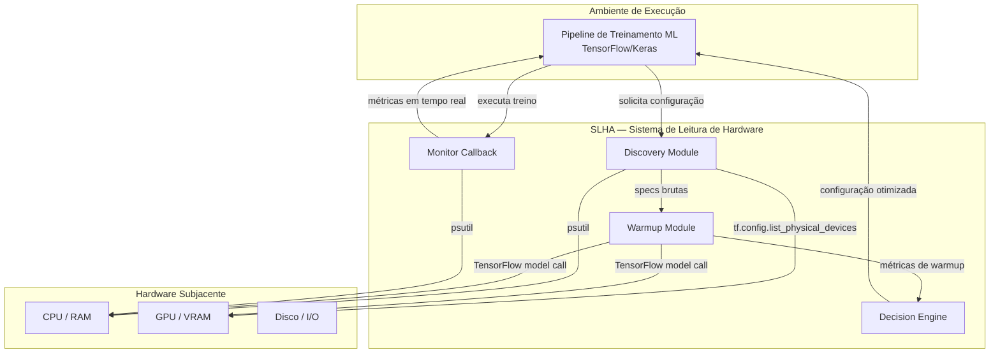
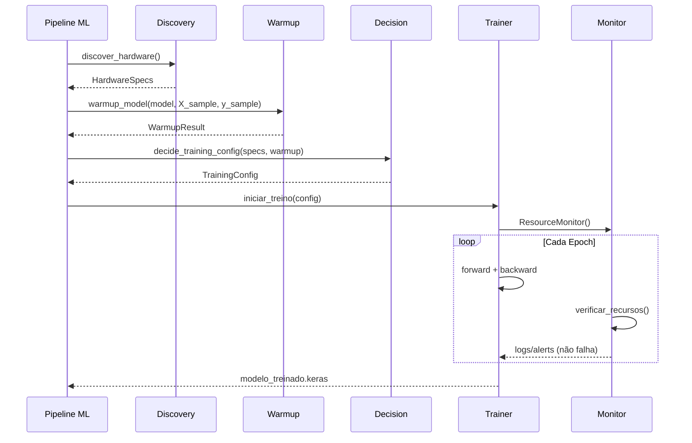

# SDD — Sistema de Leitura de Hardware Automático no Circuito de Treinamento

**Versão:** 2.0  
**Data:** 2026-06-20  
**Autor:** douglas-souza (IdeaPad 3 15ITL6)  
**Projeto:** Project-Lewis — Pipeline de Treinamento ML para ECG em Edge  
**Status:** Adaptado e integrado ao Project-Lewis

---

## 1. Visão Geral

### 1.1 Propósito

Este documento especifica o design arquitetural do **Sistema de Leitura de Hardware Automático (SLHA)**, módulo interno responsável por detectar, caracterizar e otimizar automaticamente o uso de recursos computacionais (CPU, RAM, GPU/VRAM) **antes e durante o treinamento de modelos TensorFlow/Keras** do Project-Lewis.

> **Nota de compatibilidade:** esta é a versão **adaptada** do SLHA para o Project-Lewis. A versão 1.0 previa uma stack genérica baseada em PyTorch Lightning e Python 3.13. Após análise de impacto, o módulo foi reescrito para respeitar a stack aprovada do projeto: **Python 3.12 + TensorFlow 2.21 + uv**.

### 1.2 Escopo

- **Inclui:** auto-detecção de hardware, profiling de warmup, estimativa de batch size, seleção de accelerator/precision e monitoramento contínuo durante o treino.
- **Exclui:** orquestração multi-nó, DDP/FSDP, ferramentas externas de profiling (Nsight, DLProf, LOTUS, JAX), interface gráfica e suporte a frameworks diferentes de TensorFlow/Keras.

### 1.3 Público-Alvo

Engenheiros de Software e Cientistas de Dados que operam o pipeline de treinamento do Project-Lewis em ambiente Linux local (Zorin OS / Ubuntu 24.04 LTS, WSL2 ou container Docker).

### 1.4 Referências

- `AGENTS.md` — Regras de ouro e stack aprovada do Project-Lewis
- `docs/Camada-04-Modelagem-v1.1.md` — Modelagem TensorFlow/Keras
- `docs/Camada-07-Integracao-DevOps-v1.1.md` — uv, CI/CD, Quality Gates
- TensorFlow 2.21 Documentation — `tf.config.list_physical_devices`, mixed precision
- PyTorch Lightning 2.0+ Documentation — *apenas como referência conceitual; não utilizado*

---

## 2. Glossário

| Termo | Definição |
|-------|-----------|
| **SLHA** | Sistema de Leitura de Hardware Automático |
| **Discovery** | Fase de coleta bruta de especificações do sistema |
| **Warmup** | Execução de 1-2 batches para medição de memória e latência |
| **Decision** | Fase de otimização e configuração automática |
| **Monitor** | Callback Keras que loga recursos a cada epoch |
| **Circuit** | Pipeline de treinamento propriamente dito |
| **Quality Gate** | Checkpoint de verificação obrigatória antes de avançar de fase |
| **Fallback** | Estratégia de contingência quando GPU não está disponível |

---

## 3. Requisitos Funcionais (RF)

| ID | Requisito | Prioridade | Fase |
|----|-----------|------------|------|
| RF-01 | Detectar automaticamente CPU, cores, frequência, flags SIMD | Alta | Discovery |
| RF-02 | Detectar automaticamente GPU(s), VRAM, compute capability via TensorFlow | Alta | Discovery |
| RF-03 | Detectar automaticamente RAM total e disponível | Alta | Discovery |
| RF-04 | Calcular batch size máxima estimada com base no hardware | Alta | Decision |
| RF-05 | Selecionar automaticamente accelerator (`cpu`, `gpu`) | Alta | Decision |
| RF-06 | Selecionar automaticamente precision (`float32`, `mixed_float16`) | Média | Decision |
| RF-07 | Executar warmup sem modificação de código do treino | Alta | Warmup |
| RF-08 | Monitorar utilização de CPU/RAM durante o treinamento em tempo real | Alta | Monitor |
| RF-09 | Emitir alertas quando recursos estiverem críticos | Média | Monitor |
| RF-10 | Registrar logs estruturados de todas as fases para auditoria | Alta | Todas |
| RF-11 | Implementar fallback robusto para CPU-only quando GPU indisponível | Alta | Discovery |
| RF-12 | Ser opt-in: não alterar comportamento padrão dos scripts de treino | Alta | Integração |

---

## 4. Requisitos Não-Funcionais (RNF)

| ID | Requisito | Métrica |
|----|-----------|---------|
| RNF-01 | Tempo de Discovery inferior a 2 segundos | < 2000ms |
| RNF-02 | Overhead de Warmup inferior a 5% do tempo de treino | < 5% |
| RNF-03 | Compatibilidade com Python 3.12 | Stack aprovada Project-Lewis |
| RNF-04 | Zero dependência de interface gráfica | Headless only |
| RNF-05 | Logs em formato JSON estruturado | 100% nos logs do Monitor |
| RNF-06 | Isolamento de falhas — falha no SLHA não quebra o treinamento | Graceful degradation |
| RNF-07 | Compatibilidade com WSL2, Linux bare-metal e containers Docker | Multi-platform |
| RNF-08 | Não adicionar PyTorch/Lightning, Nsight, DLProf, LOTUS, JAX, structlog | Stack aprovada |

---

## 5. Arquitetura de Alto Nível

### 5.1 Diagrama de Contexto



### 5.2 Diagrama de Sequência — Fluxo Completo



---

## 6. Especificação Técnica por Camada

### 6.1 Layer 1 — Discovery Module

**Responsabilidade:** Coletar especificações brutas do hardware sem execução de código de treino.

**Componentes:**

| Componente | Biblioteca | Saída |
|------------|------------|-------|
| CPU Reader | `psutil` | cores físicos/lógicos, frequência, flags SIMD |
| GPU Reader | `tensorflow.config` | nome, count, VRAM, compute capability |
| RAM Reader | `psutil` | total, disponível, percentual de uso |
| Disk Reader | `psutil` | espaço total/disponível |
| OS Reader | `platform`, `socket` | hostname, kernel, arquitetura |

**Estrutura de Dados de Saída:**

```json
{
  "timestamp": "2026-06-20T02:52:00Z",
  "hostname": "ideapad-3",
  "os": "Linux 6.17.0-35-generic",
  "cpu": {
    "physical_cores": 4,
    "logical_cores": 8,
    "max_freq_mhz": 4200,
    "architecture": "x86_64",
    "flags": ["avx2", "sse4_2", "fma"]
  },
  "gpu": {
    "available": false,
    "count": 0,
    "devices": []
  },
  "ram": {
    "total_gb": 15.6,
    "available_gb": 8.2,
    "percent_used": 47.4
  },
  "disk": {
    "total_gb": 512.0,
    "available_gb": 234.5
  }
}
```

**Quality Gate SLHA-Discovery:**
- [ ] JSON válido e completo gerado em < 2s
- [ ] Fallback para CPU-only quando GPU indisponível
- [ ] Flags SIMD identificadas para decisão de otimizações numéricas

---

### 6.2 Layer 2 — Warmup Module

**Responsabilidade:** Caracterizar performance real do hardware executando 1-2 batches do modelo real.

**Estratégia:**

| Estratégia | Quando Usar | Ferramenta |
|------------|-------------|------------|
| Warmup Interno | Sempre | 1-2 batches do modelo real com `tf.GradientTape` não treinável |

**Métricas Coletadas:**

```json
{
  "batch_time_ms": 45.2,
  "samples_per_second": 88.5,
  "peak_ram_mb": 256.0,
  "estimated_memory_per_sample_mb": 4.0
}
```

**Quality Gate SLHA-Warmup:**
- [ ] Warmup executado sem erro em < 30s
- [ ] Memória por amostra estimada ≥ 0
- [ ] Não modifica pesos do modelo

---

### 6.3 Layer 3 — Decision Engine

**Responsabilidade:** Calcular configuração ótima de treinamento com base nos dados das camadas anteriores.

**Algoritmos:**

#### 6.3.1 Batch Size Estimator

```
usable_memory = total_memory * 0.75        # reserva 25% para overhead
batch_max = usable_memory / mem_por_amostra
batch_size = max(1, min(batch_max, batch_referencia))
```

#### 6.3.2 Accelerator Selector

| Condição | Accelerator | Motivação |
|----------|-------------|-----------|
| GPU detectada pelo TF | `gpu` | Usar CUDA/MPS se disponível |
| GPU indisponível | `cpu` | Fallback automático |

#### 6.3.3 Precision Tuner

| Hardware | Precision | Justificativa |
|----------|-----------|---------------|
| GPU com compute capability ≥ 7.0 | `mixed_float16` | Tensor Cores / FP16 eficiente |
| GPU sem compute capability conhecido | `float32` | Estabilidade numérica |
| CPU-only | `float32` | Sem suporte a AMP |

**Estrutura de Dados de Saída:**

```json
{
  "accelerator": "cpu",
  "strategy": "single_device",
  "devices": 1,
  "batch_size": 32,
  "precision": "float32",
  "num_workers": 4,
  "pin_memory": false,
  "gradient_clip_val": 1.0,
  "accumulate_grad_batches": 1
}
```

**Quality Gate SLHA-Decision:**
- [ ] Configuração validada contra specs do Discovery
- [ ] Batch size ≥ 1
- [ ] Accelerator compatível com hardware detectado

---

### 6.4 Layer 4 — Monitor Callback

**Responsabilidade:** Monitorar recursos em tempo real durante o treinamento e emitir alertas/ajustes.

**Callbacks Implementados:**

| Callback | Gatilho | Ação |
|----------|---------|------|
| `ResourceMonitor` | A cada epoch | Log de CPU/RAM/GPU em JSONL |
| `CPUAlert` | CPU > 95% | Alerta no campo `alerts` |

**Estrutura de Log:**

```json
{
  "epoch": 3,
  "timestamp": "2026-06-20T03:15:00Z",
  "cpu_percent": 45.0,
  "ram_used_gb": 10.2,
  "gpu_utilization_percent": null,
  "gpu_memory_used_mb": null,
  "gpu_memory_total_mb": null,
  "alerts": []
}
```

**Quality Gate SLHA-Monitor:**
- [ ] Callback registrado em 100% das epochs
- [ ] Falha no callback não interrompe o treino
- [ ] Logs persistidos em disco quando `log_path` fornecido

---

## 7. Stack Tecnológico

| Categoria | Tecnologia | Versão | Justificativa |
|-----------|-----------|--------|---------------|
| Linguagem | Python | 3.12.x | Stack aprovada Project-Lewis (`AGENTS.md` veta 3.13+) |
| ML Framework | TensorFlow / Keras | 2.21+ | Stack aprovada; TFLM compatível |
| CPU/RAM | psutil | 7.0+ | Padrão de mercado, headless |
| GPU Info | `tf.config.experimental.get_device_details` | nativo | Sem dependência extra obrigatória |
| GPU Info (opcional) | pynvml / nvidia-ml-py | 12.0+ | Apenas para VRAM detalhada; import lazy |
| Logging | logging padrão Python | built-in | Segue padrão do projeto |
| Config | Pydantic | 2.10+ | Já é dependência do projeto |
| Gerenciador | uv | nativo | Lockfile determinístico |

---

## 8. Fluxo de Dados (Data Flow)


**Formatos de Intercâmbio:**
- `HardwareSpecs`, `TrainingConfig`, `ResourceLog` — objetos Pydantic validados em memória
- `.jsonl` — logs de auditoria do Monitor (JSON Lines)

---

## 9. Quality Gates — Verificações Obrigatórias por Fase

> Os Quality Gates do Project-Lewis permanecem **QG0–QG19** (`AGENTS.md`, `README.md`). Os gates abaixo são verificações internas do SLHA e **não substituem** os gates existentes.

### Fase 1: Discovery (SLHA-Discovery)

| # | Verificação | Critério de Aceitação | Método |
|---|-------------|----------------------|--------|
| 1.1 | Coleta de CPU | Cores físicos/lógicos, frequência, flags identificados | Assert JSON não nulo |
| 1.2 | Coleta de GPU | Se disponível: nome, VRAM, compute capability | Assert `tf.config` OK |
| 1.3 | Coleta de RAM | Total e disponível em GB, percentual de uso | Assert psutil OK |
| 1.4 | Fallback CPU-only | Quando GPU indisponível, sistema continua funcional | Teste em máquina sem GPU |
| 1.5 | Performance | Tempo total de discovery < 2 segundos | Benchmark |

### Fase 2: Warmup (SLHA-Warmup)

| # | Verificação | Critério de Aceitação | Método |
|---|-------------|----------------------|--------|
| 2.1 | Warmup sem erro | 1-2 batches executados com sucesso | Try/except + assert |
| 2.2 | Sem alteração de pesos | Pesos do modelo permanecem inalterados | Assert pesos iguais |
| 2.3 | Estimativa de memória | Valor ≥ 0 e coerente | Assert matemático |

### Fase 3: Decision (SLHA-Decision)

| # | Verificação | Critério de Aceitação | Método |
|---|-------------|----------------------|--------|
| 3.1 | Consistência | Configuração compatível com specs do Discovery | Cross-reference |
| 3.2 | Batch size válida | Valor ≥ 1 | Assert matemático |
| 3.3 | Precision válida | `mixed_float16` apenas se GPU suportar | Assert compute capability |

### Fase 4: Monitor (SLHA-Monitor)

| # | Verificação | Critério de Aceitação | Método |
|---|-------------|----------------------|--------|
| 4.1 | Monitoramento ativo | Callbacks registrados em 100% das epochs | Assert registry |
| 4.2 | Persistência | Logs salvos em disco a cada epoch | Assert file exists |
| 4.3 | Graceful degradation | Falha no monitor não interrompe o treino | Teste de injeção de falha |

---

## 10. Riscos e Mitigações

| Risco | Probabilidade | Impacto | Mitigação |
|-------|---------------|---------|-----------|
| GPU indisponível (CPU-only) | Alta no IdeaPad 3 | Média | Fallback automático para `cpu`/`float32` |
| WSL2 sem passthrough GPU | Alta | Média | Detectar WSL2; fallback para CPU; documentar limitação |
| psutil retornar valores inesperados | Baixa | Média | Try/except com valores default; schemas validam ranges |
| Warmup consumir memória excessiva | Baixa | Média | Batch pequeno, max_batches=2, timeout de 30s |
| Falha no SLHA quebrar treino existente | Baixa | Crítica | Integração opt-in; isolamento de falhas nos callbacks |

---

## 11. Checklist de Implantação

### Pré-requisitos
- [ ] Python 3.12 instalado e acessível (`python --version`)
- [ ] Ambiente uv ativado (`make env`)
- [ ] `uv sync --frozen` executado com sucesso

### Instalação de Dependências

As dependências já estão declaradas no `pyproject.toml`. Nenhuma instalação manual é necessária além de:

```bash
make env
```

A única dependência nova obrigatória é `psutil`. `pynvml` é opcional e só necessária para detalhes extras de VRAM.

### Validação Pós-Instalação

```bash
python -c "from src.models.slha import discover_hardware; print(discover_hardware().model_dump_json(indent=2))"
python -m pytest tests/test_slha_*.py -v
```

### Execução do Sistema

```python
# Uso opt-in no pré-treino
from src.models import pretrain_chapman
pretrain_chapman(..., use_slha=True)

# Uso opt-in no fine-tuning
from src.models import finetune_mitbih
finetune_mitbih(..., use_slha=True)
```

---

## 12. Anexos

### Anexo A: Compatibilidade com Project-Lewis

| Aspecto | Documento v1.0 (genérico) | Esta versão (adaptada) |
|---------|---------------------------|------------------------|
| Framework | PyTorch Lightning 2.5+ | TensorFlow/Keras 2.21+ |
| Python | 3.13 LTS | 3.12.x (fixo) |
| Gerenciador | pip | uv |
| GPU Info | pynvml / torch.cuda | tf.config + pynvml opcional |
| Profiling | Nsight, DLProf, LOTUS, JAX | Warmup interno com TensorFlow |
| Strategy | ddp / fsdp / single_device | `single_device` apenas |
| Precision | 16-mixed / bf16 / 32 | `mixed_float16` / `float32` |
| Logging | structlog | logging padrão Python |
| Quality Gates | QG-01..QG-04 | SLHA-Discovery/Warmup/Decision/Monitor (não conflitam com QG0..QG19) |
| Diretório | `slha/` na raiz | `src/models/slha/` |

### Anexo B: Flags SIMD e Otimizações

| Flag | Significado | Impacto no ML |
|------|-------------|---------------|
| AVX2 | Advanced Vector Extensions 2 | 256-bit ops, acelera matmul em CPU |
| AVX-512 | 512-bit vector ops | 2× throughput vs AVX2 (servidores Xeon) |
| FMA | Fused Multiply-Add | Precisão e velocidade em convoluções |
| SSE4.2 | Streaming SIMD Extensions | Compatibilidade legacy |

### Anexo C: Estrutura de Diretórios do Módulo

```
src/models/slha/
├── __init__.py          # exporta auto_configure_training, módulos
├── discovery.py         # orquestrador + readers
├── warmup.py            # warmup interno
├── decision.py          # batch / accelerator / precision
├── monitor.py           # callback Keras
├── schemas.py           # Pydantic models
└── exceptions.py        # exceções customizadas

tests/
├── test_slha_discovery.py
├── test_slha_warmup.py
├── test_slha_decision.py
├── test_slha_monitor.py
└── test_slha_integration.py
```

---

## 13. Histórico de Revisões

| Versão | Data | Autor | Alterações |
|--------|------|-------|------------|
| 1.0 | 2026-06-20 | douglas-souza | Versão inicial genérica com PyTorch Lightning |
| 2.0 | 2026-06-20 | douglas-souza | Adaptação para Project-Lewis: TensorFlow/Keras, Python 3.12, uv, stack aprovada |

---

*Documento atualizado para refletir a implementação real do SLHA no Project-Lewis, mantendo compatibilidade com `AGENTS.md`, `README.md` e os Quality Gates QG0–QG19.*
