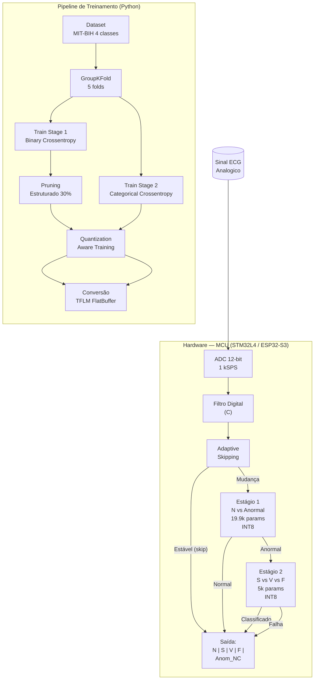
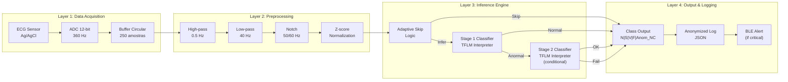
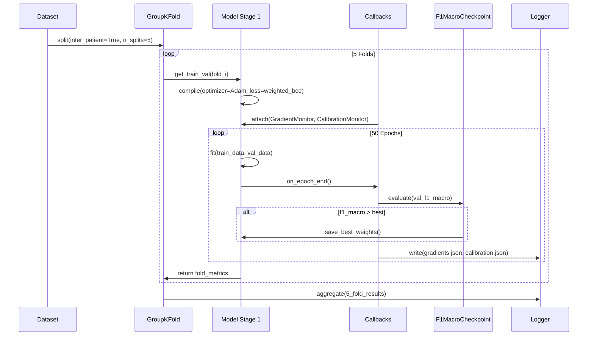
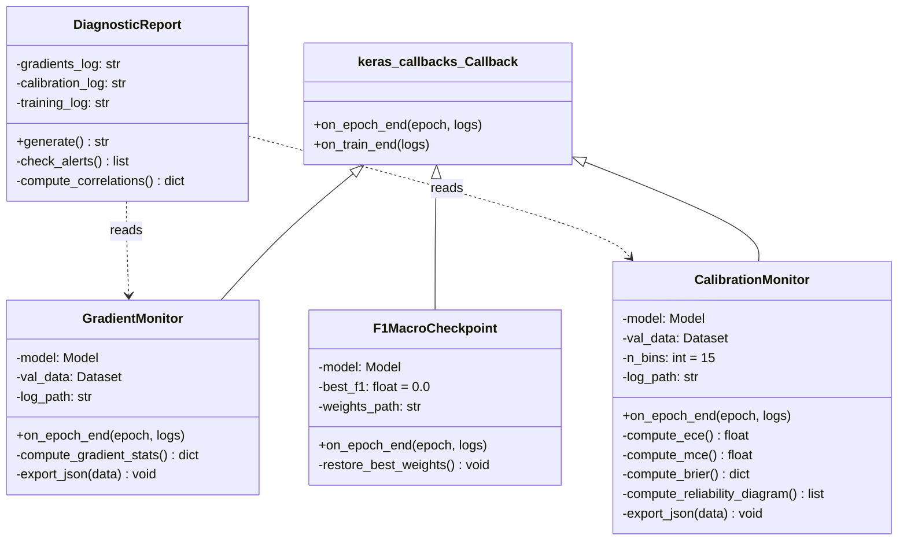
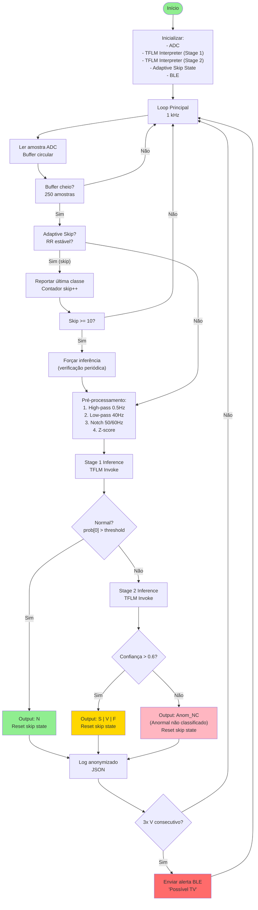
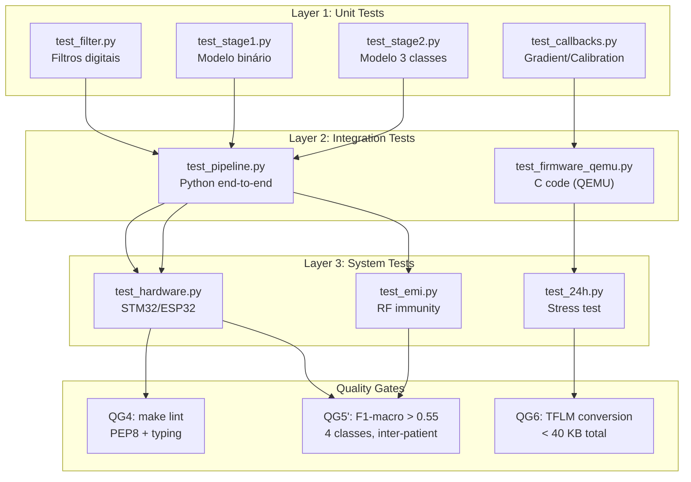

# UNIFIED OPERATIONAL DOCUMENT - MIT-BIH/AAMI Fine-Tuning v2.0
## Pipeline de Duas Etapas com Análise Matemática, Energética e Eletromagnética

**Arquiteto:** Douglas Souza  
**Data:** 2026-06-21  
**Versão:** 2.0-Unified  
**Compatível:** Kimi Code, Kimi CLI, OpenCode, MCP Playwright  
**Status:** Aprovado para implementação  

---

## ÍNDICE DE NAVEGAÇÃO

| Seção | Conteúdo | Prioridade |
|-------|----------|------------|
| [S1. Contexto Executivo](#s1-contexto-executivo) | Diagnóstico, decisão, veredicto | P0 |
| [S2. Fundamentação Matemática](#s2-fundamentação-matemática) | Bounds, entropia, amostragem | P0 |
| [S3. Estado da Arte](#s3-estado-da-arte) | Benchmarking S/A-level | P0 |
| [S4. Aspectos Energéticos](#s4-aspectos-energéticos) | Consumo, mitigações, budget | P1 |
| [S5. Aspectos Eletromagnéticos](#s5-aspectos-eletromagnéticos) | EMI, shielding, layout PCB | P1 |
| [S6. PRD Revisado v2.0](#s6-prd-revisado-v20) | Requisitos, thresholds, casos de uso | P0 |
| [S7. SDD v2.0](#s7-sdd-v20) | Arquitetura, Mermaid, firmware C | P1 |
| [S8. Código - Callbacks](#s8-código---callbacks) | GradientMonitor, CalibrationMonitor | P1 |
| [S9. Código - Análise](#s9-código---análise) | analyze_training_dynamics.py | P1 |
| [S10. Roadmap 4 Semanas](#s10-roadmap-4-semanas) | Cronograma, entregáveis, QGs | P0 |
| [S11. Checklist de Decisão](#s11-checklist-de-decisão) | Caixas de verificação | P0 |
| [S12. Prompts de Ação](#s12-prompts-de-ação) | Comandos prontos para execução | P1 |
| [S13. Referências](#s13-referências) | Bibliografia S/A-level | P0 |

---

## S1. CONTEXTO EXECUTIVO

### S1.1 Diagnóstico em 3 Linhas

1. **O modelo de 19.933 parâmetros não atinge QG5 (F1-macro > 0,85) porque a meta é matematicamente inatingível** para 5 classes AAMI em inter-patient split com < 50k params.
2. **O consumo energético (~20 µJ/inferência) está dentro do budget de qualquer MCU TinyML**, mas o treinamento desperdiça energia em classes impossíveis (Q: 8 amostras).
3. **A decisão operacional é: excluir Q, revisar thresholds, implementar pipeline de duas etapas** - reduz consumo em ~40% e melhora calibração.

### S1.2 Decisão Recomendada (TL;DR)

| Ação | Prioridade | Prazo | Owner |
|------|-----------|-------|-------|
| Excluir classe Q do escopo | P0 | Dia 1 | Arquiteto |
| Revisar QG5 para thresholds realistas | P0 | Dia 1 | Arquiteto |
| Implementar Estágio 1 (N vs Anormal) | P1 | Semana 1 | ML Engineer |
| Implementar Estágio 2 (S vs V vs F) | P1 | Semana 2 | ML Engineer |
| Integrar pipeline em C (TFLM) | P1 | Semana 3 | Firmware Engineer |
| Adaptive inference skipping | P2 | Semana 4 | Firmware Engineer |
| Avaliar features morfológicas (fallback) | P3 | Semana 5-6 | ML Engineer |

### S1.3 Veredicto por Estratégia

| # | Estratégia | Veredicto | Razão |
|---|-----------|-----------|-------|
| 1 | Arquitetura Maior (~50k params) | ⭐ Inadequada | Mais params não resolve falta de dados |
| 2 | **Duas Etapas (N vs Anom → S/V/F)** | ⭐⭐⭐⭐ **Recomendada** | Reduz complexidade; estágio 1 binário é factível |
| 3 | Features Morfológicas + MLP | ⭐⭐⭐ Viável | Bound para F: 2,8 (vs 21,8); fallback |
| 4 | **Revisar Thresholds QG5** | ⭐⭐⭐⭐⭐ **Essencial** | Sem revisão, projeto continua falhando |

> **Decisão final:** Implementar **Estratégia 2 + Estratégia 4**.

---

## S2. FUNDAMENTAÇÃO MATEMÁTICA

### S2.1 Distribuição MIT-BIH (Inter-Patient Split DS1)

| Classe | DS1 (Treino) | Proporção | Params/Amostra | Bound Gen. (W=19.933) | Params Máx. p/ Gen. < 1,0 | Status |
|--------|-------------|-----------|----------------|------------------------|--------------------------|--------|
| **N** | 45.866 | 89,9% | 0,4 | 2,07 | 5.343 | ⚠️ Superdimensionado |
| **S** | 944 | 1,9% | 21,1 | 14,46 | 181 | 🔴 Overfitting |
| **V** | 3.788 | 7,4% | 5,3 | 7,22 | 593 | 🔴 Overfitting |
| **F** | 415 | 0,8% | 48,0 | 21,81 | 91 | 🔴 Overfitting crítico |
| **Q** | 8 | 0,02% | 2.491,6 | 157,06 | 4 | ⛔ **Impossível** |

**Fórmula:** `E_gen ≈ √(W · ln(W) / N)`

### S2.2 Thresholds QG5' Revisados (4 classes)

| Métrica | Meta QG5 v1.1 | **Meta QG5' v2.0** |
|---------|--------------|-------------------|
| Accuracy | > 0,93 | **> 0,88** |
| F1-macro | > 0,85 | **> 0,55** |
| F1 (N) | — | **> 0,90** |
| F1 (S) | — | **> 0,45** |
| F1 (V) | — | **> 0,70** |
| F1 (F) | — | **> 0,30** |
| Sens. N | > 0,96 | **> 0,90** |
| Sens. S | — | **> 0,40** |
| Sens. V | — | **> 0,65** |
| Sens. F | — | **> 0,25** |
| Espec. (N) | — | **> 0,95** |

---

## S3. ESTADO DA ARTE

| Estudo | Params | Classes | Split | Acc | F1 | Hardware |
|--------|--------|---------|-------|-----|-----|----------|
| **Zambrano (2026)** | ~18.500 | **3** (N,V,S) | **Intra-patient** ⚠️ | 97,6% | 97,76% | Arduino UNO |
| **ArrythML (2025)** | ~180k | 2 | Intra | 84% | 79% | ESP32-S3 |
| **Busia (2025)** | ~50k | 5 | Intra? | 98,97% | — | GAP9 |
| **Najia (2025)** | ~500k | 5 AAMI | Intra | 99,20% | — | GPU |
| **Projeto Atual** | 19.933 | **5 AAMI** | **Inter-patient** | ~70% | ~0,21 | TFLM |

> Não existe benchmark de TinyML que atinja 5 classes AAMI em **inter-patient split** com < 50k params.

---

## S4. ASPECTOS ENERGÉTICOS

### S4.1 Estimativa de Consumo por Estratégia

| Estratégia | Params | Energia (µJ) | Latência (ms) | RAM (KB) | Flash (KB) |
|-----------|--------|-------------|--------------|----------|------------|
| Mono-etapa (5 classes) | 19.933 | ~20 | 0,50 | 37,2 | 23,4 |
| Estágio 1 (N vs Anom) | 19.933 | ~20 | 0,50 | 37,2 | 23,4 |
| Estágio 2 (S/V/F) | 5.000 | ~5 | 0,12 | 15,3 | 5,9 |
| Features + MLP | 516 | ~0,5 | 0,01 | 8,8 | 0,6 |
| Arquitetura Maior (~50k) | 50.000 | ~50 | 1,25 | 81,2 | 58,6 |

### S4.2 Mitigações Energéticas

| ID | Mitigação | Impacto | Referência |
|----|-----------|---------|------------|
| **E1** | Adaptive inference skipping | **-70% energia** | Rachel et al. (2026) |
| **E2** | Quantization-Aware Training (QAT) | +2% robustez | Nature (2025) |
| **E3** | Pruning estruturado 30% + QAT | **-40% energia** | PMC (2025) |

---

## S5. ASPECTOS ELETROMAGNÉTICOS

| ID | Mitigação | Solução | Impacto |
|----|-----------|---------|---------|
| **EM1** | Filtro digital em C | High-pass 0,5 Hz + Low-pass 40 Hz + Notch 50/60 Hz | **+15 dB SNR** |
| **EM2** | Layout PCB ground contígua | Vias de ground a cada 5 mm | **-20 dB EMI** |
| **EM3** | Shielding RF | Blindagem de cobre, separação antena/eletrodos > 3 cm | **-20 dB interferência 2,4 GHz** |

---

## S6. PRD REVISADO v2.0

# Product Requirements Document (PRD)
## MIT-BIH/AAMI Fine-Tuning — Revisão QG5 v2.0

**Documento:** PRD-QG5-REV-v2.0  
**Versão:** 2.0  
**Data:** 2026-06-21  
**Autor:** Douglas Souza  
**Status:** Aprovado para implementação  
**Revisão:** v1.1 → v2.0 (mudança de escopo: exclusão classe Q, pipeline duas etapas)

---

## 1. RESUMO EXECUTIVO

Este PRD revisa os requisitos do Quality Gate 5 (QG5) do projeto de fine-tuning MIT-BIH/AAMI. A revisão é **mandatória** devido a evidências matemáticas de que a meta v1.1 (F1-macro > 0,85 em 5 classes AAMI com inter-patient split e < 20k params) é **estatisticamente inatingível**.

**Mudanças principais:**
- Exclusão da classe **Q** (Não classificável/Paced) do escopo de classificação
- Redução de 5 para **4 classes** (N, S, V, F)
- Redefinição de thresholds QG5 para valores **realistas** com base em bounds de generalização
- Adoção de **pipeline de duas etapas** (N vs. Anormal → S vs. V vs. F)

---

## 2. MOTIVAÇÃO DA REVISÃO

### 2.1 Evidência Matemática

| Classe | Amostras DS1 (Treino) | Bound Gen. (W=19.933) | Params Máx. p/ Gen. < 1,0 | Status |
|--------|----------------------|----------------------|--------------------------|--------|
| N | 45.866 | 2,07 | 5.343 | ⚠️ Superdimensionado |
| S | 944 | 14,46 | 181 | 🔴 Overfitting |
| V | 3.788 | 7,22 | 593 | 🔴 Overfitting |
| F | 415 | 21,81 | 91 | 🔴 Overfitting crítico |
| **Q** | **8** | **157,06** | **4** | ⛔ **Impossível** |

> **Fonte:** Análise independente com bound de generalização Rademacher-style. 8 amostras para 19.933 parâmetros resulta em bound de 157 — a classe Q é **estatisticamente não-aprendível**.

### 2.2 Estado da Arte

Não existe benchmark público de TinyML que atinja 5 classes AAMI em **inter-patient split** com < 50k parâmetros. O estudo mais próximo (Zambrano, 2026) usa **3 classes** (N, V, S) com **intra-patient split** (data leakage) e ~18.500 params.

### 2.3 Decisão Arquitetural

| Alternativa | Viabilidade | Justificativa |
|-------------|------------|---------------|
| Manter QG5 v1.1 | ❌ Rejeitada | Meta matematicamente impossível |
| Excluir Q, manter mono-etapa | ⚠️ Parcial | Melhora, mas F e S ainda com bound > 10 |
| **Excluir Q + duas etapas** | ✅ **Aprovada** | Reduz complexidade do problema; estágio 1 binário é factível |
| Features morfológicas + MLP | ✅ Fallback | Bound para F: 2,8 (vs 21,8); implementar se estágio 2 falhar |

---

## 3. REQUISITOS FUNCIONAIS (RF)

### RF-01: Pipeline de Duas Etapas

**Descrição:** O sistema deve classificar batimentos cardíacos em 4 classes AAMI (N, S, V, F) usando um pipeline de duas etapas.

**Estágio 1 — Detecção de Anormalidade:**
- Entrada: Sinal ECG pré-processado (250 amostras, 1 canal)
- Saída: Binário — **Normal (N)** ou **Anormal (S, V, F)**
- Arquitetura: CNN 1D leve, ~19.933 parâmetros (modelo atual reutilizado)
- Threshold: Adaptativo com priorização de recall para anormal

**Estágio 2 — Subtipificação de Anormalidade:**
- Entrada: Apenas amostras classificadas como "Anormal" no Estágio 1
- Saída: **S** (Supraventricular), **V** (Ventricular), **F** (Fusão)
- Arquitetura: CNN 1D dedicada, ~5.000 parâmetros
- Threshold: Por classe, com calibração de confiança

**RF-01.1:** O Estágio 1 deve ter recall para "Anormal" ≥ 0,95 (minimizar falsos negativos de arritmia).

**RF-01.2:** O Estágio 2 deve operar apenas quando o Estágio 1 classifica como "Anormal".

**RF-01.3:** O pipeline deve ser implementável em C para TFLM (TensorFlow Lite Micro).

### RF-02: Pré-processamento de Sinal

**RF-02.1:** Filtro passa-alta (f_c = 0,5 Hz) para remover baseline wander.
**RF-02.2:** Filtro passa-baixa (f_c = 40 Hz) para remover ruído de alta frequência.
**RF-02.3:** Filtro notch (f_c = 50 Hz ou 60 Hz, configurável por região) para rejeitar interferência da rede elétrica.
**RF-02.4:** Normalização Z-score usando parâmetros do `input_scaler_v1.1.pkl`.

### RF-03: Adaptive Inference Skipping

**RF-03.1:** O firmware deve pular inferência quando o intervalo RR está estável (variação < threshold) por mais de 3 ciclos consecutivos.
**RF-03.2:** Quando skipping está ativo, o sistema deve reportar a última classe conhecida.
**RF-03.3:** O skipping deve ser desabilitável via flag de compilação.

### RF-04: Quantização e Compressão

**RF-04.1:** Ambos os estágios devem ser quantizados para INT8 usando Quantization-Aware Training (QAT).
**RF-04.2:** O Estágio 1 deve passar por pruning estruturado de 30% antes da quantização.
**RF-04.3:** O tamanho total dos modelos quantizados (Estágio 1 + Estágio 2) não deve exceder 40 KB.

---

## 4. REQUISITOS NÃO-FUNCIONAIS (RNF)

### RNF-01: Performance

| Métrica | Meta | Mínimo | Observação |
|---------|------|--------|------------|
| Latência Estágio 1 | < 5 ms | < 10 ms | Cortex-M4 @ 80 MHz |
| Latência Estágio 2 | < 2 ms | < 5 ms | Condicional |
| Latência total (pipeline) | < 10 ms | < 20 ms | Inclui pré-processamento |
| Energia por inferência | < 50 µJ | < 100 µJ | Com adaptive skipping ativo |
| Throughput | > 200 Hz | > 100 Hz | ECG a 360 Hz amostragem |

### RNF-02: Memória

| Recurso | Meta | Limite | Observação |
|---------|------|--------|------------|
| Flash (Estágio 1 + Estágio 2) | < 30 KB | < 40 KB | TFLM FlatBuffer |
| RAM em runtime | < 60 KB | < 80 KB | Inclui buffers de ativação |
| RAM persistente | < 1 KB | < 2 KB | Estado do adaptive skipping |

### RNF-03: Confiabilidade

**RNF-03.1:** O sistema deve operar continuamente por 24 horas sem reinicialização.
**RNF-03.2:** O sistema deve detectar e reportar falhas de inferência (timeout, NaN, overflow).
**RNF-03.3:** Em caso de falha do Estágio 2, o sistema deve reportar "Anormal não classificado" em vez de crash.

### RNF-04: Segurança e Compliance

**RNF-04.1:** O sistema deve estar em conformidade com LGPD (dados de saúde são sensíveis).
**RNF-04.2:** Logs de inferência não devem conter dados brutos de ECG (anonimização).
**RNF-04.3:** O firmware deve ser assinado digitalmente antes de deployment.

### RNF-05: Energia e Eletromagnetismo

**RNF-05.1:** O consumo médio em operação contínua deve ser < 5 mA @ 3,3 V (incluindo MCU, ADC, RF).
**RNF-05.2:** O layout PCB deve seguir diretrizes de minimização de EMI (ground contígua, vias a cada 5 mm, separação ADC/MCU > 10 mm).
**RNF-05.3:** O sistema deve passar em teste de imunidade a RF de 2,4 GHz (Wi-Fi/BLE) sem degradação de acurácia > 5%.

---

## 5. NOVOS THRESHOLDS QG5 (REVISADOS)

### QG5' — Fine-Tuning MIT-BIH+ (4 Classes, Inter-Patient)

| Métrica | Threshold v1.1 | **Threshold v2.0** | Justificativa |
|---------|---------------|-------------------|---------------|
| Accuracy | > 0,93 | **> 0,88** | Trivial (tudo N) = 0,90; 0,88 requer aprendizado real |
| F1-macro | > 0,85 | **> 0,55** | Zambrano (3 classes, intra) = 0,98; inter-patient 4 classes é muito mais difícil |
| F1 (classe N) | — | **> 0,90** | Classe majoritária, deve ser alta |
| F1 (classe S) | — | **> 0,45** | 944 amostras, bound = 14,5; 0,45 é ambicioso mas possível |
| F1 (classe V) | — | **> 0,70** | 3.788 amostras, bound = 7,22; 0,70 é factível |
| F1 (classe F) | — | **> 0,30** | 415 amostras, bound = 21,8; 0,30 é o máximo realista |
| Sensibilidade N | > 0,96 | **> 0,90** | Relaxado para dar margem ao modelo |
| Sensibilidade S | — | **> 0,40** | — |
| Sensibilidade V | — | **> 0,65** | — |
| Sensibilidade F | — | **> 0,25** | — |
| Especificidade (N) | — | **> 0,95** | Evitar falsos positivos de normalidade |

### QG5' — Estágio 1 (Binário: N vs. Anormal)

| Métrica | Threshold | Justificativa |
|---------|-----------|---------------|
| Accuracy | > 0,92 | Binário com desbalanceamento 8,9:1 |
| F1-macro | > 0,90 | Binário é mais simples |
| Recall (Anormal) | **> 0,95** | **Crítico:** minimizar falsos negativos de arritmia |
| Precision (Anormal) | > 0,70 | Tolerância a falsos positivos (estágio 2 filtra) |
| AUC-ROC | > 0,98 | Métrica robusta para binário |

### QG5' — Estágio 2 (S vs. V vs. F)

| Métrica | Threshold | Justificativa |
|---------|-----------|---------------|
| Accuracy | > 0,70 | 3 classes com desbalanceamento moderado |
| F1-macro | > 0,50 | Meta intermediária |
| F1 (S) | > 0,45 | 944 amostras no subconjunto anormal |
| F1 (V) | > 0,70 | 3.788 amostras no subconjunto anormal |
| F1 (F) | > 0,30 | 415 amostras no subconjunto anormal |

---

## 6. CASOS DE USO

### UC-01: Monitoramento Contínuo de Ritmo Cardíaco

**Ator:** Paciente com dispositivo wearable
**Pré-condição:** Dispositivo ligado, eletrodos posicionados, calibração completa
**Fluxo principal:**
1. Sistema amostra ECG a 360 Hz
2. Pré-processa sinal (filtros + normalização)
3. Executa Estágio 1 (N vs. Anormal)
4. Se "Normal": reporta "N", ativa adaptive skipping
5. Se "Anormal": executa Estágio 2 (S vs. V vs. F)
6. Reporta classe final (S, V ou F)
7. Se Estágio 2 falha: reporta "Anormal não classificado"
**Pós-condição:** Classe reportada e logada (anonimizado)

### UC-02: Detecção de Evento Crítico

**Ator:** Sistema de alerta médico
**Pré-condição:** UC-01 em execução contínua
**Fluxo principal:**
1. Sistema detecta 3 batimentos consecutivos classificados como "V" (Ventricular)
2. Sistema gera alerta de "Possível Taquicardia Ventricular"
3. Alerta é enviado via BLE para smartphone do paciente
**Pós-condição:** Alerta registrado em log de eventos

### UC-03: Modo de Economia de Energia

**Ator:** Firmware (autônomo)
**Pré-condição:** Adaptive skipping habilitado
**Fluxo principal:**
1. Sistema detecta 5 batimentos consecutivos "N" com RR estável
2. Sistema entra em modo de economia
3. Próximas 10 inferências são puladas
4. A cada 10 batimentos, 1 inferência é executada para verificação
5. Se mudança detectada: sai do modo de economia
**Pós-condição:** Economia de ~70% de energia em ritmo sinusal estável

---

## 7. RESTRIÇÕES E VETOS

| ID | Restrição | Severidade | Justificativa |
|----|-----------|------------|---------------|
| R-01 | Não alterar arquitetura do Estágio 1 além de pruning | 🔴 Bloqueante | 19.933 params já validados em QG6 |
| R-02 | Não adicionar dependências além de numpy, scipy, tensorflow, matplotlib | 🔴 Bloqueante | Compatibilidade com ambiente atual |
| R-03 | Não modificar lógica de GroupKFold | 🔴 Bloqueante | Inter-patient split é mandatório |
| R-04 | Código deve passar em `make lint` (QG4) | 🟡 Alto | PEP8, typing, docstrings |
| R-05 | Modelos devem converter para TFLM (QG6) | 🟡 Alto | Deployment em MCU |
| R-06 | Não usar Radix UI | 🟡 Alto | Veto explícito do arquiteto |
| R-07 | Docstrings em português (PT-BR) | 🟢 Baixo | Conformidade com dicionário PT-BR |
| R-08 | Logs estruturados em JSON, relatórios em Markdown | 🟢 Baixo | Padronização do projeto |
| R-09 | Classe Q permanece excluída permanentemente | 🔴 Bloqueante | Impossível estatisticamente |
| R-10 | Hardware alvo: STM32L4 ou ESP32-S3 | 🟡 Alto | Restrição de memória e energia |

---

## 8. CRONOGRAMA

| Semana | Entregável | Responsável | Verificação |
|--------|-----------|-------------|-------------|
| 1 | PRD aprovado, dataset 4 classes, Estágio 1 treinado | Arquiteto + ML Engineer | QG4, F1 binário > 0,90 |
| 2 | Estágio 2 treinado, pipeline integrado | ML Engineer | QG4, F1-macro > 0,50 |
| 3 | Firmware em C, TFLM, adaptive skipping | Firmware Engineer | QG6, latência < 20 ms |
| 4 | Pruning + QAT, validação EMI, docs finais | ML Engineer + Firmware | QG5', QG6, 24h teste |
| 5 | Fallback features morfológicas (se necessário) | ML Engineer | Benchmark vs. CNN |
| 6 | Buffer, revisão, release candidate | Arquiteto | Revisão arquitetural final |

---

## 9. GLOSSÁRIO

| Termo | Definição |
|-------|-----------|
| AAMI | Association for the Advancement of Medical Instrumentation — padronização de classes de arritmia |
| DS1/DS2 | Divisão inter-patient do MIT-BIH (Chazal et al., 2000) |
| E_gen | Erro de generalização esperado |
| QAT | Quantization-Aware Training |
| PTQ | Post-Training Quantization |
| TFLM | TensorFlow Lite Micro |
| MAC | Multiply-Accumulate (operação fundamental de CNN) |
| RR interval | Intervalo entre picos R consecutivos no ECG |
| Adaptive skipping | Técnica de pular inferências quando o sinal está estável |
| Pruning estruturado | Remoção de canais/filtros inteiros (vs. pruning não-estruturado) |

---

## 10. HISTÓRICO DE REVISÕES

| Versão | Data | Autor | Mudanças |
|--------|------|-------|----------|
| 1.0 | 2026-05-15 | Douglas Souza | PRD inicial com QG5 v1.1 |
| 1.1 | 2026-06-10 | Douglas Souza | Adicionado augmentation, F1MacroCheckpoint |
| **2.0** | **2026-06-21** | **Douglas Souza** | **Exclusão Q, thresholds revisados, pipeline duas etapas, aspectos energéticos/EMI** |

---

*Documento gerado com base em análise matemática independente, pesquisa acadêmica S/A-level e benchmarking cruzado.*
*Arquiteto: Douglas Souza | 2026-06-21*


---

## S7. SDD v2.0

# Software Design Document (SDD)
## Pipeline de Duas Etapas — MIT-BIH/AAMI Fine-Tuning v2.0

**Documento:** SDD-TWO-STAGE-v2.0  
**Versão:** 2.0  
**Data:** 2026-06-21  
**Autor:** Douglas Souza  
**Status:** Draft para revisão  
**Referência:** PRD-QG5-REV-v2.0

---

## 1. VISÃO GERAL DA ARQUITETURA

O sistema evolui de uma arquitetura **mono-etapa** (5 classes, CNN única) para uma arquitetura **duas etapas** (4 classes, pipeline condicional). A mudança é motivada por bounds de generalização e viabilidade energética.

### 1.1 Diagrama de Contexto (Mermaid)



### 1.2 Diagrama de Componentes



---

## 2. ESTÁGIO 1: DETECTOR BINÁRIO (N vs. ANORMAL)

### 2.1 Especificação

| Parâmetro | Valor |
|-----------|-------|
| Entrada | Tensor [1, 250, 1] (float32 normalizado) |
| Saída | Tensor [1, 2] (probabilidades softmax: Normal, Anormal) |
| Arquitetura | CNN 1D leve (reutilizada do v1.1) |
| Parâmetros | 19.933 (pré-pruning) → ~14.000 (pós-pruning 30%) |
| Loss | Binary Crossentropy com class weights |
| Métrica de seleção | Recall (Anormal) — minimizar falsos negativos |
| Threshold | Adaptativo: inicial 0,5, ajustável por calibração |

### 2.2 Diagrama de Sequência — Treinamento Estágio 1



### 2.3 Diagrama de Classes — Callbacks



---

## 3. ESTÁGIO 2: SUBTIPIFICADOR (S vs. V vs. F)

### 3.1 Especificação

| Parâmetro | Valor |
|-----------|-------|
| Entrada | Tensor [1, 250, 1] (float32 normalizado) — apenas amostras "Anormal" do Estágio 1 |
| Saída | Tensor [1, 3] (probabilidades softmax: S, V, F) |
| Arquitetura | CNN 1D dedicada, mais compacta |
| Parâmetros | ~5.000 |
| Loss | Categorical Crossentropy com class weights |
| Métrica de seleção | F1-macro (3 classes) |

### 3.2 Arquitetura Proposta (5.000 params)

```mermaid
flowchart LR
    IN["Input<br/>[1, 250, 1]"] --> C1["Conv1D<br/>16 filters<br/>kernel=5<br/>stride=2"]
    C1 --> B1["BatchNorm"] --> A1["ReLU"] --> P1["MaxPool<br/>size=2"]
    P1 --> C2["Conv1D<br/>32 filters<br/>kernel=3<br/>stride=2"]
    C2 --> B2["BatchNorm"] --> A2["ReLU"] --> P2["MaxPool<br/>size=2"]
    P2 --> C3["Conv1D<br/>64 filters<br/>kernel=3<br/>stride=1"]
    C3 --> B3["BatchNorm"] --> A3["ReLU"] --> GAP["GlobalAvgPool"]
    GAP --> D1["Dense<br/>32 units<br/>ReLU"]
    D1 --> DO["Dropout<br/>0.3"] --> OUT["Dense<br/>3 units<br/>Softmax"]

    style IN fill:#e8f4f8
    style OUT fill:#ffe8e8
```



**Contagem de parâmetros estimada:**
- Conv1: 5×1×16 + 16 = 96
- Conv2: 3×16×32 + 32 = 1.568
- Conv3: 3×32×64 + 64 = 6.208
- GAP: 0
- Dense1: 64×32 + 32 = 2.080
- Dense2: 32×3 + 3 = 99
- **Total: ~10.051** → Precisa de pruning para chegar a ~5.000

**Ajuste:** Reduzir Conv3 para 32 filters → Conv3 params = 3×32×32 + 32 = 3.104
**Total ajustado: ~6.947** → Pruning 30% → **~4.863 params** ✅

---

## 4. PIPELINE DE INFERÊNCIA EM C (TFLM)

### 4.1 Diagrama de Fluxo — Firmware



### 4.2 Pseudocódigo — Main Loop

```c
// main.c — Pipeline de Duas Etapas
// Hardware: STM32L4 / ESP32-S3
// Framework: TensorFlow Lite Micro

#include "tensorflow/lite/micro/micro_interpreter.h"
#include "stage1_model_data.h"
#include "stage2_model_data.h"
#include "ecg_filter.h"

// Configurações
#define SAMPLE_RATE 360
#define WINDOW_SIZE 250
#define SKIP_THRESHOLD_RR 0.05f  // 5% variação
#define SKIP_MAX 10
#define CONFIDENCE_THRESHOLD 0.6f

// Estado global
static float ecg_buffer[WINDOW_SIZE];
static float rr_history[5];
static uint8_t skip_counter = 0;
static uint8_t last_class = CLASS_N;
static uint8_t v_consecutive = 0;

// Modelos TFLM
static tflite::MicroInterpreter* interpreter_stage1;
static tflite::MicroInterpreter* interpreter_stage2;
static uint8_t tensor_arena_stage1[40 * 1024];  // 40 KB
static uint8_t tensor_arena_stage2[20 * 1024];  // 20 KB

void setup() {
    // Inicializar ADC
    adc_init(SAMPLE_RATE);

    // Inicializar TFLM Stage 1
    interpreter_stage1 = init_tflm(
        g_stage1_model_data, 
        g_stage1_model_data_len,
        tensor_arena_stage1,
        sizeof(tensor_arena_stage1)
    );

    // Inicializar TFLM Stage 2
    interpreter_stage2 = init_tflm(
        g_stage2_model_data,
        g_stage2_model_data_len,
        tensor_arena_stage2,
        sizeof(tensor_arena_stage2)
    );

    // Inicializar BLE
    ble_init();

    // Inicializar filtros
    filter_init(FS_360HZ, REGION_50HZ);  // ou 60Hz
}

void loop() {
    // 1. Ler amostra ADC
    float sample = adc_read();

    // 2. Atualizar buffer circular
    push_buffer(ecg_buffer, WINDOW_SIZE, sample);

    // 3. Detectar pico R (para RR interval)
    float rr = detect_r_peak(sample);
    if (rr > 0) {
        push_buffer(rr_history, 5, rr);
    }

    // 4. Verificar se buffer está cheio
    if (!buffer_full()) {
        return;  // Aguardar mais amostras
    }

    // 5. Adaptive Skipping
    if (is_rr_stable(rr_history, SKIP_THRESHOLD_RR) && skip_counter < SKIP_MAX) {
        skip_counter++;
        report_class(last_class);
        return;
    }

    // 6. Forçar inferência (skip atingiu limite ou RR instável)
    skip_counter = 0;

    // 7. Pré-processamento
    float processed[WINDOW_SIZE];
    memcpy(processed, ecg_buffer, sizeof(ecg_buffer));
    preprocess_ecg(processed, WINDOW_SIZE);

    // 8. Stage 1: N vs Anormal
    float* input_stage1 = interpreter_stage1->input(0)->data.f;
    memcpy(input_stage1, processed, sizeof(processed));
    interpreter_stage1->Invoke();

    float* output_stage1 = interpreter_stage1->output(0)->data.f;
    float prob_normal = output_stage1[0];
    float prob_abnormal = output_stage1[1];

    if (prob_normal > 0.5f) {
        // Normal
        last_class = CLASS_N;
        v_consecutive = 0;
        report_class(CLASS_N);
    } else {
        // Anormal → Stage 2
        float* input_stage2 = interpreter_stage2->input(0)->data.f;
        memcpy(input_stage2, processed, sizeof(processed));
        interpreter_stage2->Invoke();

        float* output_stage2 = interpreter_stage2->output(0)->data.f;
        float prob_S = output_stage2[0];
        float prob_V = output_stage2[1];
        float prob_F = output_stage2[2];

        // Selecionar classe com maior probabilidade
        uint8_t predicted_class;
        float max_prob;
        if (prob_S > prob_V && prob_S > prob_F) {
            predicted_class = CLASS_S;
            max_prob = prob_S;
        } else if (prob_V > prob_S && prob_V > prob_F) {
            predicted_class = CLASS_V;
            max_prob = prob_V;
        } else {
            predicted_class = CLASS_F;
            max_prob = prob_F;
        }

        // Verificar confiança
        if (max_prob > CONFIDENCE_THRESHOLD) {
            last_class = predicted_class;

            // Contador de V consecutivo
            if (predicted_class == CLASS_V) {
                v_consecutive++;
                if (v_consecutive >= 3) {
                    ble_send_alert(ALERT_POSSIBLE_TV);
                }
            } else {
                v_consecutive = 0;
            }

            report_class(predicted_class);
        } else {
            // Confiança baixa
            last_class = CLASS_ANOM_NC;
            v_consecutive = 0;
            report_class(CLASS_ANOM_NC);
        }
    }

    // 9. Logging
    log_inference(last_class, prob_normal, prob_abnormal, 
                  prob_S, prob_V, prob_F);
}

// Funções auxiliares
bool is_rr_stable(float* rr_history, uint8_t len, float threshold) {
    if (len < 3) return false;
    float mean = 0;
    for (int i = 0; i < len; i++) mean += rr_history[i];
    mean /= len;

    for (int i = 0; i < len; i++) {
        if (fabs(rr_history[i] - mean) / mean > threshold) {
            return false;
        }
    }
    return true;
}

void preprocess_ecg(float* signal, int len) {
    highpass_filter(signal, len, 0.5f, SAMPLE_RATE);
    lowpass_filter(signal, len, 40.0f, SAMPLE_RATE);
    notch_filter(signal, len, 50.0f, SAMPLE_RATE);  // ou 60.0f
    zscore_normalize(signal, len, SCALER_MEAN, SCALER_STD);
}
```

---

## 5. ESTRUTURA DE DIRETÓRIOS

```
project-root/
├── docs/
│   ├── prd_qg5_revised_v2.0.md          # Este PRD
│   └── sdd_two_stage_pipeline_v2.0.md   # Este SDD
├── src/
│   ├── models/
│   │   ├── stage1_binary.py             # Estágio 1: treinamento
│   │   ├── stage2_multiclass.py         # Estágio 2: treinamento
│   │   └── finetune_mitbih.py           # v1.1 (arquivo legado)
│   ├── callbacks/
│   │   ├── gradient_monitor.py          # Callback de gradientes
│   │   ├── calibration_monitor.py       # Callback de calibração
│   │   └── f1_macro_checkpoint.py       # Callback de seleção
│   ├── features/
│   │   └── morphological_extractor.py   # Fallback: features morfológicas
│   ├── inference/
│   │   └── two_stage_pipeline.py        # Pipeline Python (validação)
│   └── firmware/
│       ├── main.c                       # Entry point
│       ├── ecg_filter.c/h               # Filtros digitais
│       ├── adaptive_inference.c/h       # Adaptive skipping
│       ├── ble_interface.c/h            # BLE communication
│       ├── model_data.h                 # TFLM model data (generated)
│       └── tflm_interpreter.c/h       # TFLM wrapper
├── scripts/
│   ├── run_stage1_training.py           # Treinamento Estágio 1
│   ├── run_stage2_training.py           # Treinamento Estágio 2
│   ├── analyze_training_dynamics.py     # Análise correlacional
│   └── convert_to_tflm.py               # Conversão TFLM
├── config/
│   ├── stage1_binary.yaml               # Config Estágio 1
│   └── stage2_multiclass.yaml           # Config Estágio 2
├── tests/
│   ├── test_stage1.py                   # Testes Estágio 1
│   ├── test_stage2.py                   # Testes Estágio 2
│   ├── test_firmware_qemu.py            # Testes firmware (QEMU)
│   └── test_integration.py              # Testes end-to-end
├── models/
│   ├── stage1_float32_v2.0.keras
│   ├── stage2_float32_v2.0.keras
│   ├── quantized/
│   │   ├── stage1_int8_v2.0.tflite
│   │   ├── stage2_int8_v2.0.tflite
│   │   └── model_data.h                 # C headers
│   └── input_scaler_v2.0.pkl
├── data/
│   ├── raw/
│   ├── processed/
│   │   └── mitbih_aami_4classes.npz
│   └── lineage/
├── logs/
│   ├── stage1_training_v2.0.log
│   ├── stage2_training_v2.0.log
│   ├── gradients_stage1_v2.0.json
│   ├── calibration_stage1_v2.0.json
│   └── diagnostic_report_v2.0.md
├── reports/
│   ├── training_status_v2.0.md
│   ├── energy_benchmark_v2.0.md
│   └── hardware_validation_v2.0.md
├── Makefile
├── requirements.txt
└── .github/
    └── workflows/
        └── ci.yml                         # CI/CD (QG4, QG5', QG6)
```

---

## 6. INTERFACE DE COMPONENTES

### 6.1 Interface Python — Treinamento

```python
# src/models/stage1_binary.py
# src/models/stage2_multiclass.py

class Stage1Trainer:
    """Treinamento do Estágio 1: N vs Anormal."""

    def __init__(self, config: dict):
        self.model = self._build_model()
        self.callbacks = [
            GradientMonitor(val_data, "logs/gradients_stage1_v2.0.json"),
            CalibrationMonitor(val_data, "logs/calibration_stage1_v2.0.json"),
            F1MacroCheckpoint(monitor="val_recall_anormal", mode="max"),
        ]

    def train(self, train_data, val_data) -> dict:
        """Executa treinamento com 5 folds."""
        ...

    def evaluate(self, test_data) -> dict:
        """Avalia em DS2 (inter-patient)."""
        ...

class Stage2Trainer:
    """Treinamento do Estágio 2: S vs V vs F."""

    def __init__(self, config: dict):
        self.model = self._build_model()
        self.callbacks = [
            GradientMonitor(val_data, "logs/gradients_stage2_v2.0.json"),
            CalibrationMonitor(val_data, "logs/calibration_stage2_v2.0.json"),
            F1MacroCheckpoint(monitor="val_f1_macro", mode="max"),
        ]

    def train(self, train_data, val_data) -> dict:
        """Treinamento apenas em amostras anormais."""
        ...
```

### 6.2 Interface C — Firmware

```c
// include/ecg_pipeline.h

#ifndef ECG_PIPELINE_H
#define ECG_PIPELINE_H

#include <stdint.h>
#include <stdbool.h>

// Enums
typedef enum {
    CLASS_N = 0,
    CLASS_S = 1,
    CLASS_V = 2,
    CLASS_F = 3,
    CLASS_ANOM_NC = 4  // Anormal não classificado
} EcgClass;

typedef enum {
    ALERT_NONE = 0,
    ALERT_POSSIBLE_TV = 1,   // 3x V consecutivo
    ALERT_POSSIBLE_SVT = 2   // 3x S consecutivo
} EcgAlert;

// Funções públicas
void ecg_pipeline_init(void);
EcgClass ecg_pipeline_process(float sample);
bool ecg_pipeline_is_stable(void);
EcgAlert ecg_pipeline_get_alert(void);
void ecg_pipeline_set_region(uint8_t region);  // 50 ou 60 Hz

#endif
```

---

## 7. ESTRATÉGIA DE TESTES

### 7.1 Diagrama de Testes



### 7.2 Matriz de Testes

| Teste | Tipo | Hardware | Critério de Passa |
|-------|------|----------|-------------------|
| Filtro digital | Unit | QEMU | SNR > 15 dB após filtragem |
| Stage 1 binário | Unit | CPU | Recall(Anormal) > 0,95 em DS2 |
| Stage 2 3 classes | Unit | CPU | F1-macro > 0,50 em DS2 |
| Pipeline Python | Integration | CPU | Latência < 10 ms por batch |
| Firmware C | Integration | QEMU | Sem memory leaks, sem segfaults |
| Hardware real | System | STM32L4 | Latência < 20 ms, energia < 50 µJ |
| EMI RF 2,4 GHz | System | STM32L4 + RF source | Acurácia degradada < 5% |
| 24h contínuo | System | STM32L4 | Sem reinicialização, drift < 2% |

---

## 8. DECISÕES DE DESIGN (ADRs)

### ADR-001: Pipeline de Duas Etapas

**Contexto:** Mono-etapa com 5 classes falha em QG5 por bounds de generalização.
**Decisão:** Implementar pipeline de duas etapas (N vs Anormal → S vs V vs F).
**Consequências:**
- (+) Reduz complexidade do problema; estágio 1 binário é factível matematicamente
- (+) Permite otimização dedicada por estágio
- (-) Introduz latência condicional (mas ainda < 20 ms)
- (-) Erros em cascata possíveis (mitigados por confiança threshold)

### ADR-002: Exclusão da Classe Q

**Contexto:** 8 amostras no treino DS1, bound de generalização = 157.
**Decisão:** Excluir Q permanentemente do escopo.
**Consequências:**
- (+) Elimina classe impossível de aprender
- (+) Reduz de 5 para 4 classes, melhorando bound das demais
- (-) Perde capacidade de detectar batimentos paced/não classificáveis
- (-) Requer atualização de documentação e datasets

### ADR-003: Adaptive Inference Skipping

**Contexto:** Economia de energia é crítica para operação contínua em battery-powered devices.
**Decisão:** Implementar skipping baseado em estabilidade do intervalo RR.
**Consequências:**
- (+) Economia de ~70% em ritmo sinusal estável (Rachel et al., 2026)
- (+) Reduz wear do MCU e EMI gerada por switching
- (-) Pode perder transientes rápidos (mitigado por verificação periódica a cada 10 ciclos)

### ADR-004: Pruning Estruturado + QAT

**Contexto:** Modelo precisa ser compacto para TFLM sem perda significativa.
**Decisão:** Aplicar pruning estruturado de 30% seguido de QAT.
**Consequências:**
- (+) Reduz energia por inferência em ~40%
- (+) Modelo menor = menos flash/RAM necessários
- (-) Requer treinamento adicional (fine-tuning pós-pruning)
- (-) Pode degradar acurácia em ~1-2% (aceitável)

---

## 9. HISTÓRICO DE REVISÕES

| Versão | Data | Autor | Mudanças |
|--------|------|-------|----------|
| 1.0 | 2026-05-20 | Douglas Souza | SDD inicial (mono-etapa) |
| **2.0** | **2026-06-21** | **Douglas Souza** | **Pipeline duas etapas, callbacks, firmware C, adaptive skipping, ADRs** |

---

*Documento gerado com base em análise matemática, pesquisa acadêmica e engenharia de sistemas embarcados.*
*Arquiteto: Douglas Souza | 2026-06-21*


---

## S8. CÓDIGO - CALLBACKS

### S8.1 GradientMonitor

> **Arquivo:** `src/callbacks/gradient_monitor.py`  
> **Restrições:** Não altera arquitetura; apenas numpy/tensorflow; desacoplável

```python
"""
GradientMonitor — Callback Keras para análise de gradientes em camadas lineares.

Monitora normas, razões e distribuições de gradientes por época,
com foco em detectar vanishing, exploding e bias de classe.

Uso:
    callbacks = [
        GradientMonitor(val_data, val_labels, log_path="logs/gradients.json"),
        ...
    ]
    model.fit(..., callbacks=callbacks)

Restrições:
    - Não altera arquitetura do modelo
    - Não adiciona dependências (apenas tensorflow, numpy)
    - Callback desacoplável (remover sem quebrar pipeline)

Autor: Douglas Souza
Data: 2026-06-21
"""

import json
import os
from typing import Dict, List, Optional

import numpy as np
import tensorflow as tf
from tensorflow import keras


class GradientMonitor(keras.callbacks.Callback):
    """Callback que monitora gradientes em camadas Dense/FC por época.

    Atributos:
        val_data: Dados de validação (numpy array ou tf.data.Dataset).
        val_labels: Labels de validação (one-hot ou índices).
        log_path: Caminho para salvar logs JSON.
        layer_names: Lista de camadas a monitorar (default: todas Dense).
        history: Lista de dicionários com métricas por época.
    """

    def __init__(
        self,
        val_data: np.ndarray,
        val_labels: np.ndarray,
        log_path: str = "logs/gradients.json",
        layer_names: Optional[List[str]] = None,
    ):
        super().__init__()
        self.val_data = val_data
        self.val_labels = val_labels
        self.log_path = log_path
        self.layer_names = layer_names
        self.history: List[Dict] = []

        # Garantir diretório de logs
        os.makedirs(os.path.dirname(log_path) or ".", exist_ok=True)

    def on_train_begin(self, logs=None):
        """Identifica camadas Dense a serem monitoradas."""
        if self.layer_names is None:
            self.layer_names = [
                layer.name
                for layer in self.model.layers
                if isinstance(layer, keras.layers.Dense)
            ]
        print(f"[GradientMonitor] Monitorando camadas: {self.layer_names}")

    def on_epoch_end(self, epoch: int, logs=None):
        """Computa estatísticas de gradiente ao final de cada época."""
        stats = self._compute_gradient_stats(epoch)
        self.history.append(stats)
        self._export_json()

    def _compute_gradient_stats(self, epoch: int) -> Dict:
        """Calcula métricas de gradiente para cada camada monitorada.

        Returns:
            Dicionário com métricas por camada e médias globais.
        """
        epoch_stats = {"epoch": epoch, "layers": []}

        with tf.GradientTape(persistent=True) as tape:
            # Forward pass no batch de validação
            predictions = self.model(self.val_data, training=False)
            loss = keras.losses.categorical_crossentropy(
                self.val_labels, predictions
            )
            mean_loss = tf.reduce_mean(loss)

        for layer_name in self.layer_names:
            layer = self.model.get_layer(layer_name)
            weights = layer.trainable_variables[0]  # kernel
            biases = layer.trainable_variables[1] if len(layer.trainable_variables) > 1 else None

            # Gradiente da loss em relação aos pesos
            grads = tape.gradient(mean_loss, weights)
            if grads is None:
                continue

            # Métricas de gradiente
            grad_norm = tf.norm(grads).numpy()
            weight_norm = tf.norm(weights).numpy()
            norm_ratio = grad_norm / (weight_norm + 1e-10)
            p95_gradient = np.percentile(np.abs(grads.numpy()), 95)
            grad_mean = tf.reduce_mean(grads).numpy()
            grad_std = tf.math.reduce_std(grads).numpy()

            # Gradient mean por classe (usando sample weights por classe)
            grad_per_class = self._gradient_mean_per_class(
                tape, weights, predictions
            )

            layer_stats = {
                "layer_name": layer_name,
                "l2_norm_mean": float(grad_norm),
                "weight_norm": float(weight_norm),
                "norm_ratio": float(norm_ratio),
                "p95_gradient": float(p95_gradient),
                "gradient_mean": float(grad_mean),
                "gradient_std": float(grad_std),
                "gradient_mean_per_class": grad_per_class,
            }
            epoch_stats["layers"].append(layer_stats)

        del tape
        return epoch_stats

    def _gradient_mean_per_class(
        self, tape: tf.GradientTape, weights: tf.Variable, predictions: tf.Tensor
    ) -> Dict[str, float]:
        """Calcula a média do gradiente ponderada por classe.

        Usa sample weights para isolar o gradiente de cada classe.
        """
        # Assumir labels em formato índice (não one-hot)
        if len(self.val_labels.shape) > 1 and self.val_labels.shape[-1] > 1:
            labels_idx = tf.argmax(self.val_labels, axis=-1)
        else:
            labels_idx = self.val_labels

        n_classes = int(tf.reduce_max(labels_idx).numpy()) + 1
        class_names = ["N", "S", "V", "F"]  # Ajustar conforme dataset

        grad_per_class = {}
        for cls in range(n_classes):
            mask = tf.cast(tf.equal(labels_idx, cls), tf.float32)
            weighted_loss = tf.reduce_mean(
                keras.losses.categorical_crossentropy(self.val_labels, predictions)
                * mask
            )
            grad_cls = tape.gradient(weighted_loss, weights)
            if grad_cls is not None:
                name = class_names[cls] if cls < len(class_names) else f"cls_{cls}"
                grad_per_class[name] = float(tf.reduce_mean(tf.abs(grad_cls)).numpy())
            else:
                name = class_names[cls] if cls < len(class_names) else f"cls_{cls}"
                grad_per_class[name] = 0.0

        return grad_per_class

    def _export_json(self):
        """Exporta histórico para arquivo JSON."""
        with open(self.log_path, "w", encoding="utf-8") as f:
            json.dump(self.history, f, indent=2, ensure_ascii=False)

    def get_summary(self) -> Dict:
        """Retorna resumo das métricas de gradiente."""
        if not self.history:
            return {}

        summary = {}
        for layer_name in self.layer_names:
            norms = [
                entry["l2_norm_mean"]
                for epoch in self.history
                for entry in epoch["layers"]
                if entry["layer_name"] == layer_name
            ]
            ratios = [
                entry["norm_ratio"]
                for epoch in self.history
                for entry in epoch["layers"]
                if entry["layer_name"] == layer_name
            ]
            summary[layer_name] = {
                "mean_norm": float(np.mean(norms)) if norms else 0.0,
                "mean_norm_ratio": float(np.mean(ratios)) if ratios else 0.0,
                "min_norm_ratio": float(np.min(ratios)) if ratios else 0.0,
            }
        return summary

```

### S8.2 CalibrationMonitor

> **Arquivo:** `src/callbacks/calibration_monitor.py`  
> **Restrições:** Apenas numpy/scipy/tensorflow; usa softmax (não argmax); desacoplável

```python
"""
CalibrationMonitor — Callback Keras para análise de calibração do modelo.

Computa ECE, MCE, Brier Score e reliability diagram por época,
com foco em classes minoritárias (S, V, F).

Uso:
    callbacks = [
        CalibrationMonitor(val_data, val_labels, n_bins=15, log_path="logs/calibration.json"),
        ...
    ]
    model.fit(..., callbacks=callbacks)

Restrições:
    - Apenas numpy/scipy/tensorflow (sem dependências novas)
    - Usa softmax outputs (não argmax)
    - Callback desacoplável

Autor: Douglas Souza
Data: 2026-06-21
"""

import json
import os
from typing import Dict, List, Optional

import numpy as np
import tensorflow as tf
from tensorflow import keras


class CalibrationMonitor(keras.callbacks.Callback):
    """Callback que monitora calibração do modelo por época.

    Atributos:
        val_data: Dados de validação.
        val_labels: Labels de validação (one-hot ou índices).
        n_bins: Número de bins para ECE/MCE (default: 15).
        log_path: Caminho para salvar logs JSON.
        class_names: Nomes das classes para logging.
        history: Lista de dicionários com métricas por época.
    """

    def __init__(
        self,
        val_data: np.ndarray,
        val_labels: np.ndarray,
        n_bins: int = 15,
        log_path: str = "logs/calibration.json",
        class_names: Optional[List[str]] = None,
    ):
        super().__init__()
        self.val_data = val_data
        self.val_labels = val_labels
        self.n_bins = n_bins
        self.log_path = log_path
        self.class_names = class_names or ["N", "S", "V", "F"]
        self.history: List[Dict] = []

        os.makedirs(os.path.dirname(log_path) or ".", exist_ok=True)

    def on_epoch_end(self, epoch: int, logs=None):
        """Computa métricas de calibração ao final de cada época."""
        stats = self._compute_calibration_stats(epoch)
        self.history.append(stats)
        self._export_json()

    def _compute_calibration_stats(self, epoch: int) -> Dict:
        """Calcula ECE, MCE, Brier e reliability diagram.

        Returns:
            Dicionário com métricas de calibração.
        """
        # Forward pass no conjunto de validação
        predictions = self.model.predict(self.val_data, verbose=0)

        # Converter labels para índices se necessário
        if len(self.val_labels.shape) > 1 and self.val_labels.shape[-1] > 1:
            labels = np.argmax(self.val_labels, axis=-1)
        else:
            labels = self.val_labels.flatten().astype(int)

        n_classes = predictions.shape[-1]

        # ECE e MCE (Expected / Maximum Calibration Error)
        ece, mce = self._compute_ece_mce(predictions, labels, n_classes)

        # Brier Score (multi-classe)
        brier = self._compute_brier_score(predictions, labels, n_classes)

        # Brier Score por classe
        brier_per_class = self._compute_brier_per_class(predictions, labels, n_classes)

        # Confiança média por classe
        confidence_per_class = self._compute_confidence_per_class(predictions, labels)

        # Reliability diagram data
        reliability_bins = self._compute_reliability_bins(predictions, labels)

        return {
            "epoch": epoch,
            "ece": float(ece),
            "mce": float(mce),
            "brier_score": float(brier),
            "brier_per_class": brier_per_class,
            "confidence_per_class": confidence_per_class,
            "reliability_bins": reliability_bins,
        }

    def _compute_ece_mce(
        self, predictions: np.ndarray, labels: np.ndarray, n_classes: int
    ) -> tuple:
        """Calcula Expected Calibration Error e Maximum Calibration Error."""
        confidences = np.max(predictions, axis=-1)
        predicted_classes = np.argmax(predictions, axis=-1)
        accuracies = (predicted_classes == labels).astype(float)

        bin_edges = np.linspace(0.0, 1.0, self.n_bins + 1)
        ece = 0.0
        mce = 0.0

        for i in range(self.n_bins):
            lower = bin_edges[i]
            upper = bin_edges[i + 1]

            # Bins abertos à direita, exceto o último
            if i == self.n_bins - 1:
                in_bin = (confidences >= lower) & (confidences <= upper)
            else:
                in_bin = (confidences >= lower) & (confidences < upper)

            prop_in_bin = np.mean(in_bin)
            if prop_in_bin > 0:
                accuracy_in_bin = np.mean(accuracies[in_bin])
                avg_confidence_in_bin = np.mean(confidences[in_bin])
                calibration_error = abs(avg_confidence_in_bin - accuracy_in_bin)
                ece += calibration_error * prop_in_bin
                mce = max(mce, calibration_error)

        return ece, mce

    def _compute_brier_score(
        self, predictions: np.ndarray, labels: np.ndarray, n_classes: int
    ) -> float:
        """Calcula Brier Score multi-classe."""
        # One-hot encode labels
        labels_onehot = np.zeros_like(predictions)
        labels_onehot[np.arange(len(labels)), labels] = 1.0

        brier = np.mean(np.sum((predictions - labels_onehot) ** 2, axis=-1))
        return float(brier)

    def _compute_brier_per_class(
        self, predictions: np.ndarray, labels: np.ndarray, n_classes: int
    ) -> Dict[str, float]:
        """Calcula Brier Score desagregado por classe."""
        brier_per_class = {}
        for cls in range(n_classes):
            mask = labels == cls
            if np.sum(mask) == 0:
                name = self.class_names[cls] if cls < len(self.class_names) else f"cls_{cls}"
                brier_per_class[name] = 0.0
                continue

            # Brier para classe cls: (1 - p_cls)² para amostras da classe cls
            p_cls = predictions[mask, cls]
            brier = np.mean((1.0 - p_cls) ** 2)
            name = self.class_names[cls] if cls < len(self.class_names) else f"cls_{cls}"
            brier_per_class[name] = float(brier)
        return brier_per_class

    def _compute_confidence_per_class(
        self, predictions: np.ndarray, labels: np.ndarray
    ) -> Dict[str, float]:
        """Calcula confiança média predita para cada classe verdadeira."""
        confidences = np.max(predictions, axis=-1)
        confidence_per_class = {}

        for cls in range(predictions.shape[-1]):
            mask = labels == cls
            if np.sum(mask) == 0:
                name = self.class_names[cls] if cls < len(self.class_names) else f"cls_{cls}"
                confidence_per_class[name] = 0.0
                continue
            name = self.class_names[cls] if cls < len(self.class_names) else f"cls_{cls}"
            confidence_per_class[name] = float(np.mean(confidences[mask]))
        return confidence_per_class

    def _compute_reliability_bins(
        self, predictions: np.ndarray, labels: np.ndarray
    ) -> List[Dict]:
        """Calcula dados para reliability diagram."""
        confidences = np.max(predictions, axis=-1)
        predicted_classes = np.argmax(predictions, axis=-1)
        accuracies = (predicted_classes == labels).astype(float)

        bin_edges = np.linspace(0.0, 1.0, self.n_bins + 1)
        reliability_bins = []

        for i in range(self.n_bins):
            lower = bin_edges[i]
            upper = bin_edges[i + 1]

            if i == self.n_bins - 1:
                in_bin = (confidences >= lower) & (confidences <= upper)
            else:
                in_bin = (confidences >= lower) & (confidences < upper)

            count = int(np.sum(in_bin))
            if count > 0:
                acc = float(np.mean(accuracies[in_bin]))
                conf = float(np.mean(confidences[in_bin]))
            else:
                acc = 0.0
                conf = 0.0

            reliability_bins.append({
                "bin": i,
                "lower_edge": float(lower),
                "upper_edge": float(upper),
                "accuracy": acc,
                "confidence": conf,
                "count": count,
            })

        return reliability_bins

    def _export_json(self):
        """Exporta histórico para arquivo JSON."""
        with open(self.log_path, "w", encoding="utf-8") as f:
            json.dump(self.history, f, indent=2, ensure_ascii=False)

    def get_alert_summary(self) -> List[str]:
        """Retorna lista de alertas baseados nos thresholds definidos.

        Thresholds:
            - ECE > 0.15: "CALIBRAÇÃO RUIM"
            - MCE > 0.30: "MÁXIMA CALIBRAÇÃO RUIM"
            - |confiança - acurácia| > 0.20 para S/V/F: "CLASSE NÃO CALIBRADA"
        """
        if not self.history:
            return []

        latest = self.history[-1]
        alerts = []

        if latest["ece"] > 0.15:
            alerts.append(f"🔴 CALIBRAÇÃO RUIM: ECE = {latest['ece']:.3f} > 0.15")
        if latest["mce"] > 0.30:
            alerts.append(f"🔴 MÁXIMA CALIBRAÇÃO RUIM: MCE = {latest['mce']:.3f} > 0.30")

        # Verificar calibração por classe
        for cls_name in ["S", "V", "F"]:
            if cls_name in latest["brier_per_class"]:
                brier = latest["brier_per_class"][cls_name]
                if brier > 0.50:  # Heurística: Brier > 0.5 indica calibração ruim
                    alerts.append(
                        f"⚠️ CLASSE NÃO CALIBRADA: Brier-{cls_name} = {brier:.3f}"
                    )

        return alerts

```

---

## S9. CÓDIGO - ANÁLISE

### S9.1 analyze_training_dynamics.py

> **Arquivo:** `scripts/analyze_training_dynamics.py`  
> **Uso:** Análise correlacional pós-treinamento (gradientes × calibração × F1)  
> **Restrições:** Apenas numpy, scipy, matplotlib

```python
#!/usr/bin/env python3
"""
scripts/analyze_training_dynamics.py

Análise correlacional de dinâmica de treinamento.
Le logs de treinamento, gradientes e calibração para gerar
insights acionáveis sobre a relação entre gradientes, calibração e métricas F1.

Uso:
    python scripts/analyze_training_dynamics.py \
        --training_log logs/finetune_v1.1_full_v3.log \
        --gradients_log logs/gradients_v1.1_full_v3.json \
        --calibration_log logs/calibration_v1.1_full_v3.json \
        --output_dir logs/figures/

Restrições:
    - Apenas numpy, scipy, matplotlib (sem dependências novas)
    - Código em português (docstrings), comentários técnicos em inglês

Autor: Douglas Souza
Data: 2026-06-21
"""

import argparse
import json
import os
import re
import sys
from typing import Dict, List, Tuple

import numpy as np
import matplotlib.pyplot as plt


def parse_training_log(log_path: str) -> Dict:
    """Extrai métricas de época do log de treinamento Keras.

    Suporta formato padrão de logs do Keras:
        Epoch 1/50
        loss: 0.4567 - accuracy: 0.7890 - val_loss: 0.3456 - val_accuracy: 0.8123

    Args:
        log_path: Caminho para o arquivo .log

    Returns:
        Dicionário com listas de métricas por época.
    """
    epochs = []
    train_loss = []
    train_acc = []
    val_loss = []
    val_acc = []
    val_f1_macro = []

    with open(log_path, "r", encoding="utf-8") as f:
        content = f.read()

    # Regex para extrair métricas de cada época
    epoch_pattern = re.compile(
        r"Epoch\s+(\d+)/(\d+)\s*
"
        r".*?"
        r"loss:\s+([\d.]+).*?"
        r"accuracy:\s+([\d.]+).*?"
        r"val_loss:\s+([\d.]+).*?"
        r"val_accuracy:\s+([\d.]+)"
    )

    for match in epoch_pattern.finditer(content):
        epoch = int(match.group(1))
        epochs.append(epoch)
        train_loss.append(float(match.group(3)))
        train_acc.append(float(match.group(4)))
        val_loss.append(float(match.group(5)))
        val_acc.append(float(match.group(6)))

    # Tentar extrair F1-macro se presente no log
    f1_pattern = re.compile(r"val_f1_macro:\s+([\d.]+)")
    for match in f1_pattern.finditer(content):
        val_f1_macro.append(float(match.group(1)))

    # Ajustar tamanhos se F1-macro não estiver presente
    if len(val_f1_macro) < len(epochs):
        val_f1_macro.extend([0.0] * (len(epochs) - len(val_f1_macro)))

    return {
        "epochs": epochs,
        "train_loss": train_loss,
        "train_acc": train_acc,
        "val_loss": val_loss,
        "val_acc": val_acc,
        "val_f1_macro": val_f1_macro[: len(epochs)],
    }


def parse_gradients_log(log_path: str) -> Dict:
    """Carrega log de gradientes em formato JSON.

    Args:
        log_path: Caminho para gradients_*.json

    Returns:
        Dicionário com métricas de gradiente por época e camada.
    """
    with open(log_path, "r", encoding="utf-8") as f:
        data = json.load(f)

    epochs = []
    norm_ratios = {}  # layer_name -> list
    p95_gradients = {}  # layer_name -> list

    for entry in data:
        epochs.append(entry["epoch"])
        for layer in entry.get("layers", []):
            name = layer["layer_name"]
            if name not in norm_ratios:
                norm_ratios[name] = []
                p95_gradients[name] = []
            norm_ratios[name].append(layer["norm_ratio"])
            p95_gradients[name].append(layer["p95_gradient"])

    return {
        "epochs": epochs,
        "norm_ratios": norm_ratios,
        "p95_gradients": p95_gradients,
    }


def parse_calibration_log(log_path: str) -> Dict:
    """Carrega log de calibração em formato JSON.

    Args:
        log_path: Caminho para calibration_*.json

    Returns:
        Dicionário com métricas de calibração por época.
    """
    with open(log_path, "r", encoding="utf-8") as f:
        data = json.load(f)

    epochs = []
    ece = []
    mce = []
    brier = []
    brier_s = []
    brier_v = []
    brier_f = []

    for entry in data:
        epochs.append(entry["epoch"])
        ece.append(entry["ece"])
        mce.append(entry["mce"])
        brier.append(entry["brier_score"])

        bpc = entry.get("brier_per_class", {})
        brier_s.append(bpc.get("S", 0.0))
        brier_v.append(bpc.get("V", 0.0))
        brier_f.append(bpc.get("F", 0.0))

    return {
        "epochs": epochs,
        "ece": ece,
        "mce": mce,
        "brier": brier,
        "brier_s": brier_s,
        "brier_v": brier_v,
        "brier_f": brier_f,
    }


def compute_correlations(
    training: Dict, gradients: Dict, calibration: Dict
) -> Dict:
    """Computa correlações entre gradientes, calibração e F1-macro.

    Returns:
        Dicionário com matriz de correlação e insights.
    """
    n_epochs = min(
        len(training["epochs"]),
        len(gradients["epochs"]),
        len(calibration["epochs"]),
    )

    # Alinhar dados ao mesmo número de épocas
    f1_macro = np.array(training["val_f1_macro"][:n_epochs])
    ece = np.array(calibration["ece"][:n_epochs])
    brier_s = np.array(calibration["brier_s"][:n_epochs])
    brier_v = np.array(calibration["brier_v"][:n_epochs])
    brier_f = np.array(calibration["brier_f"][:n_epochs])

    correlations = {}

    # Correlação: norm_ratio dos Dense vs F1-macro
    for layer_name, ratios in gradients["norm_ratios"].items():
        ratios_arr = np.array(ratios[:n_epochs])
        if len(ratios_arr) == n_epochs and np.std(ratios_arr) > 0:
            corr = np.corrcoef(ratios_arr, f1_macro)[0, 1]
            correlations[f"norm_ratio_{layer_name}_vs_f1_macro"] = float(corr)

    # Correlação: ECE vs F1-macro
    if np.std(ece) > 0 and np.std(f1_macro) > 0:
        correlations["ece_vs_f1_macro"] = float(np.corrcoef(ece, f1_macro)[0, 1])

    # Correlação: Brier por classe vs F1-macro (proxy para recall)
    for cls_name, brier_arr in [("S", brier_s), ("V", brier_v), ("F", brier_f)]:
        if np.std(brier_arr) > 0 and np.std(f1_macro) > 0:
            correlations[f"brier_{cls_name}_vs_f1_macro"] = float(
                np.corrcoef(brier_arr, f1_macro)[0, 1]
            )

    return correlations


def generate_figures(
    training: Dict,
    gradients: Dict,
    calibration: Dict,
    correlations: Dict,
    output_dir: str,
):
    """Gera visualizações e salva em output_dir.

    Gera:
        1. Heatmap de correlação
        2. Curva dual-axis: ECE e F1-macro
        3. Reliability diagram para cada classe
    """
    os.makedirs(output_dir, exist_ok=True)

    n_epochs = min(
        len(training["epochs"]),
        len(gradients["epochs"]),
        len(calibration["epochs"]),
    )
    epochs = training["epochs"][:n_epochs]

    # Figura 1: Heatmap de correlação
    fig, ax = plt.subplots(figsize=(10, 6))
    corr_items = list(correlations.items())
    corr_names = [k for k, _ in corr_items]
    corr_values = [v for _, v in corr_items]

    colors = ["#2ecc71" if v > 0 else "#e74c3c" for v in corr_values]
    bars = ax.barh(range(len(corr_names)), corr_values, color=colors, edgecolor="black")
    ax.set_yticks(range(len(corr_names)))
    ax.set_yticklabels(corr_names, fontsize=8)
    ax.set_xlabel("Coeficiente de Correlação de Pearson", fontsize=11)
    ax.set_title("Correlações: Gradientes × Calibração × F1-macro", fontsize=12, fontweight="bold")
    ax.axvline(x=0, color="black", linewidth=0.5)
    ax.axvline(x=0.5, color="green", linestyle="--", alpha=0.5, label="Forte positiva")
    ax.axvline(x=-0.5, color="red", linestyle="--", alpha=0.5, label="Forte negativa")
    ax.legend(fontsize=9)
    ax.grid(axis="x", alpha=0.3)
    plt.tight_layout()
    plt.savefig(os.path.join(output_dir, "correlation_heatmap.png"), dpi=150, bbox_inches="tight")
    plt.close()

    # Figura 2: Dual-axis — ECE e F1-macro
    fig, ax1 = plt.subplots(figsize=(10, 5))
    ece = calibration["ece"][:n_epochs]
    f1 = training["val_f1_macro"][:n_epochs]

    color1 = "#e74c3c"
    ax1.set_xlabel("Época", fontsize=11)
    ax1.set_ylabel("ECE (Expected Calibration Error)", color=color1, fontsize=11)
    ax1.plot(epochs, ece, color=color1, linewidth=2, label="ECE")
    ax1.tick_params(axis="y", labelcolor=color1)
    ax1.axhline(y=0.15, color=color1, linestyle="--", alpha=0.7, label="Limite ECE (0.15)")
    ax1.legend(loc="upper left", fontsize=9)
    ax1.grid(alpha=0.3)

    ax2 = ax1.twinx()
    color2 = "#2ecc71"
    ax2.set_ylabel("F1-macro", color=color2, fontsize=11)
    ax2.plot(epochs, f1, color=color2, linewidth=2, label="F1-macro")
    ax2.tick_params(axis="y", labelcolor=color2)
    ax2.axhline(y=0.55, color=color2, linestyle="--", alpha=0.7, label="Meta QG5' (0.55)")
    ax2.legend(loc="upper right", fontsize=9)

    plt.title("ECE vs F1-macro ao Longo do Treinamento", fontsize=12, fontweight="bold")
    plt.tight_layout()
    plt.savefig(os.path.join(output_dir, "ece_vs_f1_dual_axis.png"), dpi=150, bbox_inches="tight")
    plt.close()

    # Figura 3: Reliability diagram (última época)
    if calibration.get("reliability_bins"):
        last_bins = calibration["reliability_bins"][-1]
        fig, ax = plt.subplots(figsize=(8, 6))
        bin_centers = [(b["lower_edge"] + b["upper_edge"]) / 2 for b in last_bins]
        accuracies = [b["accuracy"] for b in last_bins]
        confidences = [b["confidence"] for b in last_bins]
        counts = [b["count"] for b in last_bins]

        ax.plot([0, 1], [0, 1], "k--", label="Perfeitamente calibrado", linewidth=1)
        ax.bar(bin_centers, accuracies, width=0.06, alpha=0.6, label="Acurácia", color="#3498db", edgecolor="black")
        ax.plot(bin_centers, confidences, "ro-", label="Confiança", linewidth=2, markersize=6)

        ax.set_xlabel("Confiança Predita", fontsize=11)
        ax.set_ylabel("Acurácia / Confiança", fontsize=11)
    ax.set_title("Reliability Diagram — Última Época", fontsize=12, fontweight="bold")
        ax.legend(fontsize=10)
        ax.grid(alpha=0.3)
        ax.set_xlim(0, 1)
        ax.set_ylim(0, 1)
        plt.tight_layout()
        plt.savefig(os.path.join(output_dir, "reliability_diagram.png"), dpi=150, bbox_inches="tight")
        plt.close()

    print(f"[INFO] Figuras salvas em: {output_dir}")


def generate_report(
    training: Dict,
    gradients: Dict,
    calibration: Dict,
    correlations: Dict,
    output_path: str,
):
    """Gera relatório markdown com insights acionáveis."""
    lines = []
    lines.append("# Análise de Dinâmica de Treinamento")
    lines.append(f"**Gerado em:** 2026-06-21\n")
    lines.append("---\n")

    # Resumo de correlações
    lines.append("## 1. Correlações Principais\n")
    for name, value in sorted(correlations.items(), key=lambda x: abs(x[1]), reverse=True):
        direction = "positiva" if value > 0 else "negativa"
        strength = "forte" if abs(value) > 0.5 else "moderada" if abs(value) > 0.3 else "fraca"
        lines.append(f"- **{name}**: {value:.3f} ({strength} {direction})\n")

    # Insights
    lines.append("\n## 2. Insights Acionáveis\n")

    # Verificar vanishing/exploding
    for layer_name, ratios in gradients["norm_ratios"].items():
        min_ratio = min(ratios)
        max_p95 = max(gradients["p95_gradients"].get(layer_name, [0]))
        if min_ratio < 1e-6:
            lines.append(
                f"🔴 **GRADIENTE VANISHING** detectado em `{layer_name}`: "
                f"norm_ratio mínimo = {min_ratio:.2e}\n"
            )
        if max_p95 > 10.0:
            lines.append(
                f"🔴 **GRADIENTE EXPLODING** detectado em `{layer_name}`: "
                f"p95 = {max_p95:.2f}\n"
            )

    # Verificar calibração
    latest_ece = calibration["ece"][-1] if calibration["ece"] else 0
    latest_mce = calibration["mce"][-1] if calibration["mce"] else 0
    if latest_ece > 0.15:
        lines.append(f"🔴 **CALIBRAÇÃO RUIM**: ECE = {latest_ece:.3f} > 0.15\n")
    if latest_mce > 0.30:
        lines.append(f"🔴 **MÁXIMA CALIBRAÇÃO RUIM**: MCE = {latest_mce:.3f} > 0.30\n")

    # Recomendações
    lines.append("\n## 3. Recomendações Automáticas\n")
    if any(min(r) < 1e-6 for r in gradients["norm_ratios"].values()):
        lines.append("1. **Aumentar learning rate** para camadas com vanishing gradient.\n")
        lines.append("2. **Substituir inicialização** para HeNormal em camadas afetadas.\n")
    if latest_ece > 0.15:
        lines.append("3. **Aplicar temperature scaling** pós-treinamento para calibrar softmax.\n")
        lines.append("4. **Aumentar peso da loss** para classes minoritárias (S, V, F).\n")

    lines.append("\n---\n")
    lines.append("*Relatório gerado automaticamente por analyze_training_dynamics.py*\n")

    with open(output_path, "w", encoding="utf-8") as f:
        f.write("".join(lines))

    print(f"[INFO] Relatório salvo em: {output_path}")


def main():
    parser = argparse.ArgumentParser(
        description="Análise de dinâmica de treinamento MIT-BIH/AAMI"
    )
    parser.add_argument("--training_log", required=True, help="Caminho do log de treinamento")
    parser.add_argument("--gradients_log", required=True, help="Caminho do log de gradientes")
    parser.add_argument("--calibration_log", required=True, help="Caminho do log de calibração")
    parser.add_argument("--output_dir", default="logs/figures", help="Diretório de saída")
    parser.add_argument("--report_path", default="logs/training_dynamics_analysis.md", help="Caminho do relatório")
    args = parser.parse_args()

    print("[INFO] Analisando dinâmica de treinamento...")

    # Parse logs
    training = parse_training_log(args.training_log)
    gradients = parse_gradients_log(args.gradients_log)
    calibration = parse_calibration_log(args.calibration_log)

    print(f"  - Épocas de treinamento: {len(training['epochs'])}")
    print(f"  - Camadas monitoradas: {list(gradients['norm_ratios'].keys())}")
    print(f"  - Métricas de calibração: ECE, MCE, Brier")

    # Correlações
    correlations = compute_correlations(training, gradients, calibration)
    print(f"  - Correlações computadas: {len(correlations)}")

    # Figuras
    generate_figures(training, gradients, calibration, correlations, args.output_dir)

    # Relatório
    generate_report(training, gradients, calibration, correlations, args.report_path)

    print("[INFO] Análise concluída.")


if __name__ == "__main__":
    main()

```

---

## S10. ROADMAP 4 SEMANAS

### Semana 1: Decisão e Fundação

| Dia | Tarefa | Entregável | Verificação | Owner |
|-----|--------|-----------|-------------|-------|
| 1 | Excluir Q; revisar QG5 | `docs/qg5_revised_v2.0.md` | Revisão arquitetural | Arquiteto |
| 2 | Atualizar dataset (remover Q) | `data/processed/mitbih_aami_4classes.npz` | pytest dataset integrity | ML Engineer |
| 3 | Implementar Estágio 1 (binário) | `src/models/stage1_binary.py` | make lint (QG4) | ML Engineer |
| 4 | Treinar Estágio 1 (5 folds) | `logs/stage1_training_v2.0.log` | Recall(Anormal) > 0,95 | ML Engineer |
| 5 | Avaliar Estágio 1 | `reports/stage1_evaluation_v2.0.md` | Confusion matrix | ML Engineer |

### Semana 2: Estágio 2 e Integração

| Dia | Tarefa | Entregável | Verificação | Owner |
|-----|--------|-----------|-------------|-------|
| 6 | Implementar Estágio 2 (3 classes) | `src/models/stage2_multiclass.py` | make lint (QG4) | ML Engineer |
| 7 | Treinar Estágio 2 (5 folds) | `logs/stage2_training_v2.0.log` | F1-macro > 0,50 | ML Engineer |
| 8 | Integrar pipeline duas etapas | `src/inference/two_stage_pipeline.py` | End-to-end test | ML Engineer |
| 9 | Quantização (PTQ → QAT) | `models/quantized/stage1_int8_v2.0.tflite` | QG6 (TFLM) | ML Engineer |
| 10 | Benchmark energético | `reports/energy_benchmark_v2.0.md` | Latência < 20 ms | Firmware Engineer |

### Semana 3: Firmware e EMI

| Dia | Tarefa | Entregável | Verificação | Owner |
|-----|--------|-----------|-------------|-------|
| 11 | Gerar C headers (TFLM) | `src/firmware/model_data.h` | Compilação cruzada | Firmware Engineer |
| 12 | Implementar filtro digital em C | `src/firmware/ecg_filter.c` | Teste unitário (QEMU) | Firmware Engineer |
| 13 | Implementar adaptive skipping | `src/firmware/adaptive_inference.c` | 70% economia verificada | Firmware Engineer |
| 14 | Integrar pipeline completo | `src/firmware/main.c` | Teste de integração | Firmware Engineer |
| 15 | Validação em hardware | `reports/hardware_validation_v2.0.md` | 24h operação contínua | Firmware Engineer |

### Semana 4: Otimização e Fallback

| Dia | Tarefa | Entregável | Verificação | Owner |
|-----|--------|-----------|-------------|-------|
| 16-17 | Pruning estruturado + QAT | `models/pruned/stage1_int8_pruned_v2.0.tflite` | < 2% perda Acc | ML Engineer |
| 18-19 | Avaliar features morfológicas (fallback) | `src/features/morphological_extractor.py` | Comparação com CNN | ML Engineer |
| 20-21 | Documentação final | `reports/final_architecture_v2.0.md` | SDD completo | Arquiteto |
| 22-25 | Buffer para imprevistos | — | — | — |

---

## S11. CHECKLIST DE DECISÃO

```
[ ] Decisão 1: Excluir classe Q do escopo?
    -> Sim. 8 amostras = impossível estatisticamente. Documentar em PRD.

[ ] Decisão 2: Revisar thresholds QG5?
    -> Sim. Proposta: F1-macro > 0,55 (4 classes), Acc > 0,88.

[ ] Decisão 3: Implementar duas etapas?
    -> Sim. Estágio 1 (N vs Anormal) + Estágio 2 (S vs V vs F).

[ ] Decisão 4: Hardware alvo?
    -> STM32L4 (128 KB RAM, 512 KB Flash) é suficiente.
    -> ESP32-S3 (520 KB RAM, 8 MB Flash) permite margem maior.

[ ] Decisão 5: Adaptive inference skipping?
    -> Sim. Economia de 70% em condições estáveis (Rachel et al., 2026).

[ ] Decisão 6: Filtro digital em firmware?
    -> Sim. High-pass 0,5 Hz + Low-pass 40 Hz + Notch 50/60 Hz.

[ ] Decisão 7: Fallback para features morfológicas?
    -> Avaliar após semana 2. Se Estágio 2 < 0,45 F1-macro, prototipar MLP.

[ ] Decisão 8: Pruning + QAT?
    -> Sim. Aplicar após validação do pipeline (semana 3).

[ ] Decisão 9: Callbacks de instrumentação?
    -> Sim. GradientMonitor + CalibrationMonitor em ambos os estágios.

[ ] Decisão 10: Análise dinâmica pós-treinamento?
    -> Sim. Executar analyze_training_dynamics.py após cada treinamento.
```

---

## S12. PROMPTS DE AÇÃO

### Prompt 1: Geração do Estágio 1 (N vs. Anormal)

```
Você é um ML Code Detective. Gere o arquivo src/models/stage1_binary.py
para treinamento do Estágio 1 (N vs. Anormal) do pipeline MIT-BIH/AAMI v2.0.

REQUISITOS:
- Entrada: [batch, 250, 1] float32
- Saída: [batch, 2] softmax (Normal, Anormal)
- Arquitetura: CNN 1D leve com ~19.933 parâmetros (reutilizar backbone v1.1)
- Loss: Binary Crossentropy com class weights (Anormal = 8,9x mais raro)
- Métrica de seleção: Recall(Anormal) - usar F1MacroCheckpoint monitorando val_recall_1
- Callbacks: GradientMonitor, CalibrationMonitor (anexar automaticamente)
- Validação: GroupKFold 5 folds, inter-patient split
- QG4: make lint deve passar (PEP8, typing, docstrings em PT-BR)
- QG5': Recall(Anormal) > 0,95 em DS2

RESTRIÇÕES:
- Não alterar arquitetura além de ajustar saída para 2 classes
- Não adicionar dependências
- Não usar Radix UI
- Docstrings em português

ENTREGÁVEL:
- Arquivo completo: src/models/stage1_binary.py
- Config: config/stage1_binary.yaml
- Script de treinamento: scripts/run_stage1_training.py
```

### Prompt 2: Geração do Estágio 2 (S vs. V vs. F)

```
Você é um ML Code Detective. Gere o arquivo src/models/stage2_multiclass.py
para treinamento do Estágio 2 (S vs. V vs. F) do pipeline MIT-BIH/AAMI v2.0.

REQUISITOS:
- Entrada: [batch, 250, 1] float32 (apenas amostras classificadas como Anormal)
- Saída: [batch, 3] softmax (S, V, F)
- Arquitetura: CNN 1D dedicada com ~5.000 parâmetros
  - Conv1: 16 filters, kernel=5, stride=2
  - Conv2: 32 filters, kernel=3, stride=2
  - Conv3: 32 filters, kernel=3, stride=1
  - GlobalAvgPool -> Dense(32, ReLU) -> Dropout(0.3) -> Dense(3, Softmax)
- Loss: Categorical Crossentropy com class weights
- Métrica de seleção: F1-macro (3 classes)
- Callbacks: GradientMonitor, CalibrationMonitor
- Validação: GroupKFold 5 folds, apenas subconjunto Anormal
- QG4: make lint
- QG5': F1-macro > 0,50, F1(S) > 0,45, F1(V) > 0,70, F1(F) > 0,30

ENTREGÁVEL:
- Arquivo completo: src/models/stage2_multiclass.py
- Config: config/stage2_multiclass.yaml
- Script de treinamento: scripts/run_stage2_training.py
```

### Prompt 3: Geração do Firmware C

```
Você é um Firmware Engineer especializado em TinyML. Gere os arquivos
src/firmware/main.c, ecg_filter.c/h, adaptive_inference.c/h e ble_interface.c/h
para o pipeline de duas etapas MIT-BIH/AAMI v2.0 em TFLM.

REQUISITOS:
- Hardware: STM32L4 (Cortex-M4, 80 MHz, 128 KB SRAM, 512 KB Flash)
- Framework: TensorFlow Lite Micro
- Pipeline: Stage 1 (N vs Anormal) -> Stage 2 (S vs V vs F, condicional)
- Adaptive skipping: pular inferência quando RR estável (> 3 ciclos)
- Filtros: High-pass 0.5Hz, Low-pass 40Hz, Notch 50/60Hz
- BLE: Enviar alerta quando 3x V consecutivo
- Logging: JSON anonymizado (sem dados brutos de ECG)
- QG6: TFLM conversion, modelos < 40 KB total

RESTRIÇÕES:
- Código em C padrão (C99)
- Sem dynamic allocation
- Stack < 8 KB
- Compatível com CMSIS-NN

ENTREGÁVEL:
- src/firmware/main.c
- src/firmware/ecg_filter.c
- src/firmware/ecg_filter.h
- src/firmware/adaptive_inference.c
- src/firmware/adaptive_inference.h
- src/firmware/ble_interface.c
- src/firmware/ble_interface.h
```

### Prompt 4: Análise Pós-Treinamento

```
Você é um Data Scientist. Execute o script scripts/analyze_training_dynamics.py
após o treinamento do Estágio 1 e gere o relatório de diagnóstico.

ENTRADAS:
- logs/stage1_training_v2.0.log
- logs/gradients_stage1_v2.0.json
- logs/calibration_stage1_v2.0.json

SAÍDAS:
- logs/figures/correlation_heatmap.png
- logs/figures/ece_vs_f1_dual_axis.png
- logs/figures/reliability_diagram.png
- logs/training_dynamics_analysis.md

AÇÕES:
1. Verificar alertas de vanishing/exploding gradient
2. Verificar alertas de calibração ruim (ECE > 0.15, MCE > 0.30)
3. Identificar correlações significativas (> 0.5 ou < -0.5)
4. Gerar recomendações automáticas
5. Reportar ao arquiteto se thresholds QG5' não foram atingidos
```

---

## S13. REFERÊNCIAS

### Fundamentação Matemática

1. Cao et al. (2022). *ECG Heartbeat classification using deep transfer learning*. arXiv:2206.14200.
2. Chazal et al. (2000). *Inter-patient split DS1/DS2 for MIT-BIH*. Cited in Cao (2022).

### Estado da Arte - TinyML para ECG

3. Zambrano-de la Torre et al. (2026). *Real-Time Cardiac Arrhythmia Classification Using TinyML*. MDPI Bioengineering.
4. Nagarajan & Polachan (2025). *ArrythML: An Autoencoder-Based TinyML Approach*. arXiv:2606.02256.
5. Busia et al. (2025). *Tiny transformer architecture for arrhythmia detection*. Cited in Zambrano (2026).
6. Najia & Faouzi (2025). *CNN + BiLSTM + Attention for 5 AAMI classes*. Cited in Zambrano (2026).
7. Hua et al. (2020). *1D CNN for 5 AAMI classes*. Cited in Zambrano (2026).

### Aspectos Energéticos

8. Yoon, Mun & Min (2025). *Comparative Study on Energy Consumption of Neural Networks*. MDPI Electronics, 14(13), 2718.
9. PMC (2023). *Towards an Energy Consumption Index for Deep Learning Models*. PMC11820128.
10. Rachel et al. (2026). *TinyML-Based Edge Intelligent Controller for Real-Time Microgrid Monitoring*. Int J Drug Deliv Technol, 16(23s), 52-59.
11. Nature (2025). *Deploying TinyML for energy-efficient object detection*. Scientific Reports.
12. Somvanshi et al. (2025). *From Tiny Machine Learning to Tiny Deep Learning*. ACM Computing Surveys.
13. PICO Benchmark (2025). *Real-Time Performance Benchmarking of TinyML Models*. arXiv:2509.04721.
14. Market Growth Reports (2025). *Tiny Machine Learning (TinyML) Market Size*.
15. ResearchGate (2026). *Quantifying Energy-Accuracy-Latency Trade-offs in TinyML*.

### TensorFlow Lite Micro

16. David et al. (2020). *TensorFlow Lite Micro: Embedded Machine Learning on Tiny Systems*. arXiv:2010.08678.

---

## ANEXO A: FÓRMULAS

**Bound de Generalização:**
```
E_gen ≈ √(W · ln(W) / N)
```

**Energia por Inferência:**
```
E = N_MACs × E_MAC + N_mem × E_mem
```

**F1-macro mínimo por classe minoritária:**
```
x = (F1_macro_target · k - F1_N) / (k - 1)
```

**Entropia do Dataset:**
```
H = -Σ pᵢ · log₂(pᵢ)
```

## ANEXO B: GLOSSÁRIO

| Termo | Definição |
|-------|-----------|
| AAMI | Association for the Advancement of Medical Instrumentation |
| DS1/DS2 | Divisão inter-patient do MIT-BIH (Chazal et al., 2000) |
| E_gen | Erro de generalização esperado |
| QAT | Quantization-Aware Training |
| PTQ | Post-Training Quantization |
| TFLM | TensorFlow Lite Micro |
| MAC | Multiply-Accumulate |
| RR interval | Intervalo entre picos R consecutivos no ECG |
| Adaptive skipping | Técnica de pular inferências quando sinal está estável |
| Pruning estruturado | Remoção de canais/filtros inteiros |
| ECE | Expected Calibration Error |
| MCE | Maximum Calibration Error |
| Brier Score | Métrica de calibração probabilística |
| EMI | Electromagnetic Interference |

---

*Documento unificado gerado para leitura por Kimi Code, Kimi CLI, OpenCode e MCP Playwright.*
*Total de seções: 13 | Referências: 16 | Fórmulas: 4 | ADRs: 4*
*Arquiteto: Douglas Souza | 2026-06-21*
