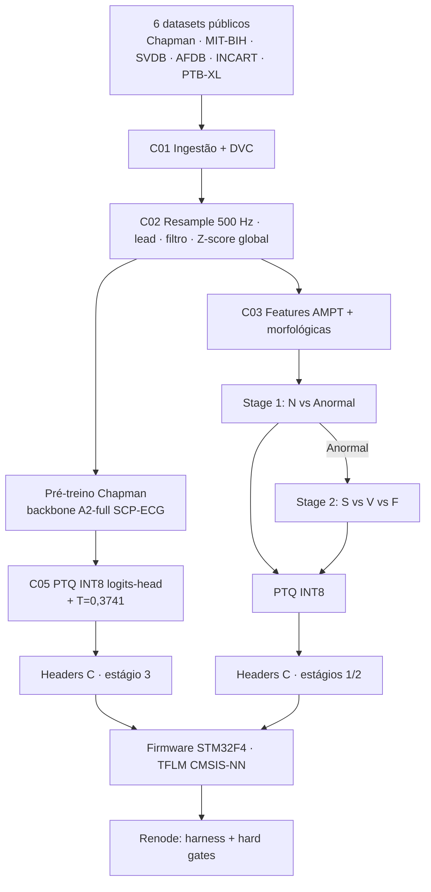

# Arquitetura do Sistema e Progresso Atual — Project-Lewis v3.1

**Versão:** v3.1.0+ · **Data:** 2026-07-31 · **Branch:** `develop` @ `b5845cc` (sincronizada com `origin/develop`)
**Escopo:** arquitetura consolidada do sistema (camadas C01–C11) e estado verificado do pipeline, incluindo a linha completa do backbone pré-treinado A2-full (calibração → INT8 → firmware → simulação Renode).

> Todos os números deste documento foram verificados contra os artefatos referenciados (JSONs de
> proveniência, calibração, quantização e simulação). Nada aqui é estimativa não marcada.

---

## 1. Resumo executivo

| Dimensão | Estado | Evidência |
|---|---|---|
| Pipeline de dados (C01–C03) | ✅ Estável, 6 datasets versionados | `data/`, QG0–QG3 |
| Classificador de produção (Stage 1 + Stage 2 v2.0) | ✅ Gates verdes; firmware integrado | `models/` (congelado), QG5′–QG10 |
| Backbone pré-treinado **A2-full** | ✅ **Simulado no STM32F4 (Renode)** — INT8, calibrado, bit-exato | T1–T5, seção 6 |
| QG4 (pré-treino) | ⚠️ AUC PASS / BCE FAIL (0,4226 ≥ 0,15) — sem afrouxamento | `docs/pretrain_benchmark_comparison.md` |
| Publicação (E07R-PD) | 🔒 `HOLD` — `NO_VALID_CANDIDATE` | `docs/e07r_evidence_report.md` |
| Verificação | ✅ `make lint` · `make test` **1088 passed** · `e07r-check` 9/9 | seção 10 |
| Firmware/simulação | ✅ `fw-build` · `fw-test` · `gates-firmware` (HG-01/HG-03) | seção 7 |

O projeto entrega, de ponta a ponta: classificador de batimentos em produção no firmware (Stage 1→2),
e — desde 2026-07-31 — o backbone pré-treinado **A2-full** (melhor modelo já produzido pelo projeto)
**quantizado INT8, calibrado (T=0,3741), integrado ao firmware como modelo adicional e validado em
simulação Renode com bit-exatidão e perfil de SRAM**.

---

## 2. Visão geral do sistema

Sistema de classificação de arritmias ECG para **edge (STM32F407VG, 168 MHz, 192 KB SRAM, 1 MB Flash)**
com validação sem hardware via **Renode 1.15.3**. Pipeline SDD em camadas com contratos, quality gates
(QG0–QG19, QG-C11, QG-MEM) e governança de integridade (freeze E07R).

---

## 3. Arquitetura por camadas

| Camada | Responsabilidade | Artefatos-chave | Gates | Estado |
|---|---|---|---|---|
| **C01** Ingestão | Download, checksums, governança de datasets | `data/raw_*`, `data/.dlq/`, DVC | QG0 | ✅ |
| **C02** Resample/Pré-proc. | 500 Hz, lead II/MLII, bandpass 0,5–40 Hz, detrend, Z-score global | `data/processed/`, `config/preprocess_v1.0.yaml` | QG1 | ✅ |
| **C03** Features | AMPT 5–15 Hz (tol. 150 ms), features morfológicas/temporais, SMOTE em feature space | `src/features/`, `data/features/` | QG2, QG3 | ✅ |
| **C04** Modelagem | Backbones 1D-CNN (A0/A1/A2), pré-treino Chapman, fine-tuning dois estágios | `src/models/`, `experiments/` | QG4, QG5′ | ⚠️ QG4 parcial (seção 5.3) |
| **C05** Quantização | PTQ INT8 full-integer per-channel, exportação TFLM | `src/quantization/`, `*/quantized/` | QG6 | ✅ (inclui A2-full) |
| **C06** Validação | Quality gates, relatórios, testes | `tests/`, `reports/` | QG0–QG19 | ✅ (1088 testes) |
| **C07** DevOps | uv/lockfile, Makefile (35 alvos públicos), CI, Docker | `Makefile`, `.github/` | gates-ci | ✅ |
| **C08** Firmware | C/C++17 bare-metal, TFLM + CMSIS-NN, DSP C | `firmware/src/` | QG7, QG8 | ✅ |
| **C09** Simulação/Energia | Renode 1.15.3, harness native/Renode | `firmware/renode/`, `firmware/tests/` | QG9–QG13, QG19 | ✅ (QG19 = débito) |
| **C10** Test Harness | Bit-exatidão C vs Python, fixtures | `firmware/tests/`, `tests/ground_truth/` | QG8, QG16–QG18 | ✅ |
| **C11** Knowledge (RAG) | sqlite-vec + embeddings, MCP server, hybrid search | `src/knowledge/`, `data/knowledge.db` | QG-C11-01..12 | ✅ |

---

## 4. Pipeline de dados

### 4.1 Datasets

| Dataset | Registros | Papel |
|---|---|---|
| Chapman-Shaoxing | 45.152 | **Pré-treino** do backbone (superclasses SCP-ECG) |
| MIT-BIH Arrhythmia | 48 | Fine-tuning/teste (AAMI beat-level) |
| MIT-BIH SVDB | 78 | Fine-tuning (supraventricular) |
| MIT-BIH AFDB | 25 | Ritmo (AFIB/AFL) — fora do classificador de batimentos (decisão D3) |
| INCART | 75 | Fine-tuning (diversidade) |
| PTB-XL | 43.598 | Fallback de pré-treino |

### 4.2 Pré-processamento (contrato C02)

Resample 500 Hz → lead única (II para Chapman/INCART; MLII/ECG1 para MIT-BIH/SVDB/AFDB) →
Butterworth 4ª ordem 0,5–40 Hz (`filtfilt`) → detrend linear → **Z-score global** (fit no treino) →
janelas de 1000 ms (500 amostras), sem padding zero. Linhagem por registro em `data/lineage/`.

### 4.3 Ontologia e splits

- **Ontologia v3** (`src/features/ontology_v3.py`, fonte única símbolo→classe): `Q_OR_UNKNOWN` é
  classe de rejeição (fora dos alvos clínicos); `F` = `FUSION` (fusão V+N, **nunca** fibrilação atrial);
  símbolos desconhecidos são excluídos.
- **Split do pré-treino:** `chapman-record-disjoint-val0.1-seed13` (40.637/4.515 registros → 45.040
  janelas de validação), imutável.
- **Split dos batimentos:** `v4.0-patient-disjoint` (`data/splits/stage2_multiclass_patient_disjoint_v4.0/`),
  MIT-BIH 201/202 unificados; splits legados record-disjoint **quarentinados** (`QUARANTINED.json`).

---

## 5. Pipeline ML

### 5.1 Produção — classificador de batimentos em dois estágios (v2.0)

Stage 1 (N vs Anormal) → Stage 2 (S vs V vs F), CNNs leves treinadas from-scratch no MIT-BIH+ com
GroupKFold por paciente. **Congelados no freeze E07R** (`models/`, 101 pins de hash).

| Componente | Métrica | Threshold v2.2 | Obtido |
|---|---|---|---|
| Stage 1 | Acc / F1-macro / Recall Anorm. / Prec. Anorm. | >75% / >0,55 / ≥30% / ≥25% | **79,3% / 0,593 / 0,325 / 0,290** |
| Stage 2 | F1(S) / F1(V) / F1(F) | ≥55% / ≥70% / ≥15% | **0,643 / 0,710 / 0,203** |
| Pipeline | Acc / F1-macro | >78% / >0,30 | **78,7% / 0,316** |

Fallback produtivo: **MLP sobre features** (v2.3, `make mlp-run`), documentado em
`reports/stage1_v2_training_analysis.md` e `docs/adr_pivotagem_mlp_features_v2.3.md`.

### 5.2 Pesquisa — E07R patient-disjoint

Remediação patient-disjoint concluída (2026-07-26): E06.5-PD 100/100 células com
**`NO_VALID_CANDIDATE`** (H6 não supera baseline: ΔF1(F) = −0,1601; IC95 [−0,398; +0,153]);
E07-PD **não executado** (0/150) por pré-registro. **Publicação: `HOLD`.**
Evidência: `docs/e07r_evidence_report.md`.

### 5.3 Pré-treino Chapman — benchmark de backbones

Fonte: `docs/pretrain_benchmark_comparison.md` (corrigido em T1.5) + artefatos dos runs.

| Run | Arch | Params | Seed/Det. | val AUC-ROC | val AUC-PR | val BCE | ECE→(T) | QG4 |
|---|---|---|---|---|---|---|---|---|
| A0 histórico `20260728_033533` | A0 | 19.933 | 42 / pré-strict | 0,8333 | 0,6734 | 0,3907 | 0,055→0,023 | FAIL |
| A0 novo `20260729_042301` | A0 | 19.933 | 42 / strict | 0,8365 | 0,6784 | 0,3880 | 0,025→0,020 | FAIL |
| **A2-full `20260728_053011`** | A2 (A1+focal) | 32.005 | 13 / strict | **0,8596 (log) / 0,8639 (offline)** | **0,7008** | 0,4226 | 0,151→**0,0152** (T=0,374) | **AUC PASS / BCE FAIL** |

Leituras centrais:

1. **A2-full é o melhor modelo do projeto**: primeiro a passar o braço AUC do QG4 (> 0,85); AUC
   offline (macro por classe, pinada em `metrics_per_class.json`) = **0,8639**. O 0,8596 é a métrica
   de log Keras (batch-averaged) — caminhos de medição distintos, ambos registrados.
2. **Reprodutibilidade strict** (oneDNN off): A0 novo × histórico Δ ≈ 0,3 p.p. — ruído numérico
   de reordenação, sem mudança de pipeline.
3. **Calibração:** o A2 (focal) é **sub-confiante** (underconfident; reliability diagram: pred 0,86
   → obs 0,99 em NORM). **T = 0,3741 < 1** afia as probabilidades e corrige ECE 0,151 → **0,0152**
   (n_bins=15) — consistente com Mukhoti 2020 (focal reduz overconfidence e pode inclinar para
   underconfidence em datasets desbalanceados). ECE mede magnitude, não direção (sinal de T−1).
4. **QG4-BCE (< 0,15) permanece fora de alcance** para todas as variantes (0,3880–0,4226) —
   threshold **não afrouxado**; revisão somente via RFC de governança (T2, pendente).

Por superclasse (A2-full, PR-AUC / F1@0,5): NORM 0,989/0,956 · CD 0,556/0,388 · MI 0,625/0,493 ·
HYP 0,508/0,421 · STTC 0,855/0,787. Ganhos concentrados em STTC (+8,0 p.p. PR vs A0) e HYP
(F1 0,321→0,421); CD/HYP seguem gargalo absoluto (limitação arquitetural/dados).

Posição externa (com ressalvas de protocolo): −7 p.p. AUC vs Strodthoff 2021 (PTB-XL, 12 leads,
~0,5–8 M params) com **1 lead e 32 k params**; Zheng 2020 mede outra tarefa (features clínicas,
12 leads); CinC 2021 usa os mesmos dados públicos (score exato = lacuna documentada).

---

## 6. Linha do A2-full: da calibração à simulação (T1 → T5)

Cadeia executada em 2026-07-31 (commits `7fe082c`…`b5845cc`, todos em `origin/develop`). O modelo
é **adicional** ao firmware — não substitui Stage 1/2; promoção a produção é decisão de governança.

### 6.1 T1 — Calibração (C04) · commit `6457c62`

- `experiments/20260728_053011_pretrain_chapman/calibration.json` regenerado com metadados de
  contrato e **n_bins=15**: **T = 0,3741**, ECE 0,1508 → **0,0152**, NLL 0,4317 → 0,3417,
  45.040 amostras, seed 13, split `chapman-record-disjoint-val0.1-seed13`.
- AUC-ROC inalterada pós-T (Δ = 7,9e-11); SHA-256 do checkpoint verificado **fail-closed** contra
  `provenance.json` (exit 3 em mismatch) no pipeline de avaliação (`scripts/evaluate_pretrain_run.py`).
- 5 testes novos; schema legado preservado. **T1.5** (`a0e1904`): narrativa de calibração corrigida
  no benchmark doc (underconfidence, não "superconfiante") + exceções cirúrgicas no `.gitignore`
  para os artefatos do run (demais 169 runs seguem ignorados).

### 6.2 T3 — Quantização INT8 + calibração pós-PTQ (C05) · commit `d49867c`

Script `scripts/quantize_pretrain_a2_full.py` (512 janelas estratificadas do split val, seed 42):

- **Cabeça de logits**: sigmoid removido na conversão (equivalência max|Δ| = 8,9e-8) — ordem de
  inferência `logits → /T → sigmoid`, com `/T` em **float32 após dequantização** (sem caminho de
  overflow int8; T < 1 amplifica ×2,67 apenas no domínio float).
- `quantized/a2_full_int8.tflite` — **54,77 KB < 64 KB** (AC-3.1).
- ΔAUC-ROC = **0,0027** (< 0,01) · ΔF1-macro = **0,0024** (< 0,02) · AUC int8 0,8612 · F1 int8 0,6112.
- Saturação int8 medida: **71/225.200 (0,0315%)** nos trilhos (bounds [−3,83; +4,81] logits) —
  impacto limitado a sigmoid 0,021/0,992; documentado em `quant_report.json`.
- **ECE pós-PTQ com T fixo: 0,1636 → 0,0207** (≤ 0,025; n_bins=15; 45.040 amostras).
- Determinístico: duas execuções produziram artefatos idênticos (56.080 bytes). 7 testes novos.

### 6.3 T4 — Headers C + integração firmware (C08) · commit `322e3a8` (revisão humana aprovada)

- `firmware/src/ml/pretrain_a2_full_int8.h` (FlatBuffer), `pretrain_a2_full_quant_params.h`
  (macros prefixadas, sem colisão com o parser legado), `pretrain_a2_full_config.h`
  (`PRETRAIN_A2_FULL_TEMPERATURE = 0,3741036858f`).
- `pretrain_calibrate.{h,c}`: `logits int8 → dequant → /T → sigmoid` em float32 (clamp ±30) —
  **verificado C == Python em 7 casas decimais**.
- `inference.{h,cpp}`: estágio id 3 (`lewis_pretrain_init/run/model_size`) no padrão de estágios
  existente, arena compartilhada; app principal/UART **intocado**.
- Gates: build `-Werror` (stub STM32 + native-tflm) ✅ · headers legados com SHA-256 == HEAD ✅ ·
  `fw-test` rc=0 ✅.

### 6.4 T5 — Simulação Renode + perfil SRAM (C09) · commit `86f38b3`

Suite `PRETRAIN_A2` no harness (16 fixtures do split val, referência TFLite **BUILTIN_REF**):

| Teste | Native | Renode (CMSIS-NN) | Gate |
|---|---|---|---|
| model_size | ✅ | ✅ | QG6 (< 64 KB) |
| init_arena | ✅ | ✅ (arena 22.820/49.152 B) | QG9/QG12 |
| bitexact (atol 1 LSB) | ✅ | ✅ | **QG8** |
| calibration_fidelity | ✅ (cosine 1,000000) | ✅ (cosine 1,000000) | **QG10** |
| latency | ✅ (3–5 ms) | ✅ (**73 ms** < 200 ms) | **QG9** |

- **Harness total:** native **21/21** · Renode **20/21** (única falha = DSP `filter_chain_vs_python`,
  **pré-existente** — fixture byte-idêntica ao HEAD, divergência FMA/ARM ≈ 1e-4; tolerância QG16
  pendente de governança).
- **Perfil de memória** (harness ELF, 3 modelos): text 381 KB · data 2 KB · bss 51,7 KB →
  **SRAM total 52,4 KB** (< 128 KB) · Flash 383 KB (< 1 MB) · arena usada 46% de 48 KB.
- Relatório: `reports/firmware_simulation_report_a2_full.json` (AC-5.1…5.8 PASS; QG19 energia =
  débito não mensurável no Renode).

**Bugs de infraestrutura corrigidos na T5** (beneficiam todo o projeto):

1. Resolver TFLM sem op **ADD** (blocos residuais) — `AllocateTensors` falhava para o A2-full.
2. **EOF no stdin truncava o harness Renode** em ponto não-determinístico (`subprocess DEVNULL` →
   pausa do console) — o histórico "verde" do harness Renode era **parcial**. Fix `tail -f` no
   `run_harness.py` + exit code por modo executado.
3. Benchmark SysTick (`lewis_hal_benchmark_*`) não confiável no Renode (lê wrap 2³² ≈ 25,5 s como
   delta) — latência medida via `lewis_hal_millis` (TIM2).

---

## 7. Firmware e simulação

- **MCU:** STM32F407VG (Cortex-M4F, 168 MHz, 192 KB SRAM, 1 MB Flash); toolchain arm-none-eabi-gcc
  13.3.rel1; TFLM com CMSIS-NN (cortex-m4+fp); arena estática configurável (padrão 48 KB no build).
- **Modelos embarcados:** Stage 1 + Stage 2 (produção) e **A2-full** (adicional, estágio 3) —
  três FlatBuffers em `.rodata.model` (≈167,5 KB no harness).
- **DSP no C:** bandpass 0,5–40 Hz + notch 60 Hz + Z-score; watchdog de inferência (1000 ms);
  saída UART4 sem `printf`/semihosting.
- **Harness:** `firmware/tests/` — suites DSP, RPEAK, INFERENCE, ADAPTIVE_SKIPPING, **PRETRAIN_A2**;
  modos native (`build/native/lewis_harness`) e Renode (`build/stm32f4/lewis_harness.bin` via
  `renode/harness.resc`); relatório `firmware/test_harness_report.json`.
- **Hard gates:** HG-01 (qg9–qg13) + HG-03 (no-stub) via `make gates-firmware` — **PASS** em 2026-07-31.
- **Limites documentados** (`docs/SIMULATION_LIMITS.md`): timings representativos, energia não
  estimada (débito QG19 — `docs/DEBITO_TECNICO_Energia_Renode-v1.4.md`), tolerância 1 LSB CMSIS-NN.

---

## 8. Integridade e governança

- **Freeze E07R:** 101 pins de hash (`experiments/stage2_v2.4_research/integrity/e07r_freeze_manifest.json`,
  modo 0444) cobrindo `models/` e splits; preflight **fail-closed 9/9** (`make e07r-check`) — qualquer
  escrita em `models/` derruba o preflight.
- **Quarentena:** splits legados record-disjoint (`data/splits/groupkfold_5_stratified/QUARANTINED.json`);
  artefatos v2.x marcados `LEGACY_ARTIFACTS_INVALID_FOR_NEW_TRAINING`.
- **Promoção de modelos:** somente via `--promote` explícito + aprovação humana; o A2-full **não**
  foi promovido (modelo adicional em `experiments/` + headers novos).
- **Revisões humanas:** T4 (firmware) executada e aprovada; T7 (decisão de publicação) pendente.
- **Exit codes:** execução × gate separados (nota SDD Mestre 2026-07-29) — `make pretrain` retorna 0
  ao concluir; `make pretrain-qg` falha com exit 10 na reprova de QG4.

---

## 9. Quality gates — estado consolidado

| QG | Critério | Estado (2026-07-31) |
|---|---|---|
| QG0 | Datasets completos + checksums | ✅ |
| QG1 | Resample/pré-processamento | ✅ |
| QG2 | AMPT @500 Hz (Sens>96,5%, PPV>99%) | ✅ |
| QG3 | Features (janela 1000 ms, ≥10 dim, sem NaN) | ✅ |
| QG4 | Pré-treino: AUC>0,85 **e** BCE<0,15 | ⚠️ **AUC PASS (0,8639) / BCE FAIL (0,4226)** — RFC T2 pendente |
| QG5′ | Fine-tuning v2.2 (Stage1/2/pipeline) | ✅ (valores na seção 5.1) |
| QG6 | Quantização (ΔF1<2%, <64 KB, header compilável) | ✅ Stage1/2 (Δ≈0,3%) e **A2-full (ΔF1 0,24%, 54,77 KB)** |
| QG7 | Build firmware `-Werror` | ✅ |
| QG8 | Bit-exatidão int8 vs BUILTIN_REF | ✅ (A2-full atol 1 LSB, native e Renode) |
| QG9 | Latência < 200 ms / memória | ✅ **73 ms** (A2-full, Renode) |
| QG10 | Fidelidade cosine > 0,99 | ✅ **1,000000** |
| QG11 | Fault injection SPI/UART | ✅ (HG-01, regressão) |
| QG12 | Limite de arena (48 KB) | ✅ (HG-01; INIT FAIL sem HardFault) |
| QG13 | Watchdog | ✅ (HG-01) |
| QG14/QG15 | Reservados (segurança/LGPD, OTA) | ⬜ Futuro |
| QG16 | Filtros C vs Python (RMSE < 1e-6) | ✅ native · ⚠️ Renode ≈1e-4 (pré-existente, seção 11) |
| QG17 | Pipeline C vs Python | ✅ |
| QG18 | R-peak C vs AMPT (Sens/PPV ≥ 90%) | ✅ |
| QG19 | Energia (< 50 mA, < 165 mJ/bat) | 🔶 **Débito** (não mensurável no Renode) |
| QG-C11-01..12 | Knowledge (índice, retrieval, LGPD, MCP…) | ✅ (via suíte `make test`) |
| QG-MEM | Artifact registry (checksum, FK run) | ✅ (via suíte) |

---

## 10. Estado de verificação (2026-07-31)

| Comando | Resultado |
|---|---|
| `make lint` (flake8 + mypy + bandit) | ✅ |
| `make test` (pytest completo) | ✅ **1088 passed** |
| `make e07r-check` (preflight 9 checks) | ✅ 9/9 |
| `make fw-build` / `make fw-test` | ✅ / ✅ (rc=0) |
| `make gates-firmware` (HG-01 qg9–qg13, HG-03) | ✅ |
| Harness native / Renode | ✅ 21/21 · ✅ 20/21 (falha DSP pré-existente) |

Commits da linha A2-full (todos em `origin/develop`): `7fe082c` (lint), `6457c62` (T1),
`a0e1904` (T1.5), `d49867c` (T3), `322e3a8` (T4), `86f38b3` (T5), `b5845cc` (AGENTS.md).

---

## 11. Dívidas e riscos conhecidos

1. **QG4-BCE FAIL (0,4226 ≥ 0,15)** — threshold não atingido por nenhuma variante; análise de
   underconfidence sugere BCE inflado por compressão de probabilidades (BCE pós-T a computar na
   RFC). **Não afrouxar** — revisão via T2 (`docs/rfc_qg4_bce_threshold.md`, pendente).
2. **DSP Renode ≈ 1e-4** (`filter_chain_vs_python`) — pré-existente, divergência FMA/ARM em cadeia
   IIR filtfilt; tolerância QG16 só via governança. Estava invisível por truncamento de log (corrigido).
3. **QG19 energia** — não mensurável no Renode; débito v1.4 documentado.
4. **CinC 2021** — score oficial da equipe vencedora não re-verificado numericamente (lacuna
   assumida no benchmark; regra: não citar sem re-verificação).
5. **Aresta operacional** — `make fw-build` (stub) sobrescreve `build/stm32f4/lewis.bin`; antes de
   `make test`, rebuildar `make -C firmware RENODE_SIMULATION=1 LEWIS_USE_TFLM=1 stm32f4`
   (exigido por `test_fidelity`). Registrado em `AGENTS.md`.
6. **Benchmark SysTick no Renode** — não usar `lewis_hal_benchmark_*` para latência; usar
   `lewis_hal_millis` (TIM2).

## 12. Próximos passos (SDD-LEWIS-NEXT-STEPS-002)

| Task | Conteúdo | Bloqueio |
|---|---|---|
| **T2** | RFC QG4-BCE: ≥5 cenários (incl. BCE pós-T), bound de T (0,1–10), decisão de governança | Nenhum (documentação) |
| **T6** | Comparativo quantitativo por superclasse (A2-full × Strodthoff × CinC × Zheng) | Nenhum |
| **T7** | Decisão de publicação GO/NO-GO consolidando T1–T6 | ⚠️ **Revisão humana obrigatória** |
| **T8** | PLAN.md fases 2/4/5 (refatoração, integridade de manifestos, decisão datasets v2.5) | Paralelo |

## 13. Referências

- Benchmark e calibração: `docs/pretrain_benchmark_comparison.md` ·
  `experiments/20260728_053011_pretrain_chapman/{provenance,calibration,metrics_per_class}.json`
- Quantização: `experiments/20260728_053011_pretrain_chapman/quantized/{quant_report,post_quant_calibration,quantization_params}.json`
- Simulação: `reports/firmware_simulation_report_a2_full.json` · `firmware/test_harness_report.json` ·
  `docs/SIMULATION_LIMITS.md` · `docs/DEBITO_TECNICO_Energia_Renode-v1.4.md`
- Governança: `docs/e07r_evidence_report.md` · `AGENTS.md` · `PLAN.md`
- Camadas: `docs/Camada-01..09-*.md` · `docs/SDD_Project-Lewis_v3.md` · `docs/SDD-C11-Knowledge-Impl-v2.0.md`
- Uso do pré-treino: `docs/pretrain_usage.md` · `docs/pretrain_architecture_v2.md`
- Literatura: Mukhoti et al. 2020 (focal/calibração) · Guo et al. 2017 (temperature scaling) ·
  Strodthoff et al. 2021 (arXiv:2004.13701) · Zheng 2020 (Sci Data 7:48) · CinC 2021 (PhysioNet)
