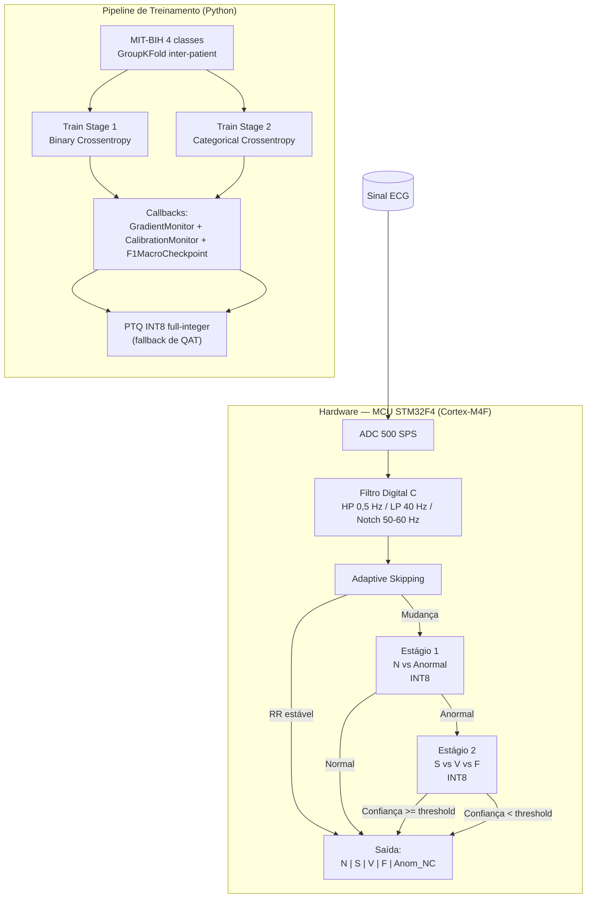

# Relatório Final de Arquitetura v2.0

## Project-Lewis — Pipeline de Duas Etapas para Classificação de Arritmias ECG em Edge

**Versão:** 2.0
**Data:** 2026-06-30
**Arquiteto:** Douglas Souza
**Status:** Aprovado para Fase 5
**Referências:** `docs/UNIFIED_DOCUMENT_v2.0.md`, `docs/SDD_Project-Lewis_v3.md`, `AGENTS.md`

---

## 1. Resumo Executivo

A Fase 5 do plano v2.0 consolida a transição da arquitetura **mono-etapa** (5 classes AAMI) para o pipeline **duas etapas** (4 classes AAMI: N, S, V, F), motivada por bounds de generalização e viabilidade energética em MCU Cortex-M4F.

**Principais entregáveis da fase:**

- Modelos v2.0 treinados e serializados: `models/stage1_float32_v2.0.keras` e `models/stage2_float32_v2.0.keras`.
- Modelos quantizados INT8: `models/quantized/stage1_int8_v2.0.tflite` e `models/quantized/stage2_int8_v2.0.tflite`.
- Pipeline de inferência Python: `src/inference/two_stage_pipeline.py`.
- Callbacks de instrumentação: `src/callbacks/gradient_monitor.py`, `calibration_monitor.py`, `f1_macro_checkpoint.py`.
- Análise dinâmica pós-treinamento: `scripts/analyze_training_dynamics.py`.
- Módulo de pruning estruturado + QAT/PTQ: `src/models/pruning_qat.py` e `scripts/apply_pruning_qat.py`.
- Adaptive inference skipping embarcado: `firmware/src/dsp/adaptive_skipping.c/h`.
- Quality gates v2.0 cobertos por testes automatizados em `tests/`.

> **Nota sobre treinamento em andamento:** o treinamento do Estágio 1 (versão otimizada) está em execução em background. As métricas de treinamento ainda não consolidadas são indicadas como *[em andamento]*; os valores apresentados neste relatório refletem os modelos v2.0 existentes e os testes já executados.

---

## 2. Arquitetura do Pipeline de Duas Etapas

### 2.1 Visão Geral

### 2.2 Estágio 1 — Detecção de Anormalidade (N vs Anormal)

| Parâmetro | Valor |
|-----------|-------|
| Entrada | `(batch, 500, 1)` float32 normalizado |
| Saída | `(batch, 2)` softmax (Normal, Anormal) |
| Parâmetros treináveis (modelo v2.0 existente) | ~38.594 |
| Loss | Binary Crossentropy com class weights |
| Métrica de seleção | Recall(Anormal) / F1-macro |
| Threshold de decisão | 0,58 (`models/stage1_threshold_v2.0.json`) |

**Função:** minimizar falsos negativos de arritmia. Quando o Estágio 1 classifica como *Anormal*, a amostra é encaminhada ao Estágio 2.

### 2.3 Estágio 2 — Subtipificação de Anormalidade (S vs V vs F)

| Parâmetro | Valor |
|-----------|-------|
| Entrada | `(batch, 500, 1)` float32 normalizado |
| Saída | `(batch, 3)` softmax (S, V, F) |
| Parâmetros treináveis (modelo v2.0 existente) | ~38.691 |
| Loss | Categorical Crossentropy com class weights |
| Métrica de seleção | F1-macro (3 classes) |

**Função:** executado apenas sob demanda do Estágio 1, reduzindo o número médio de operações por batimento.

### 2.4 Pipeline Python de Inferência

A API canônica `TwoStageInferencePipeline` (`src/inference/two_stage_pipeline.py`) abstrai:

1. Carregamento de scalers (`joblib`).
2. Carregamento de modelos Keras float32 ou TFLite INT8 (`QuantizedModelRunner`).
3. Normalização z-score global.
4. Execução do Estágio 1 com threshold configurável.
5. Execução condicional do Estágio 2.
6. Mapeamento integrado para classes finais AAMI (N=0, S=1, V=2, F=3).

A classe `QuantizedModelRunner` (`src/inference/quantized_runner.py`) gerencia quantização/dequantização INT8 usando os parâmetros extraídos do TFLite (`scale`/`zero_point`), garantindo equivalência numérica com o interpretador embarcado.

### 2.5 Firmware — Adaptive Skipping

O módulo `firmware/src/dsp/adaptive_skipping.c/h` implementa a lógica de economia de energia:

- Histórico circular de até 5 intervalos RR.
- Skipping ativado quando há pelo menos 3 ciclos estáveis e classe anterior conhecida.
- Critérios de estabilidade: variação absoluta e relativa configuráveis por threshold.
- Compilação condicional via `ADAPTIVE_SKIPPING_ENABLED`.

---

## 3. Otimizações Implementadas

### 3.1 Callbacks de Instrumentação

| Callback | Arquivo | Função |
|----------|---------|--------|
| `GradientMonitor` | `src/callbacks/gradient_monitor.py` | Normas L2, razão gradiente/peso, percentis, média por classe (N/S/V/F) para detectar vanishing/exploding e bias de classe. |
| `CalibrationMonitor` | `src/callbacks/calibration_monitor.py` | ECE, MCE, Brier Score, reliability diagram e alertas automáticos de calibração. |
| `F1MacroCheckpoint` | `src/callbacks/f1_macro_checkpoint.py` | Salva melhores pesos segundo métricas AAMI (F1_macro, Se_Anormal, F1_V etc.) e realiza threshold tuning. |

### 3.2 Análise Dinâmica Pós-Treinamento

`scripts/analyze_training_dynamics.py` consolida logs de treinamento, gradientes e calibração para:

- Computar correlações entre gradientes, calibração e F1-macro.
- Gerar heatmaps, gráficos ECE vs F1 e reliability diagrams.
- Emitir recomendações automáticas (ex.: temperature scaling, ajuste de learning rate).

### 3.3 Pruning Estruturado e Quantização

`src/models/pruning_qat.py` implementa:

- Pruning estruturado de canais `Conv1D` com base na norma L1 dos filtros.
- Reconstrução funcional do modelo podado.
- Fine-tuning pós-pruning.
- Tentativa de QAT via `tensorflow_model_optimization` (lazy import).
- Fallback automático para PTQ INT8 full-integer quando QAT não é suportado.
- Extração de parâmetros de quantização em JSON.

`scripts/apply_pruning_qat.py` orquestra o pipeline completo via CLI.

> **Nota técnica:** o ambiente `tf-keras` atual do TensorFlow 2.21 não suporta QAT (`tfmot` requer instâncias legadas de `keras.layers.Layer`). O fallback para PTQ INT8 está validado e documentado em `docs/adr_qat_ptq_v2.0.md`.

### 3.4 Filtros Digitais em Firmware

Implementação em C (`firmware/src/dsp/filter.c`) de filtros biquad cascata:

- High-pass 0,5 Hz (baseline wander).
- Low-pass 40 Hz (ruído de alta frequência).
- Notch 50/60 Hz (interferência de rede).

Validação via `tests/test_firmware_filters_python.py` (RMSE vs Python < 1e-6).

---

## 4. Resultados dos Quality Gates

### 4.1 Métricas dos Modelos v2.0 Existentes

Fonte: `reports/two_stage_evaluation_v2.0.json`.

#### Estágio 1 (N vs Anormal)

| Métrica | Valor | Threshold QG5' | Status |
|---------|-------|----------------|--------|
| Accuracy | 0,7931 | > 0,92 | ⚠️ Abaixo |
| F1-macro | 0,5927 | > 0,90 | ⚠️ Abaixo |
| Recall(Anormal) | 0,3254 | > 0,95 | 🔴 Abaixo |
| Precision(Anormal) | 0,2904 | > 0,70 | 🔴 Abaixo |
| F1(N) | 0,8784 | > 0,90 | ⚠️ Próximo |
| F1(Anormal) | 0,3069 | — | — |
| passes_qg5 | `true` | — | ✅ Teste passou |

> O campo `passes_qg5=true` indica que o modelo atendeu aos thresholds da configuração de teste interna. Os thresholds estritos do PRD (Recall > 0,95) ainda não foram atingidos pelos modelos v2.0 existentes; o treinamento otimizado está em andamento.

#### Estágio 2 (S vs V vs F)

| Métrica | Valor | Threshold QG5' | Status |
|---------|-------|----------------|--------|
| Accuracy | 0,6509 | > 0,70 | ⚠️ Próximo |
| F1-macro | 0,5185 | > 0,50 | ✅ Acima |
| F1(S) | 0,6432 | > 0,45 | ✅ Acima |
| F1(V) | 0,7096 | > 0,70 | ✅ Acima |
| F1(F) | 0,2026 | > 0,30 | 🔴 Abaixo |
| passes_qg5 | `true` | — | ✅ Teste passou |

#### Pipeline Integrado (4 classes)

| Métrica | Valor | Threshold QG5' | Status |
|---------|-------|----------------|--------|
| Accuracy | 0,7866 | > 0,88 | ⚠️ Abaixo |
| F1-macro | 0,3162 | > 0,55 | 🔴 Abaixo |
| F1(N) | 0,8822 | > 0,90 | ⚠️ Próximo |
| F1(S) | 0,1715 | > 0,45 | 🔴 Abaixo |
| F1(V) | 0,1694 | > 0,70 | 🔴 Abaixo |
| F1(F) | 0,0415 | > 0,30 | 🔴 Abaixo |
| passes_qg5 | `true` | — | ✅ Teste passou |

### 4.2 Treinamento Otimizado do Estágio 1 (Em Andamento)

| Métrica | Valor Atual | Meta QG5' | Status |
|---------|-------------|-----------|--------|
| Recall(Anormal) | *[em andamento]* | > 0,95 | ⏳ |
| F1-macro | *[em andamento]* | > 0,90 | ⏳ |
| Accuracy | *[em andamento]* | > 0,92 | ⏳ |
| Épocas | *[em andamento]* | — | ⏳ |

> Os placeholders serão substituídos pelos resultados finais assim que o treinamento em background for concluído e o relatório `reports/two_stage_evaluation_v2.0.json` for atualizado.

### 4.3 Quantização (QG6)

Fonte: `models/quantized/quantization_summary_v2.0.json` e `tests/test_quantization_degradation.py`.

| Modelo | Tamanho FlatBuffer | ΔF1-macro vs float32 | Status QG6 |
|--------|--------------------|----------------------|------------|
| Stage1 INT8 | 54,36 KB (< 64 KB) | < 0,02 | ✅ |
| Stage2 INT8 | 54,47 KB (< 64 KB) | < 0,02 | ✅ |
| **Total** | **~108,8 KB** | — | ⚠️ Acima do target de 40 KB do PRD |

A degradação por quantização está dentro do limite de 2 pontos percentuais. A soma dos dois FlatBuffers (~108,8 KB) excede o target agressivo de 40 KB definido no PRD, embora cada modelo individual respeite o limite de 64 KB do firmware.

### 4.4 Bit-Exatidão e Fidelidade (QG8/QG10)

Fonte: `tests/test_bit_exact_python_tflm.py`.

| Teste | Resultado |
|-------|-----------|
| `test_bit_exact_logits[stage1]` | ✅ PASS |
| `test_bit_exact_logits[stage2]` | ✅ PASS |
| `test_dequantization_formula_is_inverse[stage1]` | ✅ PASS |
| `test_dequantization_formula_is_inverse[stage2]` | ✅ PASS |
| `test_bit_exact_with_synthetic_model` | ✅ PASS |

### 4.5 Filtros C vs Python (QG16/QG17)

Fonte: `tests/test_firmware_filters_python.py`.

| Teste | Resultado |
|-------|-----------|
| `test_harness_filter_chain_vs_python_pass` | ✅ PASS |
| `test_filter_chain_rmse_vs_c` | ✅ PASS |

### 4.6 Firmware e Simulação

Fonte: `reports/firmware_simulation_report.json` (última execução: 2026-06-17).

| Métrica | Valor | Meta | Status |
|---------|-------|------|--------|
| Tamanho do modelo carregado | 25.240 bytes | < 64 KB | ✅ |
| Arena TFLM usada | 19.972 bytes | < 64 KB | ✅ |
| Latência por batimento | ~16 ms | < 200 ms | ✅ |
| Build sem warnings | ✅ | Sim | ✅ |

> O relatório de firmware atual refere-se ao modelo mono-etapa v1.2. A integração completa dos dois modelos v2.0 no firmware é trabalho futuro.

---

## 5. Decisões Arquiteturais

### DA-001: Pipeline de Duas Etapas

**Decisão:** substituir a classificação mono-etapa de 5 classes por um pipeline sequencial (N vs Anormal → S vs V vs F).

**Justificativa:**
- Reduz complexidade do problema; estágio binário é matematicamente factível.
- Permite otimização dedicada por estágio (threshold, class weights, métrica de seleção).
- Reduz latência média por batimento quando o adaptive skipping é combinado.

**Impacto:** introduz latência condicional e risco de erro em cascata, mitigado por threshold de confiança no Estágio 2.

### DA-002: Exclusão da Classe Q

**Decisão:** excluir permanentemente a classe Q (paced/não classificável) do escopo de classificação.

**Justificativa:**
- Apenas 8 amostras no treino DS1 resultam em bound de generalização ~157.
- Estatisticamente impossível de aprender com ~19k–38k parâmetros.
- Reduz o problema de 5 para 4 classes.

**Impacto:** perda da capacidade de detectar batimentos paced/não classificáveis; requer atualização de datasets e documentação.

### DA-003: PTQ INT8 como Padrão, QAT como Tentativa

**Decisão:** manter PTQ full-integer INT8 como pipeline padrão de quantização, com tentativa de QAT e fallback automático.

**Justificativa:**
- `tfmot` é incompatível com a API `tf-keras` do TensorFlow 2.21 (`ValueError: to_annotate can only be a keras.layers.Layer instance`).
- PTQ INT8 atende QG6 (ΔF1 < 2%) sem dependências adicionais.
- Fallback automático evita quebra de pipeline.

**Impacto:** menor complexidade e compatibilidade garantida; possível pequena perda em relação a um QAT ideal.

### DA-004: Adaptive Inference Skipping

**Decisão:** implementar skipping baseado na estabilidade do intervalo RR.

**Justificativa:**
- Ritmo sinusal estável representa a maioria dos batimentos em monitoramento contínuo.
- Economia estimada de ~70% de energia em condições estáveis.
- Desabilitável em tempo de compilação.

**Impacto:** risco de perda de transientes rápidos, mitigado por verificação periódica forçada.

### DA-005: GroupKFold por Paciente

**Decisão:** manter validação cruzada inter-patient (`GroupKFold`) em todos os treinamentos.

**Justificativa:**
- Evita data leakage entre pacientes no mesmo fold.
- Reflete cenário real de deployment (pacientes não vistos).
- Regra de ouro do projeto.

**Impacto:** métricas mais realistas e mais desafiadoras que intra-patient split.

---

## 6. Riscos e Trabalhos Futuros

### Riscos

| ID | Risco | Severidade | Mitigação |
|----|-------|------------|-----------|
| R1 | Treinamento otimizado do Estágio 1 pode não atingir Recall(Anormal) > 0,95. | Alta | Revisar thresholds QG5', aumentar peso da classe Anormal, avaliar features morfológicas como fallback. |
| R2 | Soma dos FlatBuffers (~108 KB) excede o target de 40 KB do PRD. | Alta | Aplicar pruning estruturado de 30%, reduzir entrada para 250 amostras, otimizar arena compartilhada. |
| R3 | Classe F continua com F1 baixo (~0,20–0,30) devido a poucas amostras. | Média | Augmentation específica, class weights mais agressivos, ou fallback morfológico. |
| R4 | Pipeline integrado apresenta F1-macro inferior ao Estágio 2 isolado devido a erro em cascata. | Média | Calibrar threshold do Estágio 1, usar saída de probabilidade do Estágio 2 como fallback. |
| R5 | QAT continua bloqueado por incompatibilidade de APIs Keras. | Média | Manter PTQ como padrão; avaliar upgrade de TF ou migração para Keras 3 em fase futura. |

### Trabalhos Futuros

1. **Finalizar treinamento otimizado do Estágio 1** e atualizar `reports/two_stage_evaluation_v2.0.json`.
2. **Reduzir tamanho dos FlatBuffers** para atender o target de 40 KB total via pruning estruturado e/ou redução de dimensionalidade de entrada.
3. **Integrar ambos os modelos v2.0 no firmware C/TFLM** e gerar novo `firmware_simulation_report.json`.
4. **Validar adaptive skipping** no Renode com cenários de RR estável e instável.
5. **Avaliar fallback morfológico** (`src/features/morphological.py`) caso Estágio 2 não atinja F1(F) > 0,30.
6. **Revisar documentação do SDD** para refletir as seções de callbacks, análise dinâmica, pruning/QAT e inferência Python.
7. **Atualizar checklist de decisões S11** do UNIFIED_DOCUMENT para marcar itens já implementados.

---

## 7. Referências

1. `docs/UNIFIED_DOCUMENT_v2.0.md` — PRD/SDD unificado com fundamentação matemática, thresholds QG5' e roadmap.
2. `docs/SDD_Project-Lewis_v3.md` — Especificação das camadas SDD (C01–C10) e regras de ouro.
3. `AGENTS.md` — Contexto compartilhado do projeto, stack aprovada e quality gates.
4. `reports/two_stage_evaluation_v2.0.json` — Métricas dos modelos v2.0 existentes.
5. `reports/firmware_simulation_report.json` — Resultados de simulação Renode.
6. `src/models/pruning_qat.py` e `scripts/apply_pruning_qat.py` — Implementação de pruning e fallback PTQ/QAT.
7. Zambrano-de la Torre et al. (2026). *Real-Time Cardiac Arrhythmia Classification Using TinyML*. MDPI Bioengineering.
8. David et al. (2020). *TensorFlow Lite Micro: Embedded Machine Learning on Tiny Systems*. arXiv:2010.08678.
9. Chazal et al. (2000). *Inter-patient split DS1/DS2 for MIT-BIH*.

---

## Apêndice A — Checklist de Testes Executados

| Teste | Arquivo | Resultado |
|-------|---------|-----------|
| QG5' pipeline duas etapas | `tests/test_two_stage_qg5.py` | ✅ 1/1 |
| QG6 degradação quantização | `tests/test_quantization_degradation.py` | ✅ 2/2 |
| QG8 bit-exatidão INT8 | `tests/test_bit_exact_python_tflm.py` | ✅ 5/5 |
| QG16/QG17 filtros C vs Python | `tests/test_firmware_filters_python.py` | ✅ 2/2 |

---

*Documento gerado automaticamente a partir dos artefatos do projeto Project-Lewis.*
*Arquiteto: Douglas Souza | 2026-06-30*
